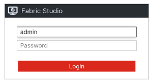
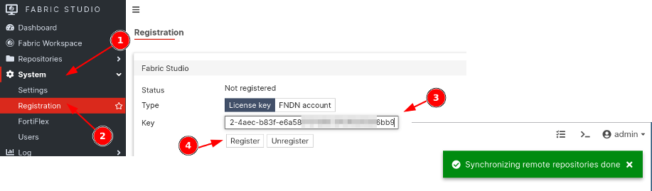

## Overview

This guide covers the steps for deploying Fabric Studio (FS) in your own lab environment. This page is for those that want to host Fabric studio themselves. If you're looking for an easy way to test Fabric Studio, check out the page [here]({})

## Download Fabric Studio

Download your Fabric Studio image from [Sharepoint](https://fortinet-my.sharepoint.com/personal/jparente_fortinet-us_com/_layouts/15/onedrive.aspx?id=%2Fpersonal%2Fjparente%5Ffortinet%2Dus%5Fcom%2FDocuments%2FFabric%20Studio%2F2%2E0&ga=1).


{}
Only GCP or qcow2 images are available. If you need to convert to vmdk format, you can use the following command:
{}

```bash
qemu-img convert -f qcow2 -O vmdk source_image.qcow2 destination_image.vmdk
```

## Import to Hypervisor

Follow your hypervisor's instructions for uploading the image.

## Configure Network Interface

### Option 1: DHCP (Default)

By default, Fabric Studio uses DHCP on the mgmt1 interface. The "mgmt1" interface is the first interface connected on the system (e.g., ens3).

To verify the hardware address or the assigned IP address:

```bash
(lab-fs20) # system diagnose interfaces mgmt1
[
    {
        "addr_info": [
            {
                "broadcast": "10.222.9.255",
                "dynamic": true,
                "family": "inet",
                "label": "mgmt1",
                "local": "10.222.8.193",
                "preferred_life_time": 271,
                "prefixlen": 22,
                "scope": "global",
                "valid_life_time": 271
            },
            {
                "family": "inet6",
                "local": "fe80::5054:64ff:fe00:c100",
                "preferred_life_time": 4294967295,
                "prefixlen": 64,
                "scope": "link",
                "valid_life_time": 4294967295
            }
        ],
        "address": "52:54:64:00:c1:00",
    ...
```

### Option 2: Static IP

To configure a static address in the console:

```bash
(lab-fs20) # system mgmt interface configure
(configure)set mode static
(configure)set address 10.222.8.193 255.255.252.0
(configure)set gateway 10.222.11.254
(configure)set dns primary 10.222.11.254
(configure)end
(lab-fs20) #
```

## Licensing

### Generate License Token

1. Go to [https://register.fabricstudio.net/](https://register.fabricstudio.net/)
2. Log in using corporate SSO credentials
3. Navigate to **My Account**
   

4. Select the **Tokens** tab
   

5. Click the **+** icon to create a new token
6. Enter `Fabric Studio` as the Title and click Submit
   

7. Click the Copy button to copy the **Token+Secret**
   

### Register Your Instance

1. Connect to your Fabric Studio VM through HTTPS
2. Type `admin` as the user. There is not a password configured by default. Click **Login**
   

3. Check the registration status on the dashboard
   

4. Go to System/Registration
5. Paste your token+secret and click Register
6. Wait for the success message
   
7. Navigate to **Repositories > Remote** to verify available Fabric templates
   

## Next Steps

After successful registration, you can begin using Fabric Studio to deploy templates and create your lab environments.