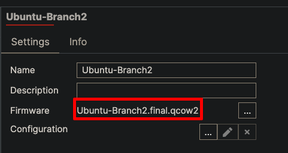
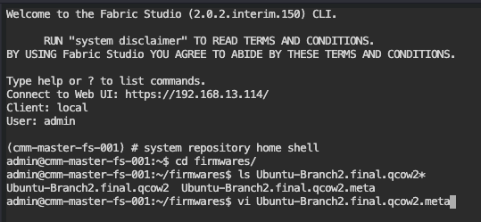
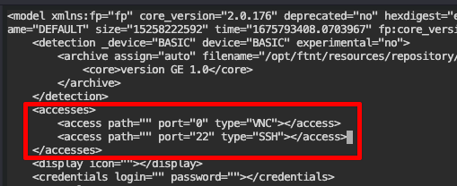
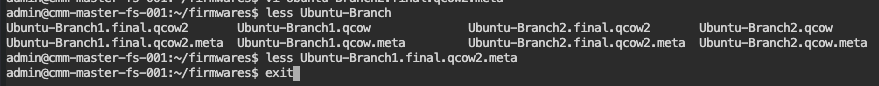
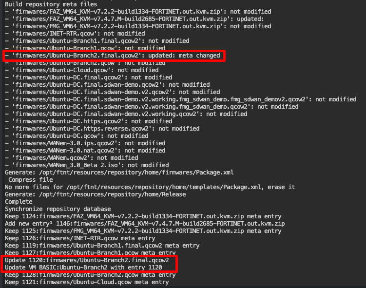
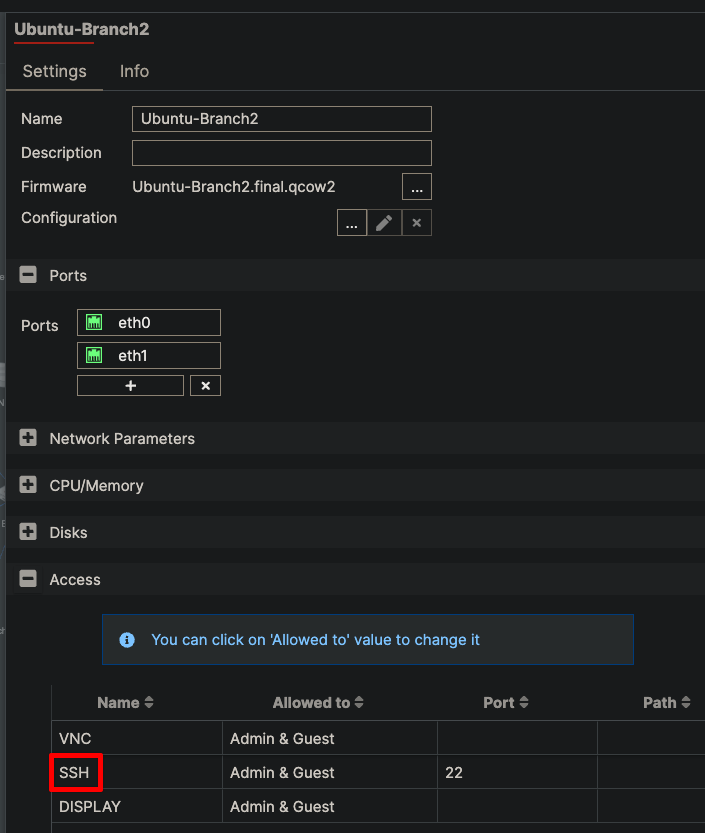
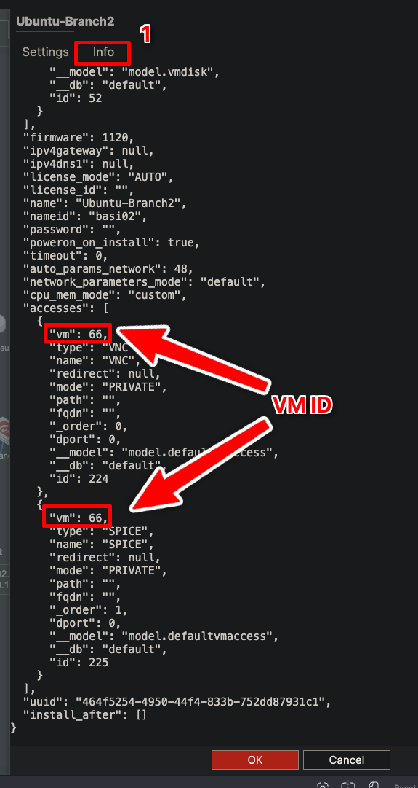

# Troubleshooting Guide

This guide covers common issues you may encounter when using Fabric Studio and provides step-by-step solutions.

## Unable to SSH to Device

If you cannot SSH to a device from outside the Fabric Studio native console, SSH access may be disabled at either the global or device level.

### Understanding SSH Access Levels

**Global Settings Impact:**
- By default, SSH access via public internet is **disabled**
- **Admin & Guest** setting means you **must** be logged into the Fabric Studio web frontend to access devices via SSH web frontend

### Global Settings Configuration

First, verify SSH access is enabled at the system level:

1. Navigate to **System > Settings** in Fabric Studio
2. Ensure both **HTTPS** and **SSH** ports are enabled


### Device Level Configuration

After confirming global settings, configure device-specific access:

#### Step 1: Access Device Configuration
1. In the Fabric configuration, **right-click** your device
2. Select **Edit** from the context menu


#### Step 2: Modify Access Settings
1. Scroll down to the **Access** section
2. **Expand** the Access section
3. Change both **HTTPS** and **SSH** settings:
   - From: `Admin & Guest`
   - To: `Any`


{}
**Additional Resources:** For comprehensive information on Security Policies, visit the [Fabric Studio Documentation](https://register.fabricstudio.net/docs/fabric-studio/2.0.2/security.html#ssh-access-to-device)
{}

## Adding SSH Access When Not Listed

If SSH is not available in the Access section, you'll need to manually add it by modifying the device meta file.

### Prerequisites

Before proceeding, note your device's firmware name. In this example: `Ubuntu-Branch2.final.qcow2`



### Step-by-Step Process

#### Step 1: Access CLI
Open the CLI interface in Fabric Studio.

#### Step 2: Navigate to Firmware Directory
```bash
system repository home shell
cd firmwares/
```

#### Step 3: Edit Meta File
Replace `<firmware-name>` with your actual firmware name:
```bash
vi <firmware-name>.meta
# Example: vi Ubuntu-Branch2.final.qcow2.meta
```



#### Step 4: Add SSH Access Entry
1. Use arrow keys or press `j` to navigate to the **accesses** section
2. Position cursor on the **VNC access line**
3. Press `o` to create a new line below VNC
4. Paste the following line:
   ```xml
   <access path="" port="22" type="SSH"></access>
   ```

You should now see two access entries:



#### Step 5: Save Changes
1. Press `ESC` to exit insert mode
2. Type `:wq` (write and quit)
3. Press `Enter` to confirm

#### Step 6: Verify Changes (Optional)
```bash
less <firmware-name>.meta
# Press 'q' to exit viewer
```

#### Step 7: Return to Main Shell
```bash
exit
```



### Repository Synchronization

{}
**Important:** After modifying meta files directly, you **must** inform Fabric Studio of changes by performing a repository sync.
{}

#### Refresh Repository
```bash
system repository home refresh
```

The refresh command will display changes made to your firmware's meta file:



### Verify and Apply Changes

#### Step 1: Confirm UI Changes
1. Navigate back to the Fabric Studio UI
2. **Refresh** the page
3. Open the modified device
4. Confirm **SSH** is now available in the Access section



#### Step 2: Sync Device Configuration
The meta file changes won't take effect on installed fabrics until you perform a device sync:

1. Initiate a **Sync** on the device
2. During sync/install, verify that Fabric Studio creates a port forward for SSH


## Adding HTTP/HTTPS Access When Not Listed

If HTTPS access is missing from your device configuration, follow these steps to add it manually.

### Initial Assessment

When HTTPS is not listed in the Access section:


### Step-by-Step Process

#### Step 1: Locate VM ID
1. Click the **Info** tab
2. Scroll down to view the **JSON format** of access settings
3. Note the **VM ID** from the `vm` field (example: `66`)



#### Step 2: Access SSH Interface
Click the **SSH** button in Fabric Studio:


#### Step 3: Create HTTPS Access
Execute the following command, replacing `66` with your actual VM ID:

```bash
model vm access create '{"vm": 66, "type": "HTTPS", "mode": "PRIVATE", "name": "HTTPS", "dport": 443}'
```

## Additional Resources

For more comprehensive troubleshooting assistance, consult the [Fabric Studio Documentation](https://register.fabricstudio.net/docs/fabric-studio/2.0.2/troubleshooting.html) which covers:

- **Fabric Studio Logs** - Analyzing system logs for debugging
- **SystemD Journal Logs** - Service-level log analysis
- **Network Packet Sniffing** - Traffic analysis and debugging
- **Storage Issues** - Resolving out-of-space errors
- **File Transfer Problems** - Fixing SCP transfer failures

{}
**Pro Tip:** Always verify changes at both the global and device level when troubleshooting access issues. Many problems stem from mismatched security settings between these two levels.
{}