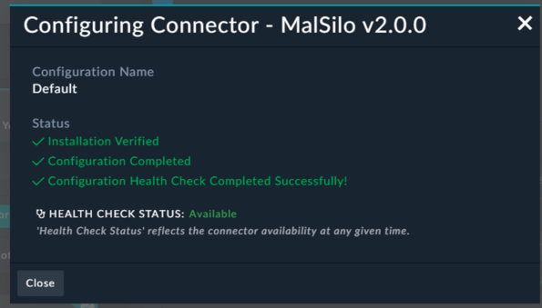

This page gives you a high-level tour of what makes up a FortiSOAR connector before you start building one. Every connector, no matter how complex, is built from two core components: **Configuration** and **Operations**.

{}
**Prerequisites:** Before continuing, you should have a basic understanding of file and folder structure and be comfortable reading JSON. If you need a refresher on JSON, see the [Working with JSON]() section of the Python Primer.
{}

---

## 1. Configuration

The **Configuration** section defines how the connector authenticates and connects to an external system. Think of it as the connector's "settings page" that an admin fills in once so all operations can reuse the same connection details.

### What goes in a configuration?

Every configuration stores reusable connection details. The most common fields are:

| Field | Purpose | Example |
|---|---|---|
| **Server URL** | Base address of the external API | `https://otx.alienvault.com` |
| **API Key** | Key passed in a header or query parameter | `a1b2c3d4e5...` |
| **Username / Password** | Basic authentication credentials | `admin` / `********` |
| **OAuth Token** | Token-based authentication for modern APIs | `Bearer eyJhbG...` |
| **Verify SSL** | Whether to validate the server's SSL certificate | `true` / `false` |
| **Port** | TCP port if the API uses a non-standard port | `8443` |

### Multiple configurations

A single connector can have **more than one configuration**. Click **Add Configuration** to create additional entries. This is useful when you need to connect to multiple instances of the same product, for example:

- A **development** instance and a **production** instance
- Separate instances in **different regions** or tenants
- Different accounts with **different permission levels**

### Health check

Every configuration has a **health check** that validates whether the connector can actually reach the external system with the settings you provided. When you click the health check button, the connector makes a lightweight API call (usually to a `/ping` or
`/health` endpoint) and reports success or failure.

A passing health check confirms three things: the URL is reachable, the credentials are valid, and the network path is open.

---

## 2. Operations

The **Operations** section defines the actions a connector can perform. Each operation maps to a specific API endpoint on the external system and becomes available as a step in FortiSOAR playbooks.

### How operations work

- Each action is a **separate operation** (e.g., `get_ip_reputation`, `block_domain`, `search_alerts`).
- Operations use the **configuration** you set up above to authenticate to the external system.
- Most operations accept **parameters** - inputs that tell the operation what to act on (an IP address to look up, a domain to block, a search query to run).
- Operations return **JSON** back to FortiSOAR, which playbooks can then use to make decisions, enrich records, or trigger follow-up actions.
---

## 3. How it all maps to info.json

Everything you see in the configuration and operations UI is defined in a single file: `info.json`. This is the heart of every connector.

| UI Section                    | info.json Section         | What it defines                                                     |
|-------------------------------|---------------------------|---------------------------------------------------------------------|
| Connector name, version, logo | Top-level metadata        | `name`, `version`, `label`, `category`                              |
| Configuration fields          | `configuration.fields`    | Each field (URL, API key, etc.) with its type, name, and validation |
| Operations list               | `operations`              | Each action with its name, description, and parameters              |
| Operation parameters          | `operations[].parameters` | Each input field for an operation (type, required, tooltip)         |

{}
When you use the RDK's Configuration or Operations tabs, you're editing `info.json` through a visual interface. When you edit `info.json` directly in the code editor, the RDK tabs update to reflect your changes. They are two views of the same file.
{}

---

## 4. Hands-on - Explore a real connector

Now that you understand the two components, let's look at a real connector from the FortiSOAR Content Hub.

### Step 1 - Find and install a connector

1. In FortiSOAR, navigate to **Content Hub** and open the **Discover** tab.
2. Browse or search for a connector that interests you. Some good ones to explore:
   
   | Connector          | Why it's interesting                             |
   |--------------------|--------------------------------------------------|
   | **AlienVault OTX** | Simple API key auth, several lookup operations   |
   | **VirusTotal**     | Multiple operation types (IP, domain, file hash) |
   | **AbuseIPDB**      | Clean example of a single-purpose connector      |

3. Click into the connector and click **Install**.

### Step 2 - Analyze the configuration

Once installed, open the connector and look at its configuration page.

- What fields does it require? (URL, API key, OAuth, something else?)
- Does it have a **Verify SSL** toggle?
- Run the **health check** - does it pass or fail? Why?

### Step 3 - Analyze the operations

Switch to the operations list.

- How many operations does the connector have?
- Pick one operation and look at its **parameters**. Which are required? Which are optional?
- What kind of **JSON response** does the operation return?

### Step 4 - Look at info.json

Now open the connector in the editor and navigate to `info.json`.

- Can you find the `configuration.fields` section? Do the fields match what you saw in the UI?
- Can you find the `operations` array? Do the operation names match the actions you saw?
- Pick one operation and compare its `parameters` array to the input fields in the UI.

{}

The structure should look familiar from this page:

- The **configuration fields** in the UI map directly to objects in `configuration.fields`, each with a `name`, `type`, `required`, and `title`.
- Each **operation** in the UI maps to an object in the `operations` array with an `operation` (API name), `title`, `description`, and `parameters` list.
- The **parameters** for each operation follow the same structure as configuration fields - `name`, `type`, `required`, `editable`, `visible`, and optionally `tooltip` and `value`.

This is the same structure you'll use when building your own connector in the next section.

{}

---

## Key takeaways

- Every connector has two core parts: **Configuration** (connection settings) and **Operations** (actions).
- Configuration stores reusable details like URLs and credentials. You can have multiple configurations per connector.
- Operations are the actions playbooks call. They accept parameters and return JSON.
- Everything is defined in `info.json` - the UI and the file are two views of the same data.
- The **health check** validates your configuration before you run any operations.