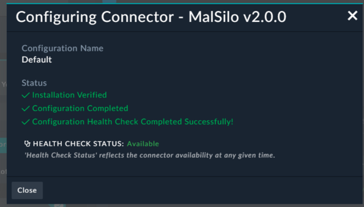
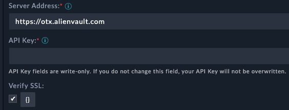
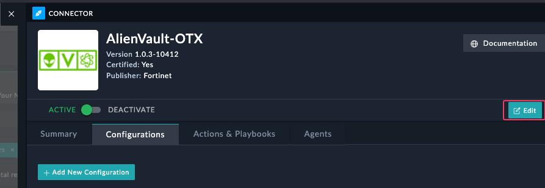
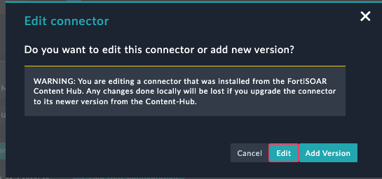
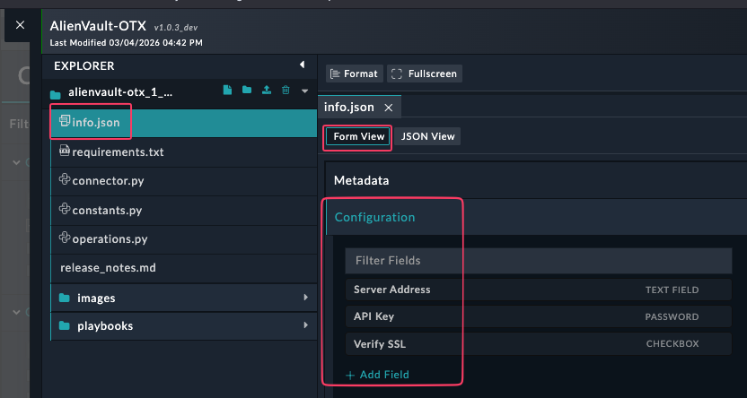
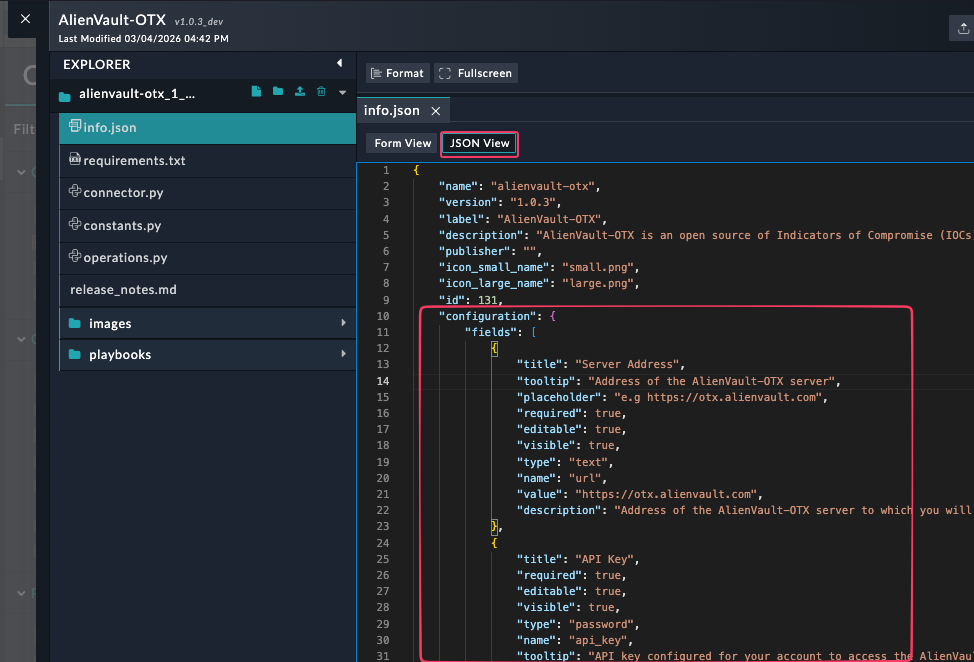
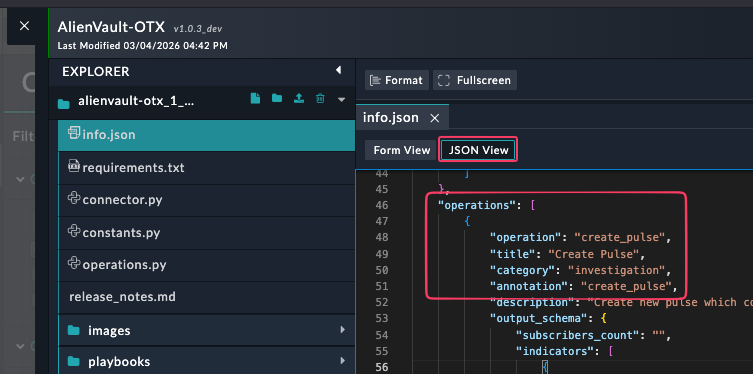
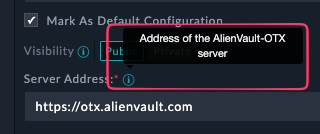

This page connects the **FortiSOAR UI** to the **connector files** you edit as a developer. Every connector, whether simple or complex, comes down to two building blocks:

- **Configuration**: how FortiSOAR stores reusable connection/auth settings (URL, API key, etc.)
- **Operations**: the actions the connector exposes to playbooks (Get Alerts, Block IP, Lookup Domain, etc.)

By the end, you’ll be able to open an existing connector and answer:

1) “Where does this UI field live in `info.json`?”
2) “How does this playbook action map to code?”

---

## Prerequisites

### FortiSOAR 7.6.4+ requirement (BYOC)

From FortiSOAR **7.6.4**, uploading/editing/debugging connectors requires enabling **Build Your Own Connector (BYOC)** under **Gear Icon > System Configuration → Advanced Development Features**.


---

## Connector file structure

At minimum, a connector contains 3 files:

```bash
connector/
├── info.json
├── connector.py
└── operations.py
````

- `info.json`: defines what users see in the UI (fields, actions, labels, validation).
- `connector.py` / `operations.py`: implements the behavior (auth, API calls, responses).

> Mental model: **`info.json` defines the interface** (UI + action schema). **Python implements the behavior.**

---

## Part 1 - Configuration

Configuration is the connector’s reusable connection/auth settings. An admin fills these in once, and all operations reuse them.


### What usually goes into configuration?

Common fields:

| Field | Purpose | Example |
|---|---|---|
| Server URL | Base address of the external API | `https://otx.alienvault.com` |
| API Key | Token sent in a header/query | `a1b2c3...` |
| Username/Password | Basic auth credentials | `admin` / `********` |
| Verify SSL | Validate server certificate | `true` / `false` |
| Port | Non-standard API port | `8443` |

### Multiple configuration support

A single connector can support **multiple configurations** (dev/prod, regions, tenants, different accounts).

### Health check

Each configuration can run a **health check** to confirm:

- URL is reachable
- credentials are valid
- network path is open



---

## Part 2 - Operations (the playbook actions)

Operations are the actions your connector exposes to playbooks (e.g., “Get Alerts”, “Block IP”). Each operation typically maps to one or more API endpoints.


Inside playbooks, operations appear as selectable actions with input fields:


### Operation basics

- Each action is a single **operation** (e.g., `get_alerts`, `block_ip`)
- Operations use the chosen **configuration** (URL/credentials/etc.)
- Operations accept **parameters** (inputs)
- Operations return **JSON** to FortiSOAR (used by later playbook steps)

---

## Part 3 - How the UI maps to `info.json`

Everything you see under **Configuration** and **Actions & Playbooks** is defined in `info.json`.

| UI Section | `info.json` section | What it defines |
|---|---|---|
| Connector identity (name/version/logo) | Top-level metadata | `name`, `label`, `version`, `category`, icons |
| Configuration page fields | `configuration.fields` | URL, API key, toggles, validation, required-ness |
| Actions list | `operations` | action name/title/description/enabled |
| Action input fields | `operations[].parameters` | each parameter field (type, required, tooltip) |

---

## `info.json` in depth

### 1) Metadata (top-level keys)

These are the fields that identify the connector.

#### Essential fields

| Field | Description | Example |
|---|---|---|
| `name` | internal API name (kebab-case) | `"sample-connector"` |
| `label` | display name in UI | `"Sample Connector"` |
| `version` | semantic version | `"1.0.0"` |

{}

| Field | Description | Example |
|---|---|---|
| `description` | what the connector does | `"Connector description..."` |
| `publisher` | publisher name/email | `"anonyges@gmail.com"` |
| `cs_approved` | CS approved flag | `true/false` |
| `cs_compatible` | CS compatible flag | `true/false` |
| `category` | category array | `["Analytics and SIEM"]` |
| `icon_small_name` | small icon filename | `"connector_logo_small.png"` |
| `icon_large_name` | large icon filename | `"connector_logo_large.png"` |

{}

---

### 2) Configuration: `configuration.fields`

Each entry in `configuration.fields` becomes a field on the connector configuration page.

Common keys you’ll use:

{}

| Key | Type | Description |
|---|---|---|
| `title` | string | Display name shown in UI |
| `name` | string | Internal identifier used in code |
| `type` | string | `text`, `password`, `checkbox`, `integer`, `json`, etc. |
| `required` | boolean | Must be filled to save/run |
| `editable` | boolean | Can user edit |
| `visible` | boolean | Show/hide field |
| `tooltip` / `description` | string | Help text |
| `validation` | object | regex + error text |

{}

Validation object:

```json
{
  "pattern": "regex pattern for validation",
  "patternError": "Error message if validation fails"
}
````

Example:

```json
{
  "configuration": {
    "fields": [
      {
        "title": "URL",
        "type": "text",
        "name": "url",
        "required": true,
        "visible": true,
        "editable": true,
        "validation": {
          "pattern": "^https?://...",
          "patternError": "Server URL must begin with https and end without '/'. Port number can be added, e.g. https://example.com:80."
        }
      }
    ]
  }
}
```

---

### 3) Operations: `operations[]`

Each object in `operations` becomes a playbook action.

Operation structure:

| Key           | Type    | Description                          |
| ------------- | ------- | ------------------------------------ |
| `operation`   | string  | internal operation id (used by code) |
| `title`       | string  | display name in UI                   |
| `description` | string  | what it does                         |
| `parameters`  | array   | input fields for the action          |
| `enabled`     | boolean | show/hide action                     |

Parameter fields follow the same shape as configuration fields.

Example:

```json
{
  "operations": [
    {
      "operation": "get_alerts",
      "title": "Get Alerts",
      "description": "Gets sample alerts from Demo SIEM",
      "parameters": [
        {
          "title": "Alert Index Start Time",
          "type": "datetime",
          "name": "start_time",
          "required": true,
          "visible": true,
          "editable": true
        },
        {
          "title": "Alert Index End Time",
          "type": "datetime",
          "name": "end_time",
          "required": true,
          "visible": true,
          "editable": true
        }
      ],
      "enabled": true
    }
  ]
}
```

{}
Parameters aren’t always required, but they’re commonly used for filtering (time ranges, severity, query strings) and for “action” targets (IP/domain/user).
{}

---

## Hands-on labs

### Lab 1 - Reverse-engineer a real connector (10–15 min)

Goal: prove you can map the**UI → `info.json`** of a connector.

1. Install a connector from the **Discover Tab** (example: AlienVault OTX).
2. Open **Configurations**:
    
    * List the fields you see (URL, API key, Verify SSL, etc.).
    * Run the **Health Check**. Note what “success” confirms.
3. Open **Actions & Playbooks**:
    * Identify an action
      
4. Open the connector’s `info.json`:
    
    * Find `configuration.fields` and confirm those fields match the UI.
    * Find the `operations` entry for the action you chose and confirm the `parameters` match.

Success criteria: you can point to the exact JSON object that created each UI field.

{}

1. In the **Discover Tab**, search for "AlienVault OTX" and install the connector.
   
      
2. Note the connector's **Configurations** fields
   
4. Edit the connector's `info.json` file.
   
   
5. Locate `configuration.fields` and verify it matches the UI fields.
   
   
6. Find the `operations` entry for the chosen action and confirm parameter matches.
   

{}

---

### Lab 2 - Make a tiny, safe edit (5 min)

Goal: experience the “edit JSON → UI updates” loop.

Pick ONE:

* Add a tooltip to an existing configuration field, or
* Change the `title` of an operation parameter (UI label only)

Re-open the UI and confirm your change appears.

Success criteria: you changed UI behavior without touching Python.

{}

#### Option A — Add a tooltip to a configuration field (recommended)

1. Open the connector’s **Configurations** tab and identify a field to modify (for example, the **Server Address** or **API Key** field).
   
    

2. Open and edit the connector’s `info.json`.
   
   
   

3. Locate the `configuration.fields` section.
   
   
   

4. In the field object you chose, add (or update) the tooltip key to display a help text
   
   Example (edit only the selected field object):
   ```json
   {
     "name": "server_url",
     "title": "Server Address",
     "type": "text",
     "required": true,
     "tooltip": "Paste the base URL only (no trailing slash). Example: https://otx.alienvault.com"
   }
   ```

5. Save `info.json`, return to **Configurations**, and confirm the tooltip/help text appears when you hover the info icon or focus the field.

   

---

#### Option B — Change the UI label of an operation parameter

1. Go to **Actions & Playbooks** and pick an action to inspect.

   

2. Open and edit the connector’s `info.json`.

   
   

3. Find the matching `operations` entry for the action you selected, then locate its `parameters`.

   

4. Change the parameter’s `title` (this changes the label shown in the playbook UI—safe edit).

   Example (edit only the `title`):

   ```json
   {
     "name": "indicator_type",
     "title": "Indicator Type (Domain/IP/URL)",
     "type": "text",
     "required": true
   }
   ```

5. Save `info.json`, reopen the playbook action UI, and confirm the field label changed.

---

**If your change doesn’t show up**

* Double-check you edited the correct connector/version (it’s easy to have multiple installed).
* Confirm the JSON is valid (a missing comma/brace can prevent the UI from loading updates).
* If the connector UI seems “stale,” refresh the page and re-open the connector configuration/action panel.

{}


---

### Lab 3 - Add one optional parameter (10–20 min)

Goal: understand how “optional inputs” improve usability.

1. Choose an existing operation (e.g., Get Alerts).

2. Add an optional parameter such as:
    
    * `severity` (select), or
    * `limit` (integer), or
    * `query` (text)

3. In code, read the parameter and pass it through to the API call (or log it for now if you’re stubbing).

✅ Success criteria: parameter shows in playbook UI AND your operation can read it.
