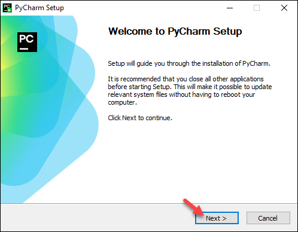
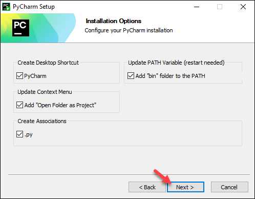
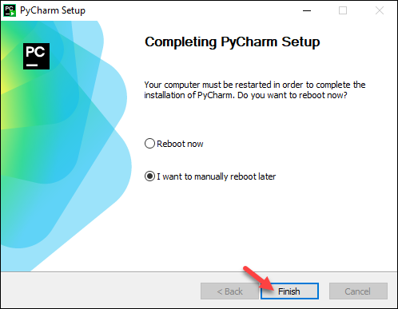
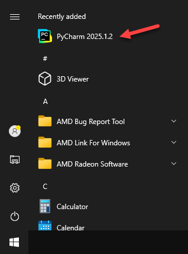

This guide walks you through installing **PyCharm**, using **uv** to install **Python**, and creating your first project to verify everything works.

---

## 1. Install PyCharm

Download and install PyCharm for your operating system.


{}

### Download

1. Download the [PyCharm installer (.exe)](https://www.jetbrains.com/pycharm/download/#section=windows) from JetBrains.
   

2. Run the installer and follow the wizard steps. Click **Next**
   
3. Choose the installation location, the default location should be fine. Click **Next**
4. Select the desired installation options. I recommend checking all the options.
   
5. Select an existing Start menu folder or create a new one. The folder contains the application shortcut in the Start menu. Click **Install** to begin the installation.
   
6. Once completed, choose whether to reboot immediately or manually at a later time. Click **Finish** to complete the installation.
   
7. PyCharm is now available from the start menu. (The version may be different on yours, that's ok!)
   

### Launch PyCharm

To run PyCharm, find it in the **Windows Start menu** or use the **desktop shortcut**. You can also run the launcher batch script or executable in the installation directory under `bin`.

When you run PyCharm for the first time, you can take several steps to complete the installation, customize your instance, and start working with the IDE.

{}
{}

### Download

1. Navigate to the [PyCharm downloads page](https://www.jetbrains.com/pycharm/download/#section=mac) from JetBrains.
2. Select the processor type (Intel or Apple Silicon) and click Download.
   

2. Open the `.dmg` file and drag **PyCharm** into the **Applications** folder.
   

### Launch PyCharm

Open PyCharm from **Applications** or use **Spotlight** (`Cmd + Space` → type "PyCharm"). When you run PyCharm for the first time, macOS may ask you to confirm that you want to open an application downloaded from the internet. Click **Open** to proceed.


{}


---

## 2. Install uv

**uv** is a fast Python package and project manager written in Rust. We'll use it to install Python itself.


{}

Open **PowerShell** and run:

```powershell
powershell -ExecutionPolicy ByPass -c "irm https://astral.sh/uv/install.ps1 | iex"
```

After installation, **restart your terminal** so that the `uv` command is available on your PATH.

Verify the installation:

```powershell
uv --version
```

{}
{}

Open **Terminal** and run:

```bash
curl -LsSf https://astral.sh/uv/install.sh | sh
```

After installation, **restart your terminal** (or run `source $HOME/.local/bin/env`) so that the `uv` command is available on your PATH.

Verify the installation:

```bash
uv --version
```

{}


---

## 3. Install Python with uv

With uv installed, you can install Python in a single command. This works the same on both operating systems.

```bash
uv python install 3.12
```

Verify Python is available:

```bash
uv python list
```

You should see Python 3.12 listed in the output.

---

## 4. Create your first project

Now let's create a project using PyCharm's built-in wizard, configured to use **uv** as the interpreter type.

### Create a new project in PyCharm

1. Launch **PyCharm**.
2. On the Welcome screen, click **New Project**.
3. In the **New Project** dialog, configure the following:
   
   | Setting              | Value                                                                       |
   |----------------------|-----------------------------------------------------------------------------|
   | **Project type**     | Select **Pure Python** from the left sidebar.                               |
   | **Location**         | Choose where to save your project (e.g., `PycharmProjects/MyFirstProject`). |
   | **Interpreter type** | Click **uv**.                                                               |
   | **Python version**   | Select **3.12** from the dropdown.                                          |
   | **Path to uv**       | PyCharm should auto-detect the uv binary. If not, set it manually.          |
   
   The default uv path on Windows is `%USERPROFILE%\.local\bin\uv.exe`
   The default uv path on Mac is `$HOME/.local/bin/uv`
   
   You'll see a note confirming that a uv environment will be created in the project root (`.venv`).

4. Optionally check **Create Git repository** if you want version control from the start.
    
5. Click **Create**.

## TODO (Finish this)
### Run a test script

1. In the PyCharm project explorer, right-click the project root and select **New → Python File**. Name it `hello.py`.
2. Add the following code:
   
   ```python
   import sys

   def main():
       print("Hello from PyCharm!")
       print(f"Python version: {sys.version}")
       print("Your environment is set up correctly.")

   if __name__ == "__main__":
       main()
   ```

3. Right-click the file in the editor and select **Run 'hello'**, or press `Ctrl+Shift+F10` (Windows) / `Ctrl+Shift+R` (macOS).

You should see output similar to:

```text
Hello from PyCharm!
Python version: 3.12.x (main, ...) [...]
Your environment is set up correctly.
```
