This guide teaches you the fundamentals of **debugging** in PyCharm. You'll learn how to pause your code mid-execution, inspect what's happening, and step through it line by line to find and fix bugs. Debugging is crucial when working with complex code, and especially so when troubleshooting other people's code.

{}
This page assumes you have completed [Installing PyCharm, UV, and Python]() and have a working PyCharm project.
{}

---

## 1. What is debugging?

When your code doesn't behave the way you expect, you need a way to look "inside" it while it runs. That's what a **debugger** does. Instead of sprinkling _print()_ statements everywhere, the debugger lets you:

- **Pause** execution at any line you choose (a *breakpoint*).
- **Inspect** the current value of every variable.
- **Step** through code one line at a time to see exactly what happens.
- **Resume** execution and jump to the next breakpoint.

---

## 2. Create the practice file

We need some code that has a bug in it so we have something to debug. We'll create a simple function that calculates the average for a list of numbers.

1. In the project directory, Click the **+** icon to create a new file, then click **Python File** Name it `debug_me`, and click **Python File**.
   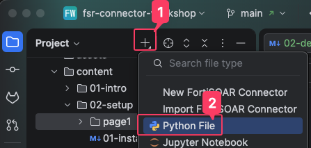
   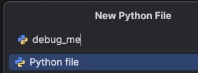
2. Your directory should now look like this:
   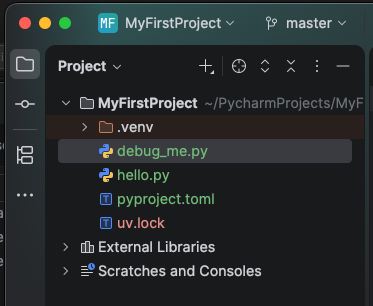
2. Paste the following code into the file:
   
   ```python
   def calculate_average(numbers):
       total = 0
       for number in numbers:
           total = total + number
       average = total / len(numbers)
       return average


   def main():
       grades = [85, 90, 78, 92, 88]
       average = calculate_average(grades)
       print(f"Average grade: {average}")

       empty_list = []
       average2 = calculate_average(empty_list)
       print(f"Average of empty list: {average2}")
    
    main()
   ```

3. Run the file (**Right-click → Run 'debug_me'**, or `Ctrl+Shift+F10` / `Ctrl+Shift+R`).

You should see it crash with a `ZeroDivisionError`. There will also be the successful output from the first list of grades.

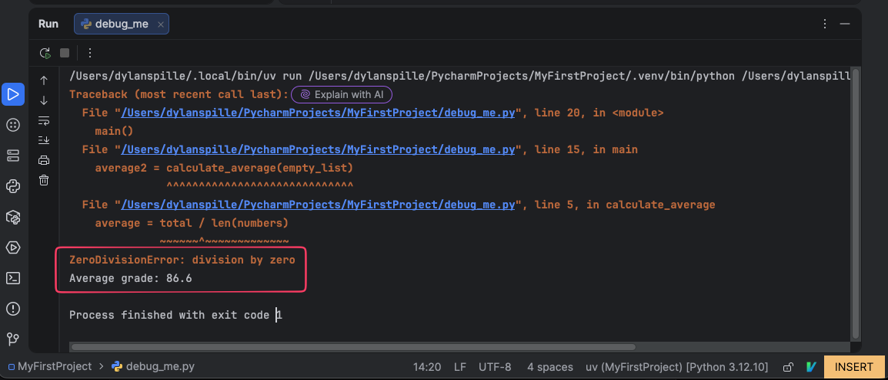

{}
Notice how the error traceback message points to line 5 (`average = total / len(numbers)`). This gives us a hint on where to take a deeper look at the faulty logic.
{}

---

## 3. Set a breakpoint

A **breakpoint** tells PyCharm: *"Pause here before running this line."*

1. Open `debug_me.py` in the editor.
2. Find line 10, which is the line that reads `grades = [85, 90, 78, 92, 88]`.
3. Click in the **gutter** (the grey strip to the left of the line numbers). The red dot that appears is your breakpoint.
   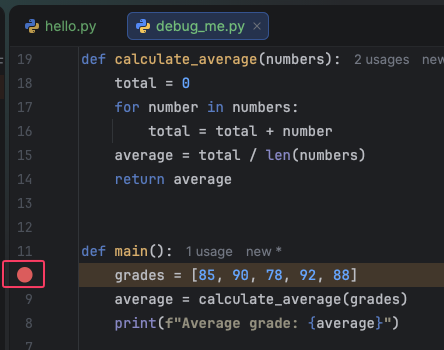

{}
You can also toggle a breakpoint by placing your cursor on a line and pressing `Ctrl+F8` (Windows) / `Cmd+F8` (macOS).
{}

---

## 4. Start the debugger

Running in **debug mode** is different from a normal run — it tells PyCharm to watch for your breakpoints.

1. **Right-click** `debug_me.py` in the editor and select **Debug 'debug_me'** (not "Run").
   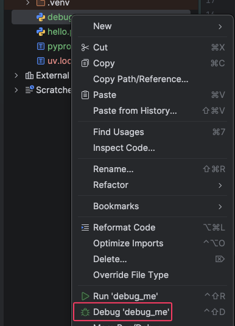
2. Alternatively, click the **bug icon** in the top-right toolbar.
   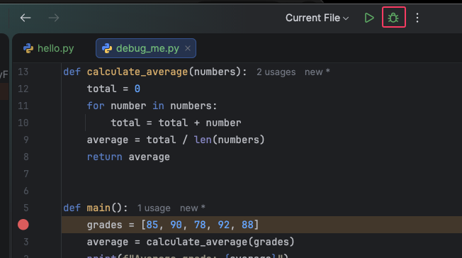

PyCharm will start your script and immediately pause at line 10. The line is highlighted in blue, meaning it has **not yet executed**.
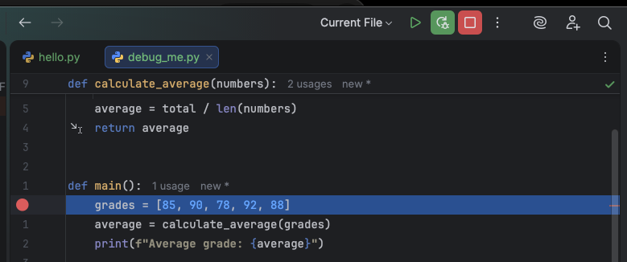

---

## 5. Explore the debugger panel

When execution is paused, a **Debug** panel appears at the bottom of PyCharm. It has several important tabs:

| Tab           | What it shows                                         |
|---------------|-------------------------------------------------------|
| **Frames**    | The call stack, or which function called which.       |
| **Variables** | All variables currently in scope and their values.    |
| **Console**   | The program's standard output (print statements).     |
| **Watches**   | Custom expressions you want to track (covered below). |

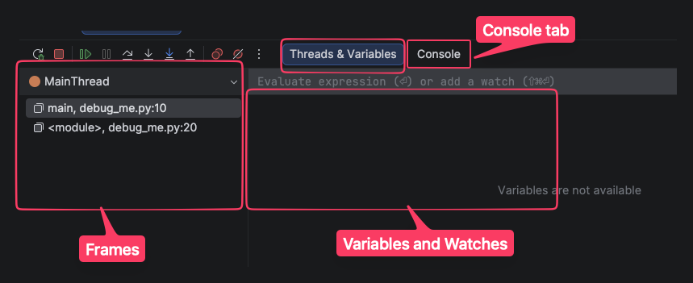

Take a look at the **Variables** tab. Right now there are no variables that have declared at this point. Later in the code you would see `grades`, `average`, and any other variables that defined within the scope of the function.

---

## 6. Stepping through code

The debugger toolbar gives you buttons to control execution. Here are the essential ones:

| Action        | Icon | Windows shortcut | macOS shortcut | What it does                                                                                   |
|---------------|------|------------------|----------------|------------------------------------------------------------------------------------------------|
| **Resume**    | ▶️   | `F9`             | `F9`           | Continue running until the next breakpoint (or the end of the program).                        |
| **Step Over** | ⤵️   | `F8`             | `F8`           | Execute the current line, then pause at the next line. Doesn't go inside function calls.       |
| **Step Into** | ⬇️   | `F7`             | `F7`           | If the current line calls a function, jump **into** that function and pause at its first line. |
| **Step Out**  | ⬆️   | `Shift+F8`       | `Shift+F8`     | Run the rest of the current function and pause when it returns to the caller.                  |

{}
Hover over other buttons to see the name and the shortcut
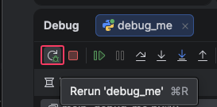
{}

### Try it out

With execution paused on line 10:

1. Press **F8** (Step Over) once. The highlight moves to line 11. In the **Variables** tab you can see `grades` now has a value: `[85, 90, 78, 92, 88]`.
   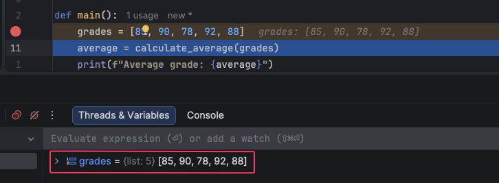
2. Line 11 calls `calculate_average(grades)`. Press **F7** (Step Into). You jump into the function on line 2 (`total = 0`).
   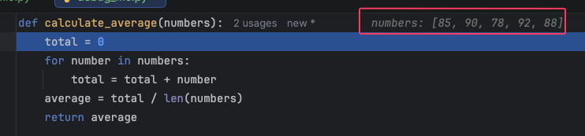
3. Press **F8** a few more times and watch `total` increase in the Variables tab as the loop runs.
   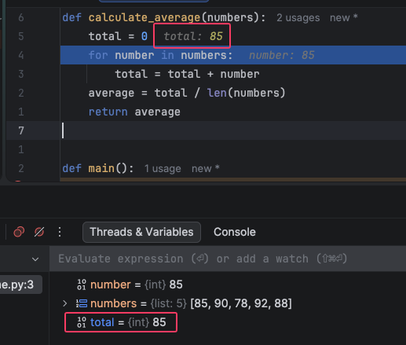
4. Press **Shift+F8** (Step Out) to finish the function and return to `main()`.
5. Press **Step Over** once more to see the output from the calculate average function
   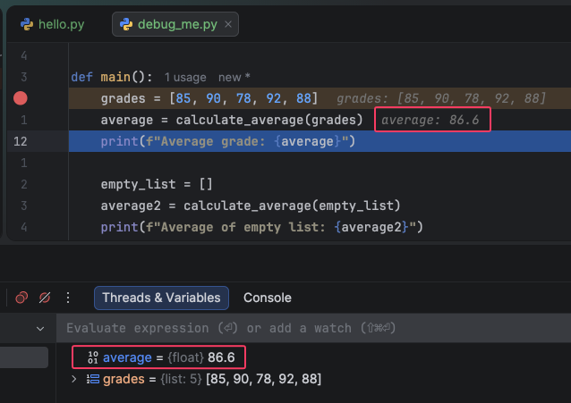

---

## 7. Inspect and watch variables

### Hover to inspect

While paused, **hover your mouse over any variable** in the editor. PyCharm shows a tooltip with its current value.

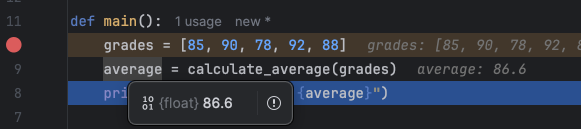

### Add a watch expression

A **watch** lets you track a custom expression across steps — not just a single variable.

1. Type an expression, for example: `len(grades)` or `total / len(grades)`. Click the **+** icon.
   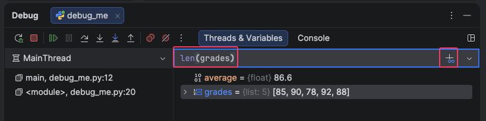
2. The expression is evaluated live at every step.
   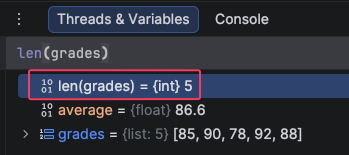

{}
Watches are great for monitoring conditions like `i > 10` or complex expressions like `data["key"]` without modifying your code.
{}

---

## 8. Find and fix the bug

Now let's catch the `ZeroDivisionError` in action.

1. **Stop** the debugger (click the red **Stop** button or press `Ctrl+F2` / `Cmd+F2`).
   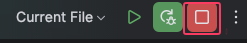
1. **Remove** your current breakpoint on line 10 (click the red dot to toggle it off).
2. **Add a new breakpoint** on line 5 — the line `average = total / len(numbers)`.
3. **Debug** the file again (bug icon or right-click → Debug).
   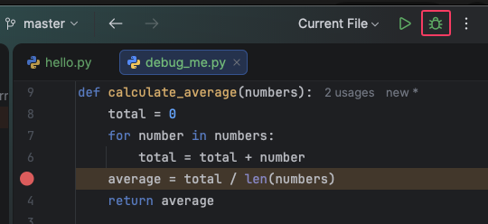

Execution pauses at line 5 the first time inside the call with `grades`. Check the Variables tab:
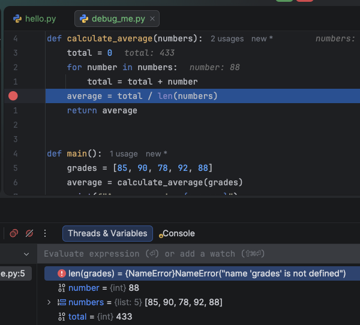

This looks fine. Press **F9** (Resume) to continue to the next time this breakpoint is hit.
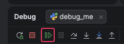

Now execution pauses at line 5 again — this time inside the call with the empty list. Check the Variables tab:

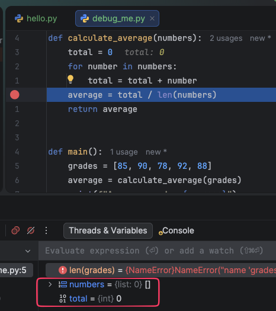

There's the problem: `len(numbers)` is `0`, so `total / len(numbers)` is a division by zero.

Try to fix the bug yourself first before looking at the solution.

{}

### Apply the fix

Stop the debugger and update the function:

```python
def calculate_average(numbers):
    if len(numbers) == 0:
        return 0
    total = 0
    for number in numbers:
        total = total + number
    average = total / len(numbers)
    return average
```

{}

Run the file normally. You should now see:

```text
Average grade: 86.6
Average of empty list: 0
```

No crash, we fixed the bug!

---

## 9. Conditional breakpoints

Sometimes a breakpoint fires too often. You can tell PyCharm to only pause when a **condition** is true.

1. **Right-click** a red breakpoint dot in the gutter.
2. In the popup, enter a condition, for example: `len(numbers) == 0`.
3. Click **Done**.
    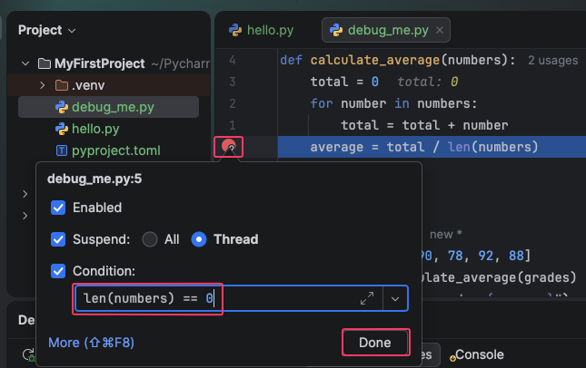
4. Debug the file again.

Now the debugger will only pause on that line when the list is empty. This is extremely useful when debugging loops or functions that get called many times.

---

You should now have a basic understanding of how to use an IDE debugger to find and fix bugs. 