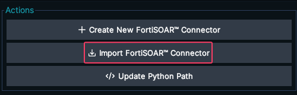
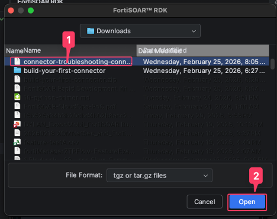
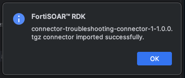
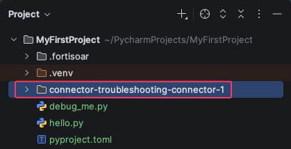

## 4. Import an existing connector

If you already have a connector packaged as a `.tgz` file, you can open it directly in the RDK. You can also export a connector from FortiSOAR and import it into the RDK.

Here is a sample connector you can download and import:
{}

1. Click **FortiSOAR RDK → Import FortiSOAR Connector**.
   
2. Browse to your connector's `.tgz` file and select it. Then click **Open**
   

You should see a message indicating that the connector was successfully imported.

You will also see a new folder in your project explorer. This is the connector files you imported.

3. Open the folder
3. The connector project opens in the RDK interface with its `info.json`, `connector.py`, and any supporting files.

<!--  -->

---

## 5. Using the RDK

Once the plugin is installed and configured, here are the core workflows you'll use during development.

### Test configuration (health check)

1. Select your connector configuration from the dropdown.
2. Click **Run** to execute the health check.
3. View the result in the output panel — a successful check confirms your credentials and connectivity.

### Test operations

1. Navigate to the **Operations** tab.
2. Select an operation from the list.
3. Fill in the required test parameters.
4. Click **Execute Action**.
5. Review the output and debug as needed.

{}
You can use PyCharm's built-in debugger alongside the RDK. Set breakpoints in `connector.py` before clicking **Execute Action** and the debugger will pause at your breakpoints. See the [Debug Python Code]() guide for a refresher on breakpoints and stepping.
{}

### Format your code

1. Right-click anywhere in a Python file.
2. Select **Format Document** (or press `Ctrl+Alt+L` / `Cmd+Option+L`).
3. Your code is automatically formatted to follow Python conventions.

### Export a connector

When your connector is ready for deployment:

1. Click **FortiSOAR RDK → Export**.
2. Choose a destination folder.
3. The connector is packaged as a `.tgz` file, ready to upload to FortiSOAR.