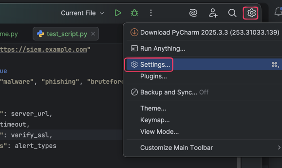
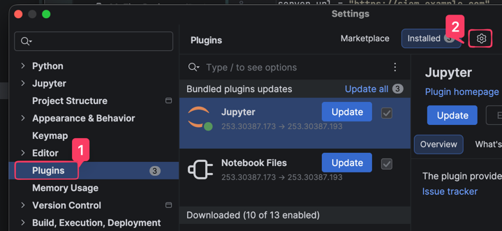
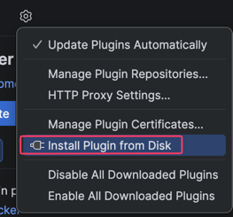
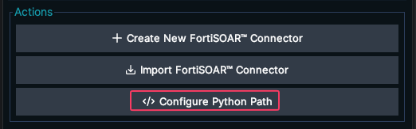
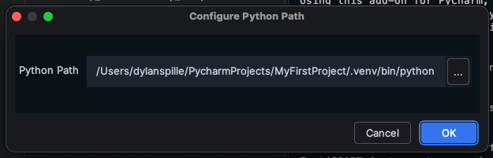
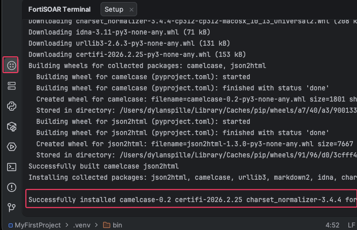
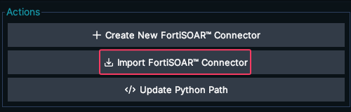
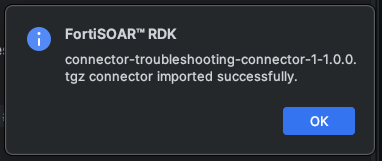
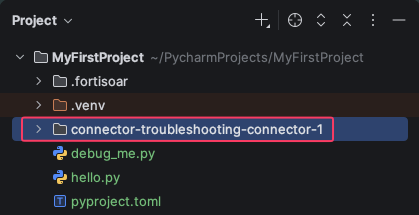

The **FortiSOAR RDK** (Remote Development Kit) is a PyCharm plugin that lets you develop, test, and package connectors without leaving your IDE. In this section you'll install the plugin, connect it to your Python environment, and learn how to use its core features.

---

## Prerequisites

Before installing the RDK, make sure you have the following ready:

| Requirement          | Details                                                  |
|----------------------|----------------------------------------------------------|
| **PyCharm**          | Community or Professional edition installed and running. |
| **Python Installed** | Installed via uv (or another method).                    |

{}
If you haven't installed PyCharm or Python yet, complete the [Installing PyCharm, UV, and Python]() guide first. That guide covers installing PyCharm, setting up uv, and installing Python 3.12.
{}

---

## 1. Download the SOAR RDK plugin

1. Download the RDK `.zip` file to the machine where PyCharm is installed.
   
   {}

{}
Do **not** unzip the file. PyCharm expects the plugin as a `.zip` archive.
{}

---

## 2. Install the plugin in PyCharm

1. Open **PyCharm**.
2. Open the Pycharm Settings**Settings**.
    - Windows / Linux: `File → Settings`
    - macOS: `PyCharm → Settings`
      
3. Navigate to the **Plugins** section in the settings, and click the **⚙️ gear icon** at the top of the Plugins panel
   
4. Select **Install Plugin from Disk**
   
6. Browse to the downloaded RDK `.zip` file and select it.

You will see the FortiSOAR RDK plugin listed in the Plugins panel.

7. Click **Apply**, then **OK**
   

You should see a **FortiSOAR RDK** entry in the PyCharm toolbar.
    


---

## 3. Configure the Python environment

The RDK needs to know where your Python interpreter lives so it can install its dependencies.

1. Click **FortiSOAR RDK** from the toolbar.
2. Select **Configure Python Path**.
   
3. Point to your Python 3 installation.
   
   
   {}
   If you installed Python with uv, the default path is:

```text
   %USERPROFILE%\.local\bin\python.exe
```

You can also find it by running this in PowerShell:

```powershell
   uv python list
```

{}
{}
If you installed Python with uv, the default path is:

```text
   $HOME/.local/bin/python3
```

You can also find it by running this in Terminal:

```bash
   uv python list
```

{}
{}
If you installed Python directly from [python.org](https://www.python.org/downloads/) or the Microsoft Store, the interpreter is usually in one of these locations:

```text
   C:\Users\<YourUsername>\AppData\Local\Programs\Python\Python312\python.exe
   C:\Python312\python.exe
```

Not sure where it is? Open **PowerShell** and run:

```powershell
   where.exe python
```

Or if you have multiple versions:

```powershell
   py --list-paths
```

The `py --list-paths` command shows every Python version installed on your system and its full path. Pick the 3.12 entry.
{}
{}
If you installed Python from [python.org](https://www.python.org/downloads/), Homebrew, or pyenv, the interpreter is usually in one of these locations:

| Installation method | Typical path |
   |---|---|
| **python.org installer** | `/Library/Frameworks/Python.framework/Versions/3.12/bin/python3` |
| **Homebrew** | `/opt/homebrew/bin/python3` (Apple Silicon) or `/usr/local/bin/python3` (Intel) |
| **pyenv** | `$HOME/.pyenv/versions/3.12.x/bin/python3` |
| **macOS system Python** | `/usr/bin/python3` (ships with Xcode Command Line Tools) |

Not sure where it is? Open **Terminal** and run:

```bash
   which python3
```

To see the exact version at that path:

```bash
   python3 --version
```

{}
Avoid using the macOS system Python (`/usr/bin/python3`) for connector development. It is managed by Apple and may be an older version. Prefer a Homebrew, pyenv, or python.org installation instead.
{}
{}


4. Click **OK**. The RDK installs its required dependencies automatically.
    

{}
If you see an error message about a missing `pip` package, you can install it manually by running `python3 -m ensurepip`.
or if uving uv you can run `uv pip install pip`


Then retry the configure python path step.
{}

{}
If the RDK can't find Python, double-check that you ran `uv python install 3.12` (or installed Python 3.12 through another method) and that your terminal can resolve
`python3 --version`. See the [Python installation steps]() for troubleshooting.
{}

When successful, you should see the FortiSOAR Terminal show that it installed a few python packages
    

---

## 4. Import an existing connector

If you already have a connector packaged as a `.tgz` file, you can open it directly in the RDK. You can also export a connector from FortiSOAR and import it into the RDK.

Here is a sample connector you can download and import:
    {}

1. Click **FortiSOAR RDK → Import FortiSOAR Connector**.
    
2. Browse to your connector's `.tgz` file and select it. Then click **Open**
    

You should see a message indicating that the connector was successfully imported.
    

You will also see a new folder in your project explorer. This is the connector files you imported.
    
3. Open the folder
3. The connector project opens in the RDK interface with its `info.json`, `connector.py`, and any supporting files.

<!--  -->

---

## 5. Using the RDK

Once the plugin is installed and configured, here are the core workflows you'll use during development.

### Test configuration (health check)

1. Select your connector configuration from the dropdown.
2. Click **Run** to execute the health check.
3. View the result in the output panel — a successful check confirms your credentials and connectivity.

### Test operations

1. Navigate to the **Operations** tab.
2. Select an operation from the list.
3. Fill in the required test parameters.
4. Click **Execute Action**.
5. Review the output and debug as needed.

{}
You can use PyCharm's built-in debugger alongside the RDK. Set breakpoints in `connector.py` before clicking **Execute Action** and the debugger will pause at your breakpoints. See the [Debug Python Code]() guide for a refresher on breakpoints and stepping.
{}

### Format your code

1. Right-click anywhere in a Python file.
2. Select **Format Document** (or press `Ctrl+Alt+L` / `Cmd+Option+L`).
3. Your code is automatically formatted to follow Python conventions.

### Export a connector

When your connector is ready for deployment:

1. Click **FortiSOAR RDK → Export**.
2. Choose a destination folder.
3. The connector is packaged as a `.tgz` file, ready to upload to FortiSOAR.

---

## Next steps

With the RDK installed you're ready to start building connectors. In the next section you'll create your first connector from scratch and test it using the workflows above.