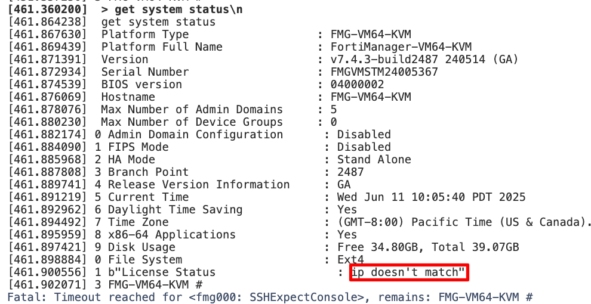

\\\\\\\\\\\\\\\\\he remote import method allows you to migrate FortiPOC instances directly through Fabric Studio's command-line interface. This approach is particularly valuable when working with custom firmwares or configurations that aren't available in standard repositories.

## When to Use Remote Import

**Recommended scenarios:**

- Custom firmware versions not in published repositories
- Specialized POC configurations requiring exact replication
- Complex environments with custom repository files
- When direct file access to FortiPOC isn't available

**Important Note:** This method is less extensively tested than standard import procedures. Consider it when other migration options aren't viable.

## Prerequisites

Before starting the remote import process, ensure you have:

### Infrastructure Requirements

- **Fabric Studio CLI Access** - Either through:
    - Built-in console interface
    - SSH connection to Fabric Studio (port 22)
- **Running FortiPOC Instance** - Your source FortiPOC/FNDN must be operational
- **Network Connectivity** - Fabric Studio must be able to reach your FortiPOC instance

### Authentication Requirements

- **FortiPOC Admin Credentials** - Username and password for CLI access
- **Fabric Studio Access** - Administrative privileges to execute import commands

## Import Process

### Step 1: Access Fabric Studio CLI

Choose your preferred method to access the command line:

**Option A: Built-in Console**

1. Log into Fabric Studio web interface
2. Access the CLI directly

**Option B: SSH Connection**

```bash
ssh admin@<fabric-studio-ip> -p 22
```

### Step 2: Execute Remote Import

Run the basic import command:

```bash
model fabric remote import fortipoc <fortipoc_url>
```

**Example:**

```bash
model fabric remote import fortipoc https://192.168.1.100
# or
model fabric remote import fortipoc fortipoc.example.com
```

Replace `<fortipoc_url>` with your FortiPOC's IP address or domain name.

## What Gets Imported

By default, the remote import process includes:

### Firmware and Software

- **Local firmwares** - Custom or non-standard firmware versions
- **Repository files** - Local software repositories and packages

### POC Configurations

- **POC definitions** - All configured proof-of-concepts
- **POC configurations** - Device settings and network configurations

### Additional Data

- **Local POCs** - User-created proof-of-concept scenarios
- **Custom configurations** - Specialized settings and customizations

## Advanced Configuration Options

For fine-tuned control over the import process, additional command-line options are available. Refer to the [comprehensive CLI documentation](https://register.fabricstudio.net/docs/fabric-studio/2.0.2/generated/cli/model.html#model-fabric-remote-import-fortipoc) for detailed parameter descriptions and advanced usage scenarios.

## Troubleshooting

### Common Issues

- **Connection timeouts** - Verify network connectivity between Fabric Studio and FortiPOC
- **Authentication failures** - Confirm FortiPOC admin credentials are correct
- **Import failures** - Check FortiPOC disk space and system health

### Best Practices

- **Test connectivity** before starting the import process
- **Backup your FortiPOC** before migration attempts
- **Monitor the import process** for errors or warnings
- **Verify imported data** after completion

---

# Troubleshooting Guide: Adding IP Address to License in Fabric Studio

## Overview

This guide addresses the common issue where deployment fails due to "ip doesn't match" license error in Fabric Studio. The root cause is typically that the license lacks a management IP address (`mgmt_addr`), preventing proper license validation during VM initialization.

## Problem Symptoms

### Primary Error

`License Status: ip doesn't match`


### Secondary Indicators

- FMG device fails to install/complete within expected timeframe
- Only one interface (port1) is configured during deployment
- License validation fails during VM boot process
- Deployment timeout errors in Fabric Studio logs

## Root Cause 

**Issue**: Fabric Studio configures minimal network settings by default, setting only the management IP. Without a license IP (`mgmt_addr`) attached to the license object, the FortiManager cannot properly validate its license against the configured network interface.

**Solution**: Update the license with the appropriate management IP address so Fabric Studio can configure both the management port and license port correctly.

## Step-by-Step Resolution

### Step 1: Enable CLI JSON Mode

```bash
cli json enable
```

### Step 2: Identify the License

First, locate your license details:

```bash
system license detail <LICENSE_ID>
```

Example:

```bash
system license detail FMGVMSTM24005367
```

### Step 3: Verify Current License State

Check that `mgmt_addr` is currently `null`:

```json
{
  "object": {
    "mgmt_addr": null,
    "name": "FMGVMSTM24005367",
    "lic_type": "FMG",
    "vm_type": "FMG"
  }
}
```

### Step 4: Update License with Management IP

Use the `system license update` command to add the management IP:

```bash
system license update <LICENSE_ID> '{"mgmt_addr": "<IP_ADDRESS>"}'
```

**Example:**

```bash
system license update FMGVMSTM24005367 '{"mgmt_addr": "10.100.55.12"}'
```

### Step 5: Verify the Update

Confirm the license now has the correct IP address:

```bash
system license detail FMGVMSTM24005367
```

Expected output:

```json
{
  "object": {
    "mgmt_addr": "10.100.55.12",
    "name": "FMGVMSTM24005367",
    "lic_type": "FMG"
  }
}
```

### Step 6: Redeploy VM

With the license properly configured, redeploy your FortiManager VM through Fabric Studio.

## Validation Steps

### 1. License Status Check

After successful deployment, connect to the FortiManager and verify:

```bash
get system status
```

Look for:

```
License Status: Valid
```

### 2. Interface Configuration

Verify that both management and license interfaces are properly configured:

```bash
show system interface
```

### 3. Network Connectivity

Test connectivity to the management IP:

```bash
ping <mgmt_addr>
```

## Next Steps

After successful import:

1. **Verify imported fabrics** in the Fabric Studio interface
2. **Test POC functionality** to ensure proper migration
3. **Review custom configurations** for accuracy
4. **Update any hardcoded references** to the new environment

The remote import method provides a way to migrate complex FortiPOC environments while preserving custom configurations and firmware versions.