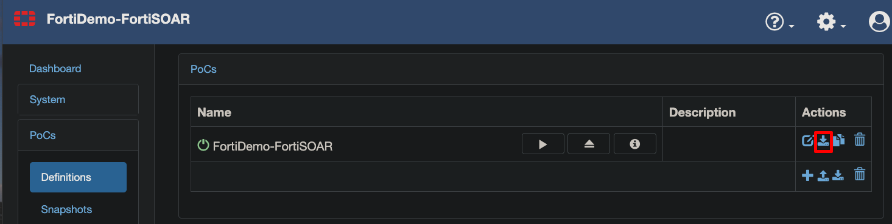
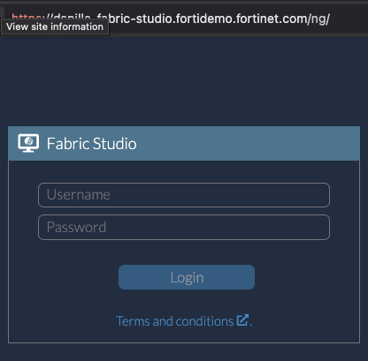
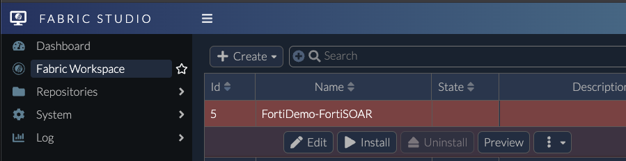
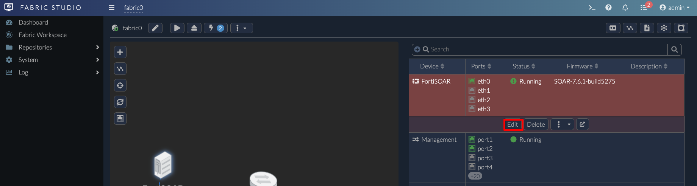
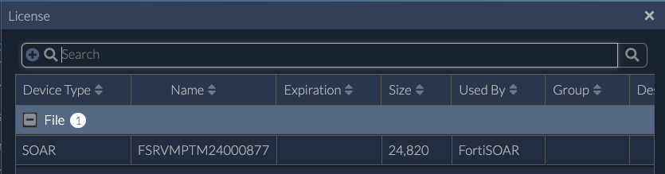

## Overview

Now that FortiPOC, the underlying tool that runs demos in FNDN, is reaching End of Life (EOL), we need to migrate virtual machines to Fabric Studio. This process involves working with two FortiDemo environments: your original demo and a blank Fabric Studio demo.

## Spin up FortiDemo in FNDN

As a CSE, you should be familiar with this process, but here are the steps for reference. These examples use a FortiSOAR demo, but you should choose your corresponding demo.

### Navigate to FNDN Demo

After you have a demo launched and in the **Running** state, click on the Demo. Locate the **FortiPOC Dashboard** button.


{}
If you don't have a button for this, you can access the device by going to the Demo IP or Hostname via port 443. To find your hostname, open any other HTTP/HTTPS button and remove everything after and including the colon in your URL. For example, removing
`:14004/ui/login` will take you to the FortiPOC dashboard.
{}


### Login to FortiPOC Dashboard

1. login with the admin credentials. On my instance that is user/pass `admin`/`fabricadmin`
   

2. On the left side, navigate to **PoCs > Definitions**
   

### Export FortiPOC Demo

{}
Before exporting, ensure your original FortiDemo is fully functional and all VMs are running properly.
{}

1. Click the export button and save the file
   

{}
If you have multiple PoCs, only export the POC that is running.
{}

2. Wait for the file to finish downloading. It can sometimes be a large file (~1 GB for bigger demos).

You should now have a file with a name ending in .fpoc.

## Spin up Fabric Studio in FNDN

{}
After launching your original FortiDemo, you'll need to create a new Fabric Studio instance in FNDN to migrate your demo.
{}

1. Navigate to the FNDN portal
2. Go to FortiDemo > Fortinet Employee > Advanced Demos
3. Click **Create Demo**
   
4. Fill in the Demo Name and Lab Purpose fields
5. Search for `Fabric-Studio` in the Type Dropdown. Select the first option unless you know your instance needs a large amount of CPU/RAM
   
6. Click Create

Wait until the Fabric Studio demo is ready.

## Import FNDN Export to Fabric Studio

By this point you should have two FNDN instances.


### Login to Fabric Studio

1. Click your Fabric Studio instance
2. Click the HTTPS Button for your **Dashboard**
   
3. Log in with the provided credentials `admin`/`B8bR!c7dM1n6*8`
   

You should now see the Fabric Studio Dashboard 


### Import FPOC File

1. Navigate to **Fabric Workspace** and click **Import**
   

2. Select your .fpoc file that you exported from your original demo and click **OK**
   

3. Wait for the import to complete

4. After import, select your new Fabric and click **Edit**
   

5. Confirm that everything looks correct and that all devices were imported properly

{}
In some cases, firmware for certain devices might not be found. This often happens when devices were using snapshots, which are not exportable from FortiDemo. You may need to manually upload firmware for these devices.


{}

## Run Fabric Demo

Once everything looks ok, you can Install the demo. 

1. Click **Install**

2. Wait for the devices to all install. 

## Uploading Custom Images

If you need to use an image that's not available in the Remote Firmwares in Fabric Studio:

1. Navigate to **Repositories > Home > Firmwares**

2. Click **Upload**
   

3. Click **Select files** and find your firmware file (must be KVM or QCOW2 format)

{}
If your firmware image is larger than 2GB, you'll need to use SCP to transfer it to the host instead of uploading through the GUI.
{}

Use the following command to upload large files:

```bash
scp <image-name> admin@<Fabric_Studio_IP_or_HOST>:firmwares/
```

Example:

```bash
scp fortisoar-kvm-enterprise-7.6.1-5275.qcow2 admin@dspille-fabric-studio.fortidemo.fortinet.com:firmwares/
```

Enter the password `B8bR!c7dM1n6*8` when prompted.

4. After the file is transferred, click the **Sync** button and refresh the browser
   

Note the **Type** column that indicates the firmware classification (e.g., "SOAR"). Fabric Studio uses this to configure and manage the firmware properly.

## Using Custom Firmware in a Fabric

1. Navigate to Fabric Workspace and click **Create > Fabric**
   

2. Select the  (plus sign) icon > **Device**
   

3. Select the type of device you want (by default, Fabric Studio searches the remote repository)
   

5. Click **OK** on the Device dialog
   

## Configure Fabric Device

A blank device usually requires additional configuration:

- Cable device to NAT Internet
- Select a network for the device
- Adjust CPU and RAM allocations
- Add a disk if needed
- Change VIPs for access ports

## Install Fabric

Once your device is configured:

1. Click the **Install** button
   

2. Click **OK** to confirm
   

3. Wait for the installation to finish
   

4. If you see errors, check the device Logs section
   

   

{}
Common issues include missing licenses or FortiFlex configuration
{}


## Upload License to Fabric Studio

1. Navigate to **Repositories > Home > Licenses**

2. Click **Add > File upload**
   

3. Browse to and select your license file, then click **OK**
   

4. Verify your license is listed with the proper **Device Type**
   

{}
If you don't see a device type, ensure you haven't renamed your license file. Fabric Studio uses the filename to determine the device type.
{}

### Manually Assign a License

If Fabric Studio isn't detecting the device type:

1. Open a Fabric and edit the device
   

2. Under License, select **Custom** and click the **...** to select your license
   
   

3. Click **OK** to save changes

## Troubleshooting Device After Install

If a device shows a warning exclamation mark but is "Running", it means the device is still being provisioned:

1. Right-click the device and select **Log** to check progress
   
   

2. Review logs for specific errors or completion status

## Accessing a Device After Install

To access your installed device:

1. Right-click the device in the diagram or select the device row in the table
2. Click **Access > HTTPS** (or your preferred access method)

## Run and Test Fabric Studio

After installation:

1. Verify all devices are running properly
2. Test connectivity between devices
3. Confirm all services are working as expected
4. Document any issues or differences from the original FNDN environment

## Notify David Chan's Team About New Instance

Once your migration is complete and tested:

1. Send an email to David Chan's team with details about your new Fabric Studio instance
2. Include information about the original FNDN demo that was migrated
3. Provide any feedback on the migration process