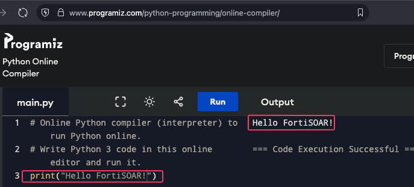
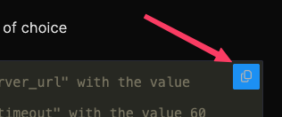

This section covers the Python concepts you need to build FortiSOAR connectors. Each topic includes a short explanation followed by a hands-on exercise so you can practice immediately. Don't worry if you're not a Python expert. The goal of this chapter is not to make you an expert in python, rather give you enough information around how python is used in FortiSOAR connectors. For a full course on python, I'd recommend the free and online Python course from the [University of Helsinki](https://programming-23.mooc.fi)

---

## Prerequisites 

You can run the exercises in **PyCharm** (recommended if you completed the [installation guide]({})). If you can't install PyCharm, you can use this free online python editor - [programiz.com/python-programming/online-compiler](https://www.programiz.com/python-programming/online-compiler/)




{}
For the best experience, use **PyCharm** so you can also practice debugging (covered in the [Debug Python Code]({}) chapter). But any of the online editors above will work fine for the exercises on this page.
{}

---

## 0. Comments
> Counting starts at 1 silly. More info on 0 indexs here [here](https://www.codegenes.net/blog/is-python-0-indexed/)

Comments are lines in your code that Python ignores when running. They're used to explain what your code does, leave notes for yourself or others, and temporarily disable code.

**Single-line comments** start with `#`:

**Multi-line comments** use triple quotes:

**Commenting out code** is useful for debugging:

```python
# This is a comment
server_url = "https://api.example.com"  # This is an inline comment

"""
This function connects to the API
and retrieves the latest threat data.
"""

# print("This line won't run")
print("This line will run")

# Bad comment:
x = 30  # Set x to 30

# Good comment:
timeout = 30  # API drops connection after 30s of inactivity
```

## 1. Variables and Data Types

Connectors work with different data types to handle API requests and responses.

**Strings**: Text data like URLs, usernames, and messages:

```python
server_url = "https://api.example.com"
username = "admin"
api_endpoint = f"{server_url}/users/{username}"  # String formatting
```
> what the f? More info on f-strings [**here**](https://www.geeksforgeeks.org/python/formatted-string-literals-f-strings-python/)

**Integers and Floats**: Numbers for timeouts, limits, and counts:

```python
timeout = 30
max_results = 100
confidence_score = 0.85
```

**Booleans**: True/False values for flags and conditions:

```python
verify_ssl = True
is_malicious = False
```

**Lists**: Ordered collections of items:

```python
ip_addresses = ["192.168.1.1", "10.0.0.1", "172.16.0.1"]
threat_types = ["malware", "phishing", "c2"]
```

**Dictionaries**: Key-value pairs (like JSON):

```python
config = {
    "server_url": "https://api.example.com",
    "api_key": "secret123",
    "timeout": 30
}

# Accessing values
url = config["server_url"]
key = config.get("api_key", "default")  # With default value
```
> Do you get it yet? More info on .get() **[here](https://www.geeksforgeeks.org/python/python-dictionary-get-method/)**

### Exercise 1: Variables and Data Types

**Goal**: Create variables that represent a connector's configuration, then print them out.

1. Copy the below text and paste it into your ide of choice

{}
Don't forget that you can click the copy button on the top right of the text below when you hover your mouse over it. 

{}

```python
# 1. Create a string variable called "server_url" with the value "https://siem.example.com"
# 2. Create an integer variable called "timeout" with the value 60
# 3. Create a boolean variable called "verify_ssl" with the value True
# 4. Create a list called "alert_types" containing "malware", "phishing", and "bruteforce"
# 5. Create a dictionary called "config" that contains all the above variables as key-value pairs
# 6. Print the server_url from the config dictionary

# Your code here
```


{}

```python
server_url = "https://siem.example.com"
timeout = 60
verify_ssl = True
alert_types = ["malware", "phishing", "bruteforce"]

config = {
    "server_url": server_url,
    "timeout": timeout,
    "verify_ssl": verify_ssl,
    "alert_types": alert_types
}

print(config["server_url"])  # https://siem.example.com
```

{}

---

## 2. Functions

Functions organize code into reusable blocks. In connectors, each operation is a function that receives `config` (connector settings) and `params` (playbook action input).

```python
def get_ip_reputation(config, params):
    """
    Retrieves reputation data for an IP address.

    Args:
        config: Connector configuration (dict)
        params: Operation parameters (dict)

    Returns:
        dict: Reputation data
    """
    ip_address = params.get('ip_address')
    server_url = config.get('server_url')

    result = {
        'ip': ip_address,
        'reputation': 'clean',
        'confidence': 85
    }

    return result
```

### Exercise 2: Functions

Write a function called `build_endpoint` that takes a `config` dict and an `action` string and returns a full API URL.

```python
# Write a function that:
# - Accepts "config" (dict with a "server_url" key) and "action" (string)
# - Returns the URL: server_url + "/api/v1/" + action
# - Example: build_endpoint({"server_url": "https://api.example.com"}, "scan")
#   should return "https://api.example.com/api/v1/scan"

# Your code here


# Test it
config = {"server_url": "https://api.example.com"}
print(build_endpoint(config, "scan"))  # https://api.example.com/api/v1/scan
print(build_endpoint(config, "lookup"))  # https://api.example.com/api/v1/lookup
```

{}

```python
def build_endpoint(config, action):
    server_url = config.get("server_url")
    return f"{server_url}/api/v1/{action}"


config = {"server_url": "https://api.example.com"}
print(build_endpoint(config, "scan"))  # https://api.example.com/api/v1/scan
print(build_endpoint(config, "lookup"))  # https://api.example.com/api/v1/lookup
```

{}

---

## 3. Working with JSON

Connectors constantly convert between Python dictionaries and JSON for API communication.

```python
import json

# Python dict to JSON string
data = {"name": "malware.exe", "hash": "abc123"}
json_string = json.dumps(data)

# JSON string to Python dict
response_text = '{"status": "success", "data": {"count": 5}}'
response_data = json.loads(response_text)
count = response_data['data']['count']  # Access nested values
```

### Exercise 3: JSON

You receive a JSON string from an API. Parse it and extract specific fields.

```python
import json

# This is a JSON response string from a threat intelligence API
response_text = '''
{
    "status": "found",
    "indicator": {
        "type": "ip",
        "value": "198.51.100.1",
        "threat_score": 92,
        "tags": ["malware", "c2", "botnet"]
    }
}
'''

# 1. Parse response_text into a Python dictionary
# 2. Extract and print the "value" field (the IP address)
# 3. Extract and print the "threat_score"
# 4. Extract and print the first tag from the "tags" list

# Your code here
```

{}

```python
import json

response_text = '''
{
    "status": "found",
    "indicator": {
        "type": "ip",
        "value": "198.51.100.1",
        "threat_score": 92,
        "tags": ["malware", "c2", "botnet"]
    }
}
'''

response_data = json.loads(response_text)

ip_address = response_data["indicator"]["value"]
print(ip_address)  # 198.51.100.1

threat_score = response_data["indicator"]["threat_score"]
print(threat_score)  # 92

first_tag = response_data["indicator"]["tags"][0]
print(first_tag)  # malware
```

{}

---

## 4. String Manipulation

Working with strings for formatting URLs, messages, and parsing data.

```python
# String concatenation
url = base_url + "/api/v1/" + endpoint

# f-strings (recommended)
url = f"{base_url}/api/v1/{endpoint}"
message = f"Found {count} results for query '{search_term}'"

# String methods
email = "  USER@EXAMPLE.COM  "
clean_email = email.strip().lower()  # "user@example.com"

domain = "api.example.com"
if domain.startswith("api."):
    subdomain = domain.split(".")[0]  # "api"
```

### Exercise 4: Strings

Write a function that cleans and validates a server URL entered by a user.

```python
# Write a function called "clean_url" that:
# 1. Strips leading/trailing whitespace
# 2. Removes a trailing "/" if present
# 3. Returns the cleaned URL
#
# Example:
#   clean_url("  https://api.example.com/  ") → "https://api.example.com"
#   clean_url("https://siem.local")           → "https://siem.local"

# Your code here


# Test it
print(clean_url("  https://api.example.com/  "))  # https://api.example.com
print(clean_url("https://siem.local"))  # https://siem.local
print(clean_url("  https://host.com///  "))  # https://host.com//
```

{}

```python
def clean_url(url):
    cleaned = url.strip()
    if cleaned.endswith("/"):
        cleaned = cleaned.rstrip("/")
    return cleaned


# Or more concisely:
def clean_url(url):
    return url.strip().rstrip("/")


print(clean_url("  https://api.example.com/  "))  # https://api.example.com
print(clean_url("https://siem.local"))  # https://siem.local
print(clean_url("  https://host.com///  "))  # https://host.com
```

{}

---

## 5. Lists and Loops

Processing multiple items is common in connector responses.

```python
# Iterating over lists
ip_addresses = ["1.1.1.1", "8.8.8.8", "9.9.9.9"]

for ip in ip_addresses:
    print(f"Checking {ip}")

# List comprehension (transform lists efficiently)
indicators = [
    {"value": "1.1.1.1", "type": "ip"},
    {"value": "evil.com", "type": "domain"}
]
ip_only = [item['value'] for item in indicators if item['type'] == 'ip']
```

### Exercise 5: Lists and Loops

An API returned a list of alerts. Write code to process them.

```python
alerts = [
    {"id": 1, "severity": "high", "title": "Malware detected"},
    {"id": 2, "severity": "low", "title": "Failed login"},
    {"id": 3, "severity": "high", "title": "Data exfiltration"},
    {"id": 4, "severity": "medium", "title": "Suspicious DNS query"},
    {"id": 5, "severity": "high", "title": "Ransomware activity"},
]

# 1. Using a for loop, print only the titles of "high" severity alerts
# 2. Using a list comprehension, create a list called "high_ids" containing
#    just the "id" values of high severity alerts
# Expected high_ids: [1, 3, 5]

# Your code here
```

{}

```python
alerts = [
    {"id": 1, "severity": "high", "title": "Malware detected"},
    {"id": 2, "severity": "low", "title": "Failed login"},
    {"id": 3, "severity": "high", "title": "Data exfiltration"},
    {"id": 4, "severity": "medium", "title": "Suspicious DNS query"},
    {"id": 5, "severity": "high", "title": "Ransomware activity"},
]

# 1. Print high severity titles
for alert in alerts:
    if alert["severity"] == "high":
        print(alert["title"])
# Output:
#   Malware detected
#   Data exfiltration
#   Ransomware activity

# 2. List comprehension for IDs
high_ids = [alert["id"] for alert in alerts if alert["severity"] == "high"]
print(high_ids)  # [1, 3, 5]
```

{}

---

## 6. Dictionary Operations

Connectors frequently manipulate dictionary data from API responses.

```python
# Accessing nested data safely
response = {
    "data": {
        "user": {
            "name": "John",
            "email": "john@example.com"
        }
    }
}

# Safe access with .get(): returns a default instead of crashing
name = response.get('data', {}).get('user', {}).get('name', 'Unknown')

# Merging dictionaries
defaults = {"timeout": 30, "verify_ssl": True}
user_config = {"timeout": 60}
config = {**defaults, **user_config}  # timeout=60, verify_ssl=True

# Extracting specific fields
api_response = {
    "id": 123,
    "timestamp": "2024-01-25",
    "severity": "high",
    "details": "Long description..."
}

summary = {
    "id": api_response.get("id"),
    "severity": api_response.get("severity")
}
```

### Exercise 6: Dictionaries

An API returned a deeply nested response. Safely extract the data you need.

```python
api_response = {
    "meta": {
        "status": 200,
        "request_id": "abc-123"
    },
    "data": {
        "scan_results": {
            "file_name": "suspicious.exe",
            "hash": "d41d8cd98f00b204e9800998ecf8427e",
            "detections": {
                "malicious": 12,
                "clean": 58,
                "total": 70
            }
        }
    }
}

# 1. Safely extract the "file_name" using chained .get() calls
#    (should not crash if any key is missing)
# 2. Safely extract the "malicious" detection count
# 3. Create a new dictionary called "summary" with keys:
#    "file", "hash", "malicious_count", and "detection_ratio"
#    where detection_ratio is a string like "12/70"

# Your code here
```

{}

```python
api_response = {
    "meta": {
        "status": 200,
        "request_id": "abc-123"
    },
    "data": {
        "scan_results": {
            "file_name": "suspicious.exe",
            "hash": "d41d8cd98f00b204e9800998ecf8427e",
            "detections": {
                "malicious": 12,
                "clean": 58,
                "total": 70
            }
        }
    }
}

# 1. Safely extract file_name
file_name = api_response.get("data", {}).get("scan_results", {}).get("file_name", "Unknown")
print(file_name)  # suspicious.exe

# 2. Safely extract malicious count
scan = api_response.get("data", {}).get("scan_results", {})
detections = scan.get("detections", {})
malicious_count = detections.get("malicious", 0)
print(malicious_count)  # 12

# 3. Build summary
total = detections.get("total", 0)
summary = {
    "file": file_name,
    "hash": scan.get("hash", ""),
    "malicious_count": malicious_count,
    "detection_ratio": f"{malicious_count}/{total}"
}
print(summary)
# {'file': 'suspicious.exe', 'hash': 'd41d8cd98f00b204e9800998ecf8427e',
#  'malicious_count': 12, 'detection_ratio': '12/70'}
```

{}

---

## 7. Error Handling

Proper error handling makes connectors reliable and user-friendly. Python uses `try` / `except` blocks to catch errors instead of letting the program crash.

```python
from connectors.core.connector import ConnectorError


def check_ip_reputation(config, params):
    try:
        ip_address = params.get('ip_address')

        if not ip_address:
            raise ConnectorError('IP address is required')

        response = requests.get(f"{config['url']}/ip/{ip_address}")
        response.raise_for_status()  # Raises error for 4xx/5xx status

        return response.json()

    except requests.exceptions.Timeout:
        raise ConnectorError('Request timed out. Check server connectivity.')
    except requests.exceptions.ConnectionError:
        raise ConnectorError('Cannot connect to server. Verify the URL.')
    except Exception as e:
        raise ConnectorError(f'Unexpected error: {str(e)}')
```

### Exercise 7: Error Handling

Write a function that safely divides two numbers and processes a dictionary: handle what could go wrong.

```python
# Write a function called "safe_divide" that:
# - Takes two arguments: numerator and denominator
# - Returns the result of the division
# - If denominator is 0, return None and print a warning instead of crashing
# - If either argument is not a number, return None and print a warning
#
# Then write a function called "get_field" that:
# - Takes a dictionary and a key name
# - Returns the value for that key
# - If the key doesn't exist, return "N/A" instead of crashing

# Your code here


# Test safe_divide
print(safe_divide(10, 3))  # 3.333...
print(safe_divide(10, 0))  # None (with warning printed)
print(safe_divide("a", 5))  # None (with warning printed)

# Test get_field
data = {"ip": "1.1.1.1", "score": 85}
print(get_field(data, "ip"))  # 1.1.1.1
print(get_field(data, "country"))  # N/A
```

{}

```python
def safe_divide(numerator, denominator):
    try:
        return numerator / denominator
    except ZeroDivisionError:
        print("Warning: Cannot divide by zero")
        return None
    except TypeError:
        print("Warning: Both arguments must be numbers")
        return None


def get_field(data, key):
    try:
        return data[key]
    except KeyError:
        return "N/A"


# Or simply using .get():
def get_field(data, key):
    return data.get(key, "N/A")


# Test safe_divide
print(safe_divide(10, 3))  # 3.3333333333333335
print(safe_divide(10, 0))  # Warning: Cannot divide by zero → None
print(safe_divide("a", 5))  # Warning: Both arguments must be numbers → None

# Test get_field
data = {"ip": "1.1.1.1", "score": 85}
print(get_field(data, "ip"))  # 1.1.1.1
print(get_field(data, "country"))  # N/A
```

{}

---

## 8. Making HTTP Requests

The `requests` library handles API calls in connectors. You won't be able to run these against real APIs in this exercise, but understanding the pattern is essential.

```python
import requests

# GET request
response = requests.get(
    'https://api.example.com/users',
    headers={'Authorization': 'Bearer token123'},
    timeout=30
)

# POST request with JSON body
response = requests.post(
    'https://api.example.com/alerts',
    json={'severity': 'high', 'message': 'Suspicious activity'},
    headers={'Content-Type': 'application/json'}
)

# Check response
if response.status_code == 200:
    data = response.json()
else:
    error_message = f"API returned status {response.status_code}"
```

### Exercise 8: HTTP Requests (Reading Comprehension)

You can't call a real API in this exercise, but you need to be able to *read* request code. Study the function below and answer the questions.

```python
import requests


def lookup_domain(config, params):
    url = f"{config['server_url']}/api/v1/domain/{params['domain']}"
    headers = {
        "Authorization": f"Bearer {config['api_key']}",
        "Accept": "application/json"
    }

    response = requests.get(url, headers=headers, timeout=config.get('timeout', 30))

    if response.status_code == 200:
        return response.json()
    elif response.status_code == 404:
        return {"status": "not_found", "domain": params['domain']}
    else:
        raise Exception(f"API error: {response.status_code}")
```

```python
# Given this config and params:
config = {
    "server_url": "https://threat-intel.example.com",
    "api_key": "mytoken123",
    "timeout": 45
}
params = {"domain": "evil.com"}

# Answer these questions by assigning values to the variables below:

# 1. What is the full URL that will be called?
answer_1 = ""

# 2. What HTTP method is used (GET or POST)?
answer_2 = ""

# 3. What value is sent in the Authorization header?
answer_3 = ""

# 4. What timeout value will be used?
answer_4 = 0

# 5. If the API returns status code 404, what dictionary is returned?
answer_5 = {}

print(answer_1)
print(answer_2)
print(answer_3)
print(answer_4)
print(answer_5)
```

{}

```python
answer_1 = "https://threat-intel.example.com/api/v1/domain/evil.com"
answer_2 = "GET"
answer_3 = "Bearer mytoken123"
answer_4 = 45
answer_5 = {"status": "not_found", "domain": "evil.com"}

print(answer_1)  # https://threat-intel.example.com/api/v1/domain/evil.com
print(answer_2)  # GET
print(answer_3)  # Bearer mytoken123
print(answer_4)  # 45
print(answer_5)  # {'status': 'not_found', 'domain': 'evil.com'}
```

{}

---

## 9. Classes (Basic Understanding)

Connectors are Python classes, but you don't need deep object-oriented programming knowledge. The key idea is that your connector *inherits* from a base `Connector` class and overrides two methods: `execute` and `check_health`.

```python
from connectors.core.connector import Connector


class MyConnector(Connector):
    """Your connector inherits from the base Connector class"""

    def execute(self, config, operation, params, **kwargs):
        """This method is called when your connector runs"""
        if operation == 'get_ip_reputation':
            return self.get_ip_reputation(config, params)
        elif operation == 'block_ip':
            return self.block_ip(config, params)

    def check_health(self, config):
        """Tests if the configuration works"""
        try:
            response = requests.get(config['server_url'] + '/health')
            return response.status_code == 200
        except:
            return False
```

### Exercise 9: Classes

Fill in the blanks to complete a connector class skeleton.

```python
# Fill in the blanks (replace the ___ placeholders)

class ThreatIntelConnector(___):
    """A connector for a threat intelligence service"""

    def execute(self, config, operation, params, **kwargs):
        if operation == '___':
            return self.scan_ip(config, params)
        elif operation == 'scan_domain':
            return self.___(config, params)

    def check_health(self, ___):
        try:
            url = config['server_url'] + '/ping'
            response = requests.get(url)
            return response.status_code == ___
        except:
            return ___

    def scan_ip(self, config, params):
        ip = params.get('ip_address')
        return {"ip": ip, "status": "clean"}

    def scan_domain(self, config, params):
        domain = params.get('domain')
        return {"domain": domain, "status": "suspicious"}
```

{}

```python
class ThreatIntelConnector(Connector):
    """A connector for a threat intelligence service"""

    def execute(self, config, operation, params, **kwargs):
        if operation == 'scan_ip':
            return self.scan_ip(config, params)
        elif operation == 'scan_domain':
            return self.scan_domain(config, params)

    def check_health(self, config):
        try:
            url = config['server_url'] + '/ping'
            response = requests.get(url)
            return response.status_code == 200
        except:
            return False

    def scan_ip(self, config, params):
        ip = params.get('ip_address')
        return {"ip": ip, "status": "clean"}

    def scan_domain(self, config, params):
        domain = params.get('domain')
        return {"domain": domain, "status": "suspicious"}
```

{}

---

## 10. Common Patterns in Connectors

### Pattern: Reusable API Request Function

Most connectors reuse a single helper function for all API calls. This avoids repeating headers and error handling in every operation.

```python
def make_api_call(config, endpoint, method='GET', data=None):
    """Reusable function for API calls"""

    url = f"{config['server_url']}{endpoint}"
    headers = {
        'Authorization': f"Bearer {config['api_token']}",
        'Content-Type': 'application/json'
    }

    try:
        if method == 'GET':
            response = requests.get(url, headers=headers, timeout=30)
        elif method == 'POST':
            response = requests.post(url, headers=headers, json=data, timeout=30)

        response.raise_for_status()
        return response.json()

    except Exception as e:
        raise ConnectorError(f"API call failed: {str(e)}")
```

---

## 🏆 Final Challenge: Putting It All Together

This exercise combines everything you've learned. Write a function that processes a list of indicators and returns only the malicious ones, formatted as a summary.

```python
def analyze_indicators(indicators):
    """
    Process a list of threat indicators and return a summary of malicious ones.

    Args:
        indicators: List of dicts, each with keys "value", "type", "score"
                    Example: {"value": "1.1.1.1", "type": "ip", "score": 85}

    Returns:
        dict with:
            "malicious_count": number of indicators with score >= 70
            "total_count": total number of indicators
            "malicious_indicators": list of malicious items (score >= 70),
                each formatted as {"value": ..., "type": ..., "score": ...}
    """
    # Your code here
    pass


# Test data
test_indicators = [
    {"value": "1.1.1.1", "type": "ip", "score": 25},
    {"value": "evil.com", "type": "domain", "score": 88},
    {"value": "2.2.2.2", "type": "ip", "score": 85},
    {"value": "safe-site.org", "type": "domain", "score": 5},
    {"value": "3.3.3.3", "type": "ip", "score": 92},
    {"value": "4.4.4.4", "type": "ip", "score": 10},
]

result = analyze_indicators(test_indicators)
print(f"Malicious: {result['malicious_count']} / {result['total_count']}")
for item in result['malicious_indicators']:
    print(f"  [{item['type']}] {item['value']} (score: {item['score']})")

# Expected output:
# Malicious: 3 / 6
#   [domain] evil.com (score: 88)
#   [ip] 2.2.2.2 (score: 85)
#   [ip] 3.3.3.3 (score: 92)
```

{}

```python
def analyze_indicators(indicators):
    malicious = [ind for ind in indicators if ind.get("score", 0) >= 70]

    return {
        "malicious_count": len(malicious),
        "total_count": len(indicators),
        "malicious_indicators": malicious
    }


# Or with a regular loop:
def analyze_indicators(indicators):
    malicious = []
    for ind in indicators:
        if ind.get("score", 0) >= 70:
            malicious.append(ind)

    return {
        "malicious_count": len(malicious),
        "total_count": len(indicators),
        "malicious_indicators": malicious
    }
```

{}

---

## Key Takeaways

- **Dictionaries** are everywhere in connectors: they represent configuration, parameters, and API responses.
- **Error handling** with `try`/`except` makes connectors reliable.
- **The `requests` library** handles all HTTP communication.
- **String formatting** with f-strings keeps code readable.
- **List comprehensions** process data efficiently.
- You don't need to be a Python expert: these fundamentals cover 90% of connector development.

## Next Steps

Now that you understand the Python essentials, you're ready to learn about FortiSOAR connector architecture and build your first connector!
