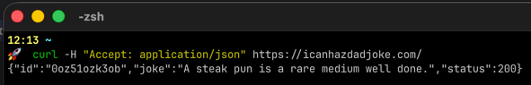
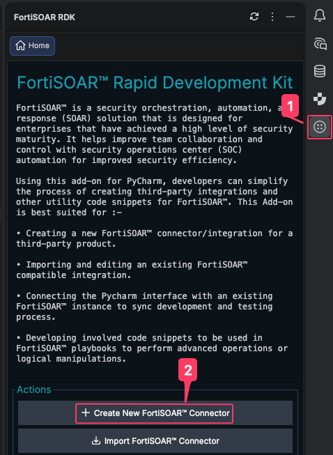
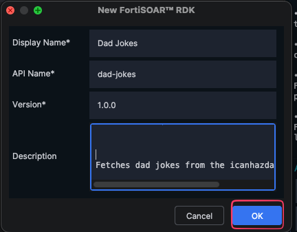
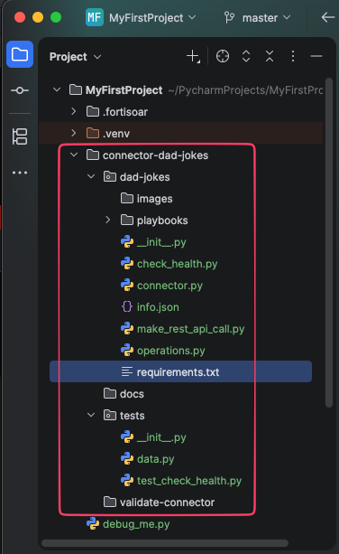

<!-- TODO - finish this page -->

In this chapter you'll use the Pycharm RDK to create a connector project, explore the files it generates, and take a quick look at the Dad Joke API we'll be connecting to.

---

## 1. Test the Dad Joke API Locally

Before we write any code, let's try our the API ourselves to see what we're working with. Open a terminal of your choice and run:

```bash
curl -H "Accept: application/json" https://icanhazdadjoke.com/
```

You should get back something like:

```json
{
  "id": "R7UfaahVfFd",
  "joke": "My dog used to chase people on a bike a lot. It got so bad I had to take his bike away.",
  "status": 200
}
```



The response from this API is very simple. There's an `id`, the `joke` text, and a `status` code.

---

## 2. Open the New Connector wizard

1. Open **PyCharm** with the RDK plugin installed.
2. Click **FortiSOAR RDK** from the toolbar menu at the top.
3. Select **Create New FortiSOAR Connector**.
   

The **New FortiSOAR Connector** dialog appears.

---

## 3. Fill in the connector details

Enter the following values in the dialog:

| Parameter | Value | Notes |
|---|---|---|
| **Display Name** | `Dad Jokes` | The name users see in FortiSOAR. |
| **API Name** | `dad-jokes` | Auto-generated from the display name. Must be unique. |
| **Version** | `1.0.0` | Semantic versioning (`major.minor.patch`). |
| **Description** | `Fetches dad jokes from the icanhazdadjoke.com API.` | Shown on the connector listing page. |

Click **OK**.


{}
The **API Name** cannot match any existing Content Hub connector and cannot be changed later. Choose carefully.
{}

## 5. Explore the generated project

Your project explorer now shows the connector scaffold:

```text
connector-dad-jokes
├── dad-jokes
│    ├── __init__.py
│    ├── check_health.py
│    ├── connector.py
│    ├── images
│    ├── info.json
│    ├── make_rest_api_call.py
│    ├── operations.py
│    ├── playbooks
│    │    └── playbooks.json
│    └── requirements.txt
├── docs
├── tests
│    ├── __init__.py
│    ├── data.py
│    └── test_check_health.py
└── validate-connector
```


Let's look at the two most important files.

### info.json

Open `info.json` in the editor. Right now it contains the metadata you entered plus empty `configuration` and `operations` sections:

```json
{
  "name": "dad-jokes",
  "label": "Dad Jokes",
  "version": "1.0.0",
  "description": "Fetches dad jokes from the icanhazdadjoke.com API.",
  "publisher": "Community",
  "cs_approved": false,
  "cs_compatible": true,
  "category": "",
  "icon_small_name": "",
  "icon_large_name": "",
  "help_online": "",
  "configuration": {},
  "operations": []
}
```

We'll populate `configuration` and `operations` in the next two chapters.

### connector.py

Open `connector.py`. This is the entry point FortiSOAR calls when your connector runs:

```python
from connectors.core.connector import Connector, get_logger, ConnectorError
from .operations import operations
from .check_health import _check_health

logger = get_logger("dad-jokes")


class CustomConnector(Connector):
    def execute(self, config, operation, params, **kwargs):
        try:
            config['connector_info'] = {"connector_name": self._info_json.get('name'),
                                        "connector_version": self._info_json.get('version')}
            operation = operations.get(operation)
            if not operation:
                logger.error('Unsupported operation: {}'.format(operation))
                raise ConnectorError('Unsupported operation')
            return operation(config, params)
        except Exception as err:
            logger.exception(err)
            raise ConnectorError(err)

    def check_health(self, config=None):
        try:
            config['connector_info'] = {"connector_name": self._info_json.get('name'),
                                        "connector_version": self._info_json.get('version')}
            return _check_health(config)
        except Exception as err:
            raise ConnectorError(err)
```

There are two methods in this file:

- `execute` - routes to the correct operation function when a playbook calls the connector.
- `check_health` - verifies that the configuration works.

---

## 6. Quick reference - Details tab actions

The Details tab has several action buttons at the bottom. Here's what they do:

| Action                   | What it does                                                     | When to use                                                     |
|--------------------------|------------------------------------------------------------------|-----------------------------------------------------------------|
| **Save**                 | Writes your changes to `info.json`.                              | When ready to "write" the RDK UI contents to the info.json file |
| **Generate Playbooks**   | Creates sample playbooks from your operations.                   | After defining all operations.                                  |
| **Generate Documents**   | Creates HTML/MD docs from your descriptions.                     | Before exporting.                                               |
| **Validate Connector**   | Checks naming, descriptions, icons, etc. Outputs an HTML report. | Before exporting.                                               |
| **Install Requirements** | Installs packages from `requirements.txt`.                       | When adding dependencies to the requirements.txt                |
| **Export**               | Packages the connector as a `.tgz` file.                         | When ready to import to FortiSOAR.                              |


---

## Summary

You now have a connector project scaffolded and ready to build on:

- Created the **Dad Jokes** connector via the RDK wizard
- Filled in the Details tab (publisher, category)
- Explored the generated file structure
- Reviewed `info.json` and `connector.py`
- Confirmed the Dad Joke API works with a quick `curl` test

In the next chapter, you'll add **configuration parameters** so the connector knows which server to talk to.
