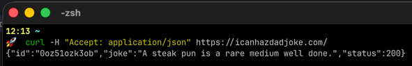
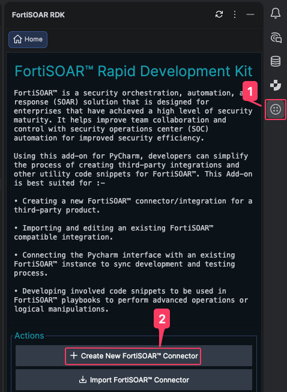
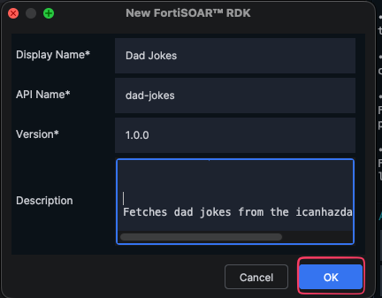
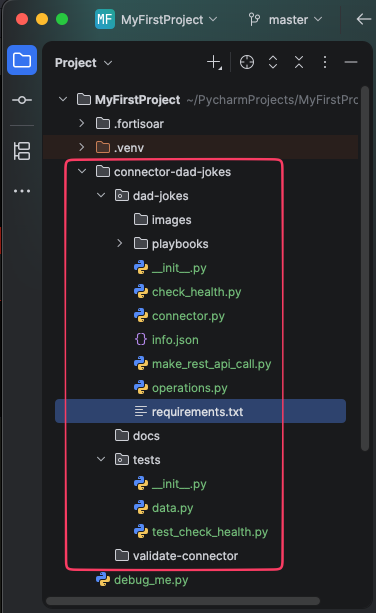
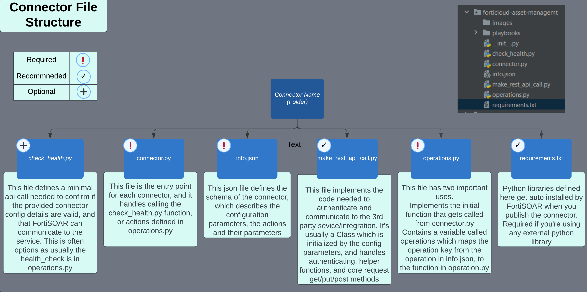

<!-- TODO - finish this page -->

In this chapter you'll scaffold a connector project in your IDE, explore the files it generates, and take a quick look at the Dad Joke API we'll be connecting to. The generated project is the same in either IDE.

---

## 1. Test the Dad Joke API Locally

Before we write any code, let's try our the API ourselves to see what we're working with. Open a terminal of your choice and run:

```bash
curl -H "Accept: application/json" https://icanhazdadjoke.com/
```

You should get back something like:

```json
{
  "id": "R7UfaahVfFd",
  "joke": "My dog used to chase people on a bike a lot. It got so bad I had to take his bike away.",
  "status": 200
}
```



The response from this API is very simple. There's an `id`, the `joke` text, and a `status` code.

---

## 2. Scaffold the connector

Whichever IDE you use, you'll create a new connector project and give it the **same details**:

| Parameter        | Value                                                | Notes                                                 |
|------------------|------------------------------------------------------|-------------------------------------------------------|
| **Display Name** | `Dad Jokes`                                          | The name users see in FortiSOAR.                      |
| **API Name**     | `dad-jokes`                                          | Derived from the display name. Must be unique.        |
| **Version**      | `1.0.0`                                              | Semantic versioning (`major.minor.patch`).            |
| **Description**  | `Fetches dad jokes from the icanhazdadjoke.com API.` | Shown on the connector listing page.                  |

{}
The **API Name** cannot match any existing Content Hub connector and cannot be changed later. Choose carefully.
{}

{}
{}
1. Make sure a **folder is open** in VSCode (the connector registry lives at `<workspace>/.fortisoar/local_data.json`) and the workspace is **trusted**.
2. Open the **Command Palette** (`Cmd+Shift+P` / `Ctrl+Shift+P`) and run **`FortiSOAR: New Connector`** - or click the `+` in the **FortiSOAR Connectors** view (the plug icon in the activity bar).
3. Answer the seven prompts in order:

   | Prompt | Answer |
   |---|---|
   | **name** | `dad-jokes` |
   | **display name** | `Dad Jokes` |
   | **description** | `Fetches dad jokes from the icanhazdadjoke.com API.` |
   | **category** | `Utilities` |
   | **authentication template** | `None` -- the Dad Joke API needs no credentials |
   | **starter operations** | Deselect both -- we add our own in the operations chapter |
   | **include a tests/ scaffold?** | `Yes` (default) -- used in the test-and-debug chapter |

The new connector is scaffolded on disk and registered in the **FortiSOAR Connectors** view.

{}
The wizard never asks for a **version** -- it always writes `1.0.0`. Bump it later
by editing `info.json` or with **`FortiSOAR: New Version`**.

The authentication template pre-fills `configuration.fields`, so the scaffolded
`info.json` already contains `server_url` and `verify_ssl` rather than an empty
`configuration`. You replace those in the next chapter.
{}

The wizard runs as a chain of prompts, starting with the name:


{}
{}
1. Open **PyCharm** with the RDK plugin installed.
2. Click **FortiSOAR RDK** from the toolbar menu at the top.
3. Select **Create New FortiSOAR Connector**.
   
4. In the **New FortiSOAR Connector** dialog, enter the values from the table above and click **OK**.
   
{}
{}

## 5. Explore the generated project

The two IDEs scaffold **different file sets** -- the RDK generates a fuller
project, the VSCode extension a minimal one. Both are valid connectors; the
files that matter (`info.json`, `connector.py`, `operations.py`) are the same.

{}
{}
```text
dad-jokes
├── __init__.py
├── connector.py
├── info.json
├── operations.py
├── requirements.txt
├── README.md
├── .gitignore
└── tests
     ├── conftest.py
     ├── pytest.ini
     ├── requirements.txt
     ├── test_check_health_live.py
     ├── test_check_health_mock.py
     └── README.md
```

There's no separate `check_health.py` or `make_rest_api_call.py` -- the health
check and the HTTP helper both live in `operations.py`, registered through the
`operation_map` dict at the bottom of that file.
{}
{}
```text
connector-dad-jokes
├── dad-jokes
│    ├── __init__.py
│    ├── check_health.py
│    ├── connector.py
│    ├── images
│    ├── info.json
│    ├── make_rest_api_call.py
│    ├── operations.py
│    ├── playbooks
│    │    └── playbooks.json
│    └── requirements.txt
├── docs
├── tests
│    ├── __init__.py
│    ├── data.py
│    └── test_check_health.py
└── validate-connector
```


{}
{}

Let's look at the two most important files.

### info.json

Open `info.json` in the editor. It contains the metadata you entered plus the
`configuration` and `operations` sections we'll populate over the next two
chapters.

{}
{}
```json
{
  "name": "dad-jokes",
  "label": "Dad Jokes",
  "description": "Fetches dad jokes from the icanhazdadjoke.com API.",
  "publisher": "Community",
  "cs_approved": false,
  "cs_compatible": true,
  "version": "1.0.0",
  "category": "Utilities",
  "icon_small_name": "icon-small.png",
  "icon_large_name": "icon-large.png",
  "help_online": "",
  "configuration": {
    "fields": [
      { "name": "server_url", "title": "Server URL", "type": "text", "required": true },
      { "name": "verify_ssl", "title": "Verify SSL", "type": "checkbox", "value": true }
    ]
  },
  "operations": [
    {
      "operation": "check_health",
      "title": "Check Health",
      "description": "Verifies that the configured credentials reach the target service."
    }
  ]
}
```

The `configuration.fields` came from the **None** authentication template, and
`check_health` is always included. Both get replaced in the next chapter.

{}
`icon_small_name` and `icon_large_name` are declared but the files aren't
generated. Export flags this as a *warning* (not an error) -- you can export
anyway, or drop two PNGs with those names into the connector folder.
{}
{}
{}
```json
{
  "name": "dad-jokes",
  "label": "Dad Jokes",
  "version": "1.0.0",
  "description": "Fetches dad jokes from the icanhazdadjoke.com API.",
  "publisher": "Community",
  "cs_approved": false,
  "cs_compatible": true,
  "category": "",
  "icon_small_name": "",
  "icon_large_name": "",
  "help_online": "",
  "configuration": {},
  "operations": []
}
```
{}
{}

### connector.py

Open `connector.py`. This is the entry point FortiSOAR calls when your connector runs:

{}
{}
```python
"""Connector entrypoint for Dad Jokes."""
from connectors.core.connector import Connector, ConnectorError
from .operations import operation_map, check_health


class DadJokes(Connector):
    def execute(self, config, operation, params, **kwargs):
        try:
            handler = operation_map.get(operation)
            if handler is None:
                raise ConnectorError(f"Unsupported operation: {operation}")
            return handler(config, params)
        except Exception as exc:
            raise ConnectorError(str(exc))

    def check_health(self, config):
        return check_health(config)
```

Routing goes through the `operation_map` dict in `operations.py`, which the
**Add Operation** command maintains for you.
{}
{}
```python
from connectors.core.connector import Connector, get_logger, ConnectorError
from .operations import operations
from .check_health import _check_health

logger = get_logger("dad-jokes")


class CustomConnector(Connector):
    def execute(self, config, operation, params, **kwargs):
        try:
            config['connector_info'] = {"connector_name": self._info_json.get('name'),
                                        "connector_version": self._info_json.get('version')}
            operation = operations.get(operation)
            if not operation:
                logger.error('Unsupported operation: {}'.format(operation))
                raise ConnectorError('Unsupported operation')
            return operation(config, params)
        except Exception as err:
            logger.exception(err)
            raise ConnectorError(err)

    def check_health(self, config=None):
        try:
            config['connector_info'] = {"connector_name": self._info_json.get('name'),
                                        "connector_version": self._info_json.get('version')}
            return _check_health(config)
        except Exception as err:
            raise ConnectorError(err)
```
{}
{}

There are two methods in this file:

- `execute` - routes to the correct operation function when a playbook calls the connector.
- `check_health` - verifies that the configuration works.

---

## 6. Quick reference - common actions

Here are the actions you'll reach for while building, and where they live in each IDE.

{}
{}
Actions are on the **right-click menu** of a connector (or operation) in the **FortiSOAR Connectors** view, or in the **Command Palette** under `FortiSOAR:`.

| Action | What it does | When to use |
|---|---|---|
| **Configure Connector** | Form for the `configuration` fields; secrets go to the OS keychain. | Before running anything that needs a base URL / credentials. |
| **Add Operation** | Atomically appends to `info.json` **and** stubs the function in `operations.py`. | When adding an operation. |
| **Run / Debug Operation** | Runs a single operation (Debug attaches `debugpy`). | Testing an operation as you build it. |
| **Check Health** | Invokes `check_health(config)` the same way FortiSOAR does. | Smoke-test after configuring. |
| **Scaffold / Run Tests** | pytest mocked + live in a per-connector venv. | Covered in the test-and-debug chapter. |
| **Export Connector as Tarball** | Runs pre-export validation, then writes the `.tgz`. | When ready to import to FortiSOAR. |
| **New Version** | Copies the connector and bumps `info.json.version`. | Releasing an update. |

Edit `info.json` **directly** in the editor - it has JSON-schema autocomplete and inline validation. Requirements from `requirements.txt` install automatically on the next Run. Validation runs **as part of Export** (errors block; warnings prompt).

{}
In v1 the extension does **not** ship *Generate Playbooks* or *Generate Documents* (deferred to v2). Generate sample playbooks from FortiSOAR after import if you need them.
{}
{}
{}
The Details tab has several action buttons at the bottom. Here's what they do:

| Action                   | What it does                                                     | When to use                                                     |
|--------------------------|------------------------------------------------------------------|-----------------------------------------------------------------|
| **Save**                 | Writes your changes to `info.json`.                              | When ready to "write" the RDK UI contents to the info.json file |
| **Generate Playbooks**   | Creates sample playbooks from your operations.                   | After defining all operations.                                  |
| **Generate Documents**   | Creates HTML/MD docs from your descriptions.                     | Before exporting.                                               |
| **Validate Connector**   | Checks naming, descriptions, icons, etc. Outputs an HTML report. | Before exporting.                                               |
| **Install Requirements** | Installs packages from `requirements.txt`.                       | When adding dependencies to the requirements.txt                |
| **Export**               | Packages the connector as a `.tgz` file.                         | When ready to import to FortiSOAR.                              |


{}
{}
---

## Connector Contents Breakdown



## Summary

You now have a connector project scaffolded and ready to build on:

- Created the **Dad Jokes** connector via the RDK wizard
- Filled in the Details tab (publisher, category)
- Explored the generated file structure
- Reviewed `info.json` and `connector.py`
- Confirmed the Dad Joke API works with a quick `curl` test

In the next chapter, you'll add **configuration parameters** so the connector knows which server to talk to.
