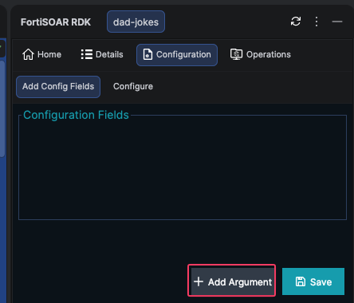
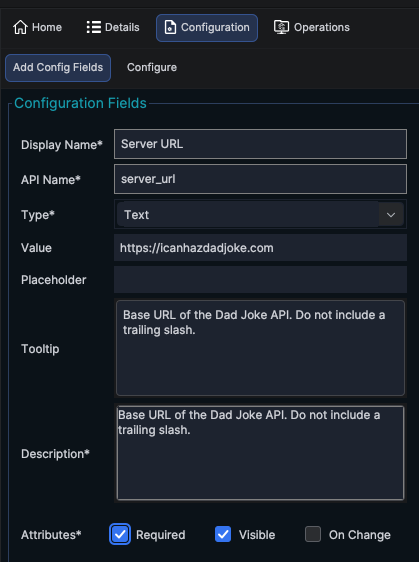
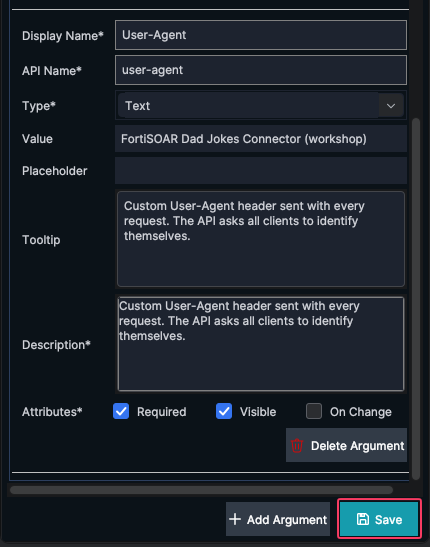
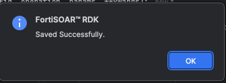
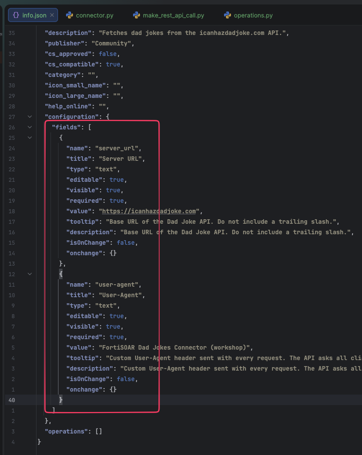
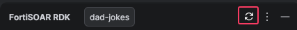
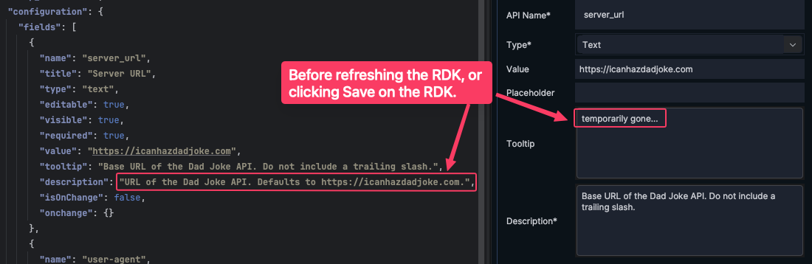
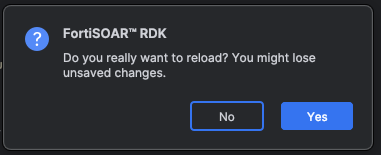
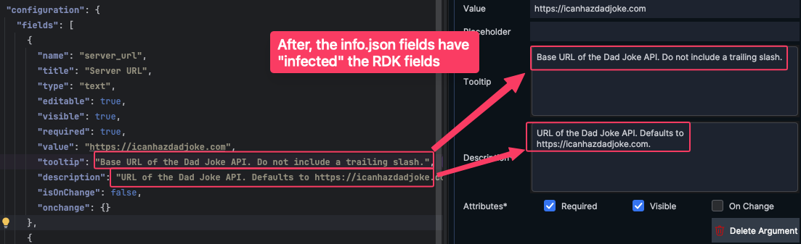

<!-- TODO - finish this page -->

Every connector needs a **configuration** - the settings a FortiSOAR admin fills in when they set up the connector. In this chapter you'll add two configuration fields: the API server URL and a custom User-Agent string.

---

## 1. What goes in configuration?

Configuration holds values that stay the same across all operations - things like server addresses, credentials, and connection preferences. For our Dad Jokes connector:

| Field          | Why we need it                                                                                                                        |
|----------------|---------------------------------------------------------------------------------------------------------------------------------------|
| **Server URL** | The base URL of the API (`https://icanhazdadjoke.com`). Storing it in config means we can change it without editing code.             |
| **User-Agent** | The Dad Joke API [asks](https://icanhazdadjoke.com/api) that all clients send a custom `User-Agent` header so they can monitor usage. |

{}
Even though the Dad Joke API has no authentication, real-world connectors would also include fields like **API Key**, **Username/Password**, or **Verify SSL** here. The pattern is exactly the same - you're just adding more fields.
{}

---

## 2. Add fields using the RDK Configuration tab

1. In the RDK panel, click the **Configuration** tab.
   
2. Click **Add Argument** to add the first configuration parameter.
   

### Field 1 - Server URL

Fill in the following:

| Property         | Value                                                            |
|------------------|------------------------------------------------------------------|
| **Display Name** | `Server URL`                                                     |
| **API Name**     | `server_url` (auto-generated)                                    |
| **Type**         | `Text`                                                           |
| **Value**        | `https://icanhazdadjoke.com`                                     |
| **Tooltip**      | `Base URL of the Dad Joke API. Do not include a trailing slash.` |
| **Description**  | `Base URL of the Dad Joke API. Do not include a trailing slash.` |
| **Required**     | ✅ Checked                                                        |
| **Visible**      | ✅ Checked                                                        |

<!--  -->


### Field 2 - User-Agent

1. Click **Add Argument** again and fill in:

| Property         | Value                                                                                                |
|------------------|------------------------------------------------------------------------------------------------------|
| **Display Name** | `User-Agent`                                                                                         |
| **API Name**     | `user_agent`                                                                                         |
| **Type**         | `Text`                                                                                               |
| **Value**        | `FortiSOAR Dad Jokes Connector (workshop)`                                                           |
| **Tooltip**      | `Custom User-Agent header sent with every request. The API asks all clients to identify themselves.` |
| **Description**  | `Custom User-Agent header sent with every request. The API asks all clients to identify themselves.` |
| **Required**     | ✅ Checked                                                                                            |
| **Visible**      | ✅ Checked                                                                                            |

<!--  -->

2. Click **Save**.


3. Click **OK** to confirm.


---

## 3. Verify in info.json

Open `info.json` and confirm the `configuration` section now looks like this:

```json
{
  "configuration": {
    "fields": [
      {
        "title": "Server URL",
        "type": "text",
        "name": "server_url",
        "required": true,
        "editable": true,
        "visible": true,
        "value": "https://icanhazdadjoke.com",
        "tooltip": "Base URL of the Dad Joke API. Do not include a trailing slash."
      },
      {
        "title": "User-Agent",
        "type": "text",
        "name": "user_agent",
        "required": true,
        "editable": true,
        "visible": true,
        "value": "FortiSOAR Dad Jokes Connector (workshop)",
        "tooltip": "Custom User-Agent header sent with every request. The API asks all clients to identify themselves."
      }
    ]
  }
}
```



{}
You can edit `info.json` directly in the code editor or through the RDK Configuration tab. Just keep in mind if you edit info.json directly, you need to click the **refresh** button in the RDK panel to see the changes there.

{}

### Modify Info.json

1. Find the server url field in `info.json` and change the tooltip to `URL of the Dad Joke API. Defaults to https://icanhazdadjoke.com.`
2. In the RDK for the connector, set the tooltip for the **Server URL** field to `temporary gone...`


{}
Notice how before, the fields in the info.json and RDK are out of sync?
{}

3. Click the **Refresh** button in the RDK panel.


4. Click **Yes** to confirm the refresh.
    

5. Now the fields in the RDK and info.json are in sync.


### Challenge

1. Now try the reverse behavior. Change the tooltip in the RDK and confirm it updates in info.json after you click **Save**.

---

## 4. Build the API helper function

Before we add operations, let's create a reusable function that handles all HTTP calls to the Dad Joke API. This avoids repeating headers and error handling in every operation.

Open `operations.py` and replace its contents with:

```python
import requests
from connectors.core.connector import ConnectorError


def _make_request(config, endpoint="", params=None):
    """
    Reusable helper for all Dad Joke API calls.

    Args:
        config:   Connector configuration dict (from the Configuration tab).
        endpoint: URL path to append to the server URL (e.g., "/j/abc123").
        params:   Optional dict of query string parameters (e.g., {"term": "cat"}).

    Returns:
        dict: Parsed JSON response from the API.

    Raises:
        ConnectorError: If the request fails for any reason.
    """
    url = f"{config['server_url']}{endpoint}"
    headers = {
        "Accept": "application/json",
        "User-Agent": config.get("user_agent", "FortiSOAR Connector")
    }

    try:
        response = requests.get(url, headers=headers, params=params, timeout=30)
        response.raise_for_status()
        return response.json()
    except requests.exceptions.ConnectionError:
        raise ConnectorError(
            f"Cannot connect to {url}. Verify the Server URL in the connector configuration."
        )
    except requests.exceptions.Timeout:
        raise ConnectorError(
            f"Request to {url} timed out after 30 seconds."
        )
    except requests.exceptions.HTTPError as e:
        raise ConnectorError(
            f"API returned an error: {e.response.status_code} {e.response.reason}"
        )
    except Exception as e:
        raise ConnectorError(f"Unexpected error: {str(e)}")
```

Let's break this down:

| Part                            | What it does                                                       |
|---------------------------------|--------------------------------------------------------------------|
| `config['server_url']`          | Reads the Server URL from the configuration you just created.      |
| `config.get('user_agent', ...)` | Reads the User-Agent, with a safe fallback.                        |
| `"Accept": "application/json"`  | Tells the API we want JSON, not HTML.                              |
| `response.raise_for_status()`   | Raises an exception if the API returns a 4xx or 5xx status code.   |
| `ConnectorError(...)`           | FortiSOAR's standard error class - surfaces the message in the UI. |

---

## 5. Implement the health check

The **health check** runs when an admin clicks **Test Configuration** in FortiSOAR. It should verify that the API is reachable with the given settings.

We'll make it fetch a random joke - if that succeeds, the configuration is valid.

Add the following to `operations.py`, below the `_make_request` function:

```python
def check_health(config):
    """
    Health check - fetch a random joke to verify connectivity.
    Returns True if successful, raises ConnectorError otherwise.
    """
    result = _make_request(config)
    if result.get("id") and result.get("joke"):
        return True
    raise ConnectorError("Unexpected response from the API. Check the Server URL.")
```

Now open `connector.py` and update the `check_health` method to call this function:

```python
from connectors.core.connector import Connector
from .operations import check_health


class DadJokes(Connector):

    def execute(self, config, operation, params, **kwargs):
        pass  # We'll fill this in next chapter

    def check_health(self, config):
        return check_health(config)
```

---

## 6. Test the health check

Let's verify our configuration and health check work before moving on.

1. In the RDK, switch to the **Configuration** tab.
2. Make sure the **Server URL** is set to `https://icanhazdadjoke.com` and the **User-Agent** is filled in.
3. Click **Run** (the health check button).
4. You should see a success message in the output panel.

<!--  -->

{}
If the health check fails, check these common issues:

- **No internet access** - The machine running PyCharm needs to reach `icanhazdadjoke.com`.
- **Trailing slash** - Make sure the Server URL is `https://icanhazdadjoke.com` (no trailing `/`).
- **Typo in field names** - The `name` values in `info.json` must exactly match the keys you use in `operations.py` (e.g., `server_url`, `user_agent`).
  {}

---

## Summary

Your connector now has a working configuration and health check:

- ✅ Added **Server URL** and **User-Agent** configuration fields
- ✅ Created the `_make_request` helper function with proper error handling
- ✅ Implemented and tested the **health check**
- ✅ Confirmed the configuration values flow from `info.json` → `connector.py` → `operations.py`

In the next chapter, you'll add the three **operations** - Get Random Joke, Get Joke by ID, and Search Jokes.
