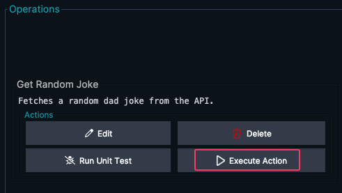
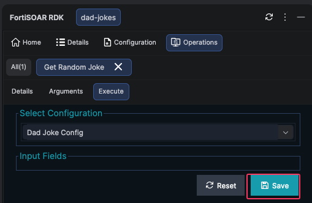
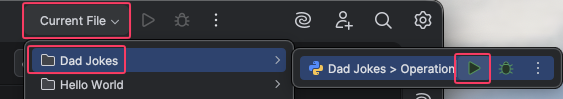

<!-- TODO - finish this page -->

Your connector has configuration, a health check, and three operations. In this chapter you'll run each one, inspect the live API responses, use your IDE's debugger to step through the code when something goes wrong, run automated tests, and export the connector.

{}
{}
If you need a refresher on breakpoints, stepping, and the debug panel, see the [VSCode setup guide]() or VSCode's [debugging documentation](https://code.visualstudio.com/docs/editor/debugging).
{}
{}
If you need a refresher on breakpoints, stepping, and the debug panel, see the [Debug Python Code]() chapter.
{}
{}

---

## 1. Test the health check

Before testing operations, always verify the configuration first.

{}
{}
Right-click the connector in the **FortiSOAR Connectors** view → **Check Health** (or Command Palette → **`FortiSOAR: Check Health`**).

A pass/fail notification appears; full output streams to the **FortiSOAR** Output channel. If config fields haven't been saved, the extension warns and offers to open **Configure Connector** first.
{}
{}
1. In the RDK, switch to the **Configuration** tab.
2. Confirm the values:

   | Field          | Value                                      |
   |----------------|--------------------------------------------|
   | **Server URL** | `https://icanhazdadjoke.com`               |
   | **User-Agent** | `FortiSOAR Dad Jokes Connector (workshop)` |

3. Click **Run** (the health check button).
4. The output panel should show a **success** message.
{}
{}

If it fails, check:
- Your machine has internet access.
- The Server URL has no trailing `/`.
- The field names in `info.json` match the keys in `operations.py` (`server_url`, `user_agent`).

---

## 2. Test Get Random Joke

{}
{}
Right-click **get_random_joke** in the **FortiSOAR Connectors** tree → **Run Operation** -- or open `operations.py` and click the **▶ Run** CodeLens above the `get_random_joke` function.



This operation has no parameters, so just confirm the run. An operation *with*
parameters opens a form like this one:



Output streams to the **FortiSOAR** Output channel:



{}
**CodeLenses:** Open `operations.py` for any registered connector and you'll see inline **▶ Run · 🐞 Debug · 🧪 Test** lenses above each handler function. They run the same flows as the right-click menu without leaving the file.
{}
{}
{}
1. Switch to the **Operations** tab in the RDK panel.
2. For the **Get Random Joke** action, click **Execute Action** from the operation dropdown.
   
3. This operation has no parameters, so click **Save**
   
{}
Make sure you have a Configuration Selected before saving.
{}
4. At the top, click **Current File > Dad Jokes > Play**
   
{}
{}

You should see a JSON response like this:

```json
{
    "id": "R7UfaahVfFd",
    "joke": "My dog used to chase people on a bike a lot. It got so bad I had to take his bike away.",
    "status": 200
}
```

{}
Run it a few times, and you'll get a different joke each time. Save one of the `id` values (e.g., `R7UfaahVfFd`) for the next test.
{}

---

## 3. Test Get Joke by ID

{}
{}
Right-click **get_joke_by_id** → **Run Operation** (or the **▶ Run** CodeLens).

A parameter form opens in a new editor tab. Enter `R7UfaahVfFd` in the **Joke ID** field and click **Run**. Values are remembered per-operation across reloads.
{}
{}
1. Select **Get Joke by ID** from the operation dropdown.
2. In the **Joke ID** parameter field, paste one of the IDs from the previous test (e.g., `R7UfaahVfFd`).
3. Click **Execute Action**.
{}
{}

Expected output:

```json
{
    "id": "R7UfaahVfFd",
    "joke": "My dog used to chase people on a bike a lot. It got so bad I had to take his bike away.",
    "status": 200
}
```

Now try an ID that doesn't exist:

{}
{}
Run **get_joke_by_id** again with `this-id-is-fake` as the Joke ID. Watch the **FortiSOAR** Output channel.
{}
{}
1. Enter `this-id-is-fake` in the Joke ID field.
2. Click **Execute Action**.
{}
{}

You get a **result**, not an error:

```json
{
    "message": "Joke with id \"this-id-is-fake\" not found",
    "status": 404
}
```

This is worth stopping on. The API answers an unknown ID with **HTTP 200** and puts
`404` in the *body*. `response.raise_for_status()` only looks at the HTTP status
line, so it sees `200`, raises nothing, and `_make_request` hands the error body
straight back to the playbook as if it were a joke.

{}
Plenty of real APIs do this. Status-code-only error handling is not enough -- you
have to know what your API actually returns on failure. Fixing it here means
inspecting the parsed body:

```python
def get_joke_by_id(config, params):
    """Fetch a specific joke by its ID."""
    joke_id = params.get("joke_id")
    if not joke_id:
        raise ConnectorError("Joke ID is required.")
    result = _make_request(config, endpoint=f"/j/{joke_id}")
    if result.get("status") != 200:
        raise ConnectorError(result.get("message", f"Joke {joke_id} not found."))
    return result
```
{}

To see the `except requests.exceptions.HTTPError` branch actually fire, point the
**Server URL** at a path that really does 404 -- e.g. temporarily set it to
`https://icanhazdadjoke.com/no-such-endpoint` and re-run. Then you get
`API error: 404 Not Found` from `raise_for_status()`.

---

## 4. Test Search Jokes

{}
{}
Right-click **search_jokes** → **Run Operation** (or the **▶ Run** CodeLens).

Fill in the parameter form:

| Parameter       | Value |
|-----------------|-------|
| **Search Term** | `cat` |
| **Limit**       | `5`   |

Click **Run**. Output streams to the **FortiSOAR** Output channel.
{}
{}
1. Select **Search Jokes** from the operation dropdown.
2. Fill in the parameters:

   | Parameter       | Value |
   |-----------------|-------|
   | **Search Term** | `cat` |
   | **Limit**       | `5`   |

3. Click **Execute Action**.
{}
{}

Expected output (your results may vary):

```json
{
    "current_page": 1,
    "limit": 5,
    "next_page": 1,
    "previous_page": 1,
    "results": [
        {
            "id": "iGJeEg4YDb",
            "joke": "What do you call a pile of cats? A meowntain."
        },
        {
            "id": "AQn3wPKeqrc",
            "joke": "It was raining cats and dogs the other day. I almost stepped in a poodle."
        }
    ],
    "search_term": "cat",
    "status": 200,
    "total_jokes": 3,
    "total_pages": 1
}
```

Try a few more searches to explore the API:

| Search Term | What you'll find                                     |
|-------------|------------------------------------------------------|
| `hipster`   | 2 jokes about hipsters                               |
| `dog`       | Several dog-related jokes                            |
| `math`      | Math puns                                            |
| `asdfghjkl` | An empty results list (great for testing edge cases) |

---

## 5. Debug an operation with breakpoints

Now let's use the debugger to step through an operation and see exactly what happens at each stage.

### Set a breakpoint

1. Open `operations.py` in the editor.
2. Find the `search_jokes` function.
3. Click in the **gutter** next to the line `search_term = params.get("search_term")` to set a red breakpoint dot.

### Run in debug mode

{}
{}
Right-click **search_jokes** → **Debug Operation** (or the **🐞 Debug** CodeLens, or Command Palette → **`FortiSOAR: Debug Operation`**).

Fill in `Search Term: dog` and `Limit: 3`, then click **Debug**. The extension generates a `debugpy` launch on the fly and starts a VSCode debug session. Execution pauses at your breakpoint -- the line is highlighted.

The connector's stdout/stderr is mirrored from the debug session into the **FortiSOAR** Output channel so you can see results in the same place as Run.

{}
If the debug session never starts, ensure both `ms-python.python` **and** `ms-python.debugpy` are installed, and a Python interpreter is selected for the workspace (`Cmd+Shift+P` → "Python: Select Interpreter").
{}
{}
{}
1. In the RDK, select **Search Jokes** and fill in `Search Term: dog` and `Limit: 3`.
2. Instead of clicking **Execute Action** normally, click the **Debug** button (the bug icon 🪲) next to it.

PyCharm pauses execution at your breakpoint. The line is highlighted in blue.
{}
{}

### Step through the code

Use the debugger controls to walk through the function:

{}
{}

| Step | Press               | What you'll see                                                                     |
|------|---------------------|-------------------------------------------------------------------------------------|
| 1    | `F10` (Step Over)   | `search_term` now equals `"dog"` in the Variables view.                             |
| 2    | `F10`               | The `if not search_term` check is skipped (it has a value).                         |
| 3    | `F10`               | `query_params` is created: `{"term": "dog"}`.                                       |
| 4    | `F10`               | `limit` equals `3`.                                                                 |
| 5    | `F10`               | `query_params` is now `{"term": "dog", "limit": 3}`.                                |
| 6    | `F11` (Step Into)  | Jump into `_make_request`.                                                          |
| 7    | `F10`               | Watch `url` become `"https://icanhazdadjoke.com/search"`.                           |
| 8    | `F10`               | Watch `headers` populate with your User-Agent.                                      |
| 9    | `F10`               | The `requests.get(...)` call fires. Watch `response` appear.                        |
| 10   | `F10`               | `response.raise_for_status()` passes (status 200).                                  |
| 11   | `F10`               | `response.json()` parses the JSON. Expand it in the Variables view to see the jokes. |
| 12   | `F5` (Continue)    | Execution finishes. The result appears in the FortiSOAR Output channel.             |
{}
{}

| Step | Press            | What you'll see                                                                     |
|------|------------------|-------------------------------------------------------------------------------------|
| 1    | `F8` (Step Over) | `search_term` now equals `"dog"` in the Variables tab.                              |
| 2    | `F8`             | The `if not search_term` check is skipped (it has a value).                         |
| 3    | `F8`             | `query_params` is created: `{"term": "dog"}`.                                       |
| 4    | `F8`             | `limit` equals `3`.                                                                 |
| 5    | `F8`             | `query_params` is now `{"term": "dog", "limit": 3}`.                                |
| 6    | `F7` (Step Into) | Jump into `_make_request`.                                                          |
| 7    | `F8`             | Watch `url` become `"https://icanhazdadjoke.com/search"`.                           |
| 8    | `F8`             | Watch `headers` populate with your User-Agent.                                      |
| 9    | `F8`             | The `requests.get(...)` call fires. Watch `response` appear.                        |
| 10   | `F8`             | `response.raise_for_status()` passes (status 200).                                  |
| 11   | `F8`             | `response.json()` parses the JSON. Expand it in the Variables tab to see the jokes. |
| 12   | `F9` (Resume)    | Execution finishes. The result appears in the RDK output panel.                     |
{}
{}

{}
Try adding a **Watch** expression for `len(response.json().get('results', []))` to see the result count update live as you step through the code.
{}

---

## 6. Debug an error scenario

Let's trace the mismatch from section 3 through the debugger -- this is the exact
technique you'll use on a real connector that "succeeds" with the wrong data.

1. Set a breakpoint on the `response.raise_for_status()` line inside `_make_request`.
2. {}{}Right-click **get_joke_by_id** → **Debug Operation**, enter `this-does-not-exist` as the Joke ID, click **Debug**.{}{}In the RDK, select **Get Joke by ID** and enter `this-does-not-exist` as the Joke ID. Click **Debug**.{}{}
3. When execution pauses, hover over `response` in the Variables view. You'll see:
   - `response.status_code` = `200` -- **not** 404
   - `response.reason` = `"OK"`
4. Step over (`F10` / `F8`) -- `raise_for_status()` returns without raising, because
   the HTTP layer thinks the call succeeded.
5. Step over again -- `response.json()` parses `{"message": "...not found", "status": 404}`.
6. Expand it in the Variables view. The failure was in the body the whole time.

This is exactly how you'll debug real connector failures: set a breakpoint in
`_make_request`, reproduce the issue, and inspect what the API *actually*
returned rather than trusting the status code.

---

## 7. Common issues and troubleshooting

| Symptom                                    | Likely cause                                                                   | Fix                                                                                   |
|--------------------------------------------|--------------------------------------------------------------------------------|---------------------------------------------------------------------------------------|
| `ConnectorError: Cannot connect to...`     | No internet, firewall blocking, or wrong URL.                                  | Check network access. Verify the Server URL.                                          |
| `ConnectorError: API error: 404 Not Found` | Wrong endpoint path -- the URL itself doesn't exist.                            | Check the `endpoint` string in your function.                                         |
| An unknown joke ID returns a result instead of an error | The API answers with HTTP 200 and `"status": 404` in the body. | Inspect the parsed body, not just the status code (see section 3).        |
| `KeyError: 'server_url'`                   | The field `name` in `info.json` doesn't match the key used in `operations.py`. | Ensure `"name": "server_url"` in config fields.                                       |
| Operation not found / unknown              | The `operation` key in `info.json` doesn't match the key in `OPERATION_MAP`.   | Compare the strings exactly, they're case-sensitive.                                  |
| Health check passes but operations fail    | Health check uses `/` but the operation might use a different endpoint.        | Debug the specific operation to see which URL is called.                              |

{}
{}

| Symptom                                    | Fix                                                                                   |
|--------------------------------------------|---------------------------------------------------------------------------------------|
| `ModuleNotFoundError: requests`            | The connector's `requirements.txt` auto-installs on the first Run. If it fails, run **`FortiSOAR: Reset Python Environment`** to wipe the engine venv and reinstall. |
| Debug session never starts                  | Ensure both `ms-python.python` **and** `ms-python.debugpy` are installed, and a Python interpreter is selected (`Cmd+Shift+P` → "Python: Select Interpreter"). |
| "Configure Now / Run Anyway" warning every run | Click **Configure Now** and fill in config values once -- the warning won't fire again. |
| Tree shows "needs configuration" after configuring | Click the **Refresh** button on the view title bar; readiness recomputes. |
{}
{}

| Symptom                                    | Fix                                                                                   |
|--------------------------------------------|---------------------------------------------------------------------------------------|
| `ModuleNotFoundError: requests`            | Click **Install Requirements** in the RDK Details tab, or run `pip install requests`. |
{}
{}

---

## 8. Run automated tests

The scaffold created a `tests/` folder with pytest-based test stubs. Both IDEs can run these tests.

{}
{}
The extension scaffolds and runs pytest-based tests against each connector in its **own** virtual environment, kept separate from the engine venv so heavyweight live-test deps can't pollute Run/Debug.

**Scaffold tests** (if you didn't during New Connector): right-click the connector → **Scaffold Tests**, or Command Palette → **`FortiSOAR: Scaffold Tests`**. Generates `tests/{pytest.ini, requirements.txt, .env.example, .gitignore, conftest.py, test_check_health_mock.py, test_check_health_live.py, README.md}`.

**Run Tests (Mocked)** -- right-click the connector → **Run Tests (Mocked)**, or Command Palette → **`FortiSOAR: Run Tests (Mocked)`**. Runs `pytest -m "not live"` against mocked fixtures. No credentials needed -- this is what CI runs.

{}
The scaffolded `test_check_health_mock.py` is a **template**, not a passing test.
It fakes a generic `{"ok": True}` response, which our `check_health` rejects -- it
requires an `id` and a `joke`. Open the file and make the mock match the shape
your connector actually expects:

```python
    responses.add(
        responses.GET,
        mocked_config["server_url"],
        json={"id": "abc123", "joke": "A mocked joke.", "status": 200},
        status=200,
    )
```

Adapting the fixture to the real response contract is the point of the exercise --
a mocked test that passes against a response your connector would never see tells
you nothing.
{}

**Run Tests (Live)** -- right-click the connector → **Run Tests (Live)**, or Command Palette → **`FortiSOAR: Run Tests (Live)`**. Runs `pytest -m live` against the real service. Requires `tests/.env`; if missing, the extension offers to copy `.env.example` → `.env` and open it in the editor for you to fill in.

**Debug Tests** -- **`FortiSOAR: Debug Tests (Mocked)`** and **`FortiSOAR: Debug Tests (Live)`**. Same as Run, but launched under `debugpy` so breakpoints in tests _and_ in `operations.py` hit normally.

If a test venv gets into a bad state, **`FortiSOAR: Reset Test Environment`** removes it; the next test run rebuilds it from `tests/requirements.txt`.

{}
The 🧪 **Test** CodeLens in `operations.py` runs **`FortiSOAR: Run Tests for Operation`** -- `pytest -k <operation_name>` against the connector's test venv, filtered to that operation's tests. It only appears once a `tests/` scaffold exists.
{}
{}
{}
The scaffolded `tests/` folder includes pytest test stubs. Run them from PyCharm's built-in test runner or from the terminal:

```bash
# Mocked tests (no credentials needed)
pytest tests/ -m "not live"

# Live tests (requires tests/.env with credentials)
pytest tests/ -m live
```

In PyCharm, right-click the `tests/` folder → **Run pytest in tests** to use the built-in runner. Set breakpoints in test files or `operations.py` and use **Debug** instead of **Run** to step through.
{}
{}

---

## 9. Export the connector

Once all three operations pass testing, you can package the connector for deployment.

{}
{}
Right-click the connector → **Export Connector as Tarball** (or Command Palette → **`FortiSOAR: Export Connector as Tarball`**).

Before the tarball is written, the extension runs a **pre-export validation** pass:

- Missing/invalid `info.json` fields
- Operations declared in `info.json` but missing from `operation_map`
- Handlers in `operation_map` not declared in `info.json`
- Missing icon files
- Malformed lines in `requirements.txt`
- Hardcoded credentials in `connector.py` / `operations.py`
- Folder-name vs `info.json.name` mismatch

**Errors block** the export with a picker listing each issue; **warnings prompt** with an "Export Anyway" option.



The output is a `.tgz` at `<connector>/build/<name>-<version>.tgz` (e.g., `dad-jokes-1.0.0.tgz`).

{}
v1 does **not** ship **Generate Playbooks** or **Generate Documents** (deferred to v2). Generate sample playbooks from FortiSOAR after import if you need them.
{}
{}
{}
1. Go to the **Details** tab in the RDK.
2. *(Optional)* Click **Validate Connector** to run the automated checks. Fix any warnings.
3. *(Optional)* Click **Generate Playbooks** to create sample playbooks from your operations.
4. *(Optional)* Click **Generate Documents** to create documentation.
5. Click **Export**.
6. Choose a destination folder.
7. The RDK packages everything into a `.tgz` file (e.g., `dad-jokes-1.0.0.tgz`).
{}
{}

### What's inside the tarball

FortiSOAR's importer requires the archive to contain **exactly one top-level
directory**, named for the connector:

```text
dad-jokes/
├── info.json
├── connector.py
├── operations.py
├── requirements.txt
├── __init__.py
├── README.md
└── tests/…
```

`__pycache__`, `*.pyc`, `build/`, `.git/` and `local_data.json` are stripped on
the way in. If you ever hand-roll a connector tarball, pack the *parent* of the
connector folder -- `tar czf dad-jokes.tgz dad-jokes/`, not `cd dad-jokes && tar
czf ../x.tgz .`.

{}
A flat archive -- `info.json` at the root, with no wrapping directory -- is
rejected by the importer, and the error it returns is **"Connector with same
name is already active"** even when no such connector exists. If you see that
message for a connector you've never imported, check the archive's shape before
hunting for a duplicate.
{}

---

## 10. Import into FortiSOAR

1. In FortiSOAR, go to **Content Hub → Manage Connectors**.
2. Click **Add** and choose the `.tgz` you just exported.
3. Wait for the import to report **Import Complete**.
4. Open the connector, add a configuration, and fill in **Server URL**
   (`https://icanhazdadjoke.com`) and **User-Agent** -- the same values you used
   in the IDE.
5. Click **Test Connection**. It runs the same `check_health` you wrote.
6. From the connector's **Actions** tab, run **Get Random Joke**.

You should get back the same shape you saw in your IDE:

```json
{
    "id": "UfxAIm3wkjb",
    "joke": "Why are ghosts bad liars? Because you can see right through them!",
    "status": 200
}
```

That's the whole loop: scaffolded in the IDE, run and debugged locally, packaged,
imported, and executing on the platform.

---

## Summary

You've built, tested, and debugged a complete connector from scratch:

- ✅ **Health check** - verified API connectivity
- ✅ **Get Random Joke** - tested a no-parameter operation
- ✅ **Get Joke by ID** - tested with valid and invalid IDs
- ✅ **Search Jokes** - tested with different search terms and limits
- ✅ **Debugger** - stepped through live API calls with breakpoints
- ✅ **Error handling** - traced a 404 error through the exception chain
- ✅ **Automated tests** - ran mocked and live pytest tests
- ✅ **Export** - packaged the connector as a `.tgz` for deployment


### Congratulations!

You've completed the **Build Your First Connector** section. You now know how to:

1. Create a connector project
2. Add configuration fields
3. Define operations with parameters
4. Write Python functions that call a real API
5. Test and debug operations locally
6. Run automated tests
7. Export a deployable `.tgz` package

You're ready to build connectors for any REST API.
