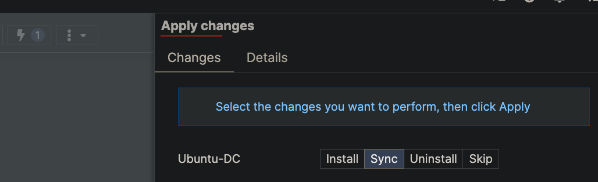

## Upgrade Fabric Studio to latest interim build

`system execute upgrade --channel interim`

## Access FS Shell

Sometimes you need to access the CLI / shell of Fabric studio

`system repository home shell` [link](https://register.fabricstudio.net/docs/fabric-studio/2.0.2/generated/cli/system.html#system-repository-home-shell)

```bash
(cmm-master-fs-001) # system repository home shell
admin@cmm-master-fs-001:~$ pwd
/home/home
admin@cmm-master-fs-001:~$ ls -lh
total 895M
drwxr-xr-x 3 admin www-data 4.0K May 28 14:53 firmwares
-rw-r--r-- 1 root  root     895M May 28 15:16 fortisoar-fs-5-28-25.fpoc
drwxr-xr-x 2 admin www-data 4.0K Sep  6  2024 gui
drwxr-xr-x 4 root  root     4.0K Feb 24 21:22 log
-rw-rw-rw- 1 root  root      487 May 28 14:53 Release
drwxr-xr-x 2 admin www-data 4.0K May 28 14:53 templates
```

## List fabric IDs

```bash
(cmm-master-fs-001) # model fabric list
2 fabric: 
3 FortiDemo-FortiSOAR: 
```

The id's (2,3) are used to identify the fabric in filters

## List available configs for a fabric

```bash
(cmm-master-fs-001) # model fabric device config list 3
98 /fabrics/3/configs/Branch1-20250221-025621.conf
99 /fabrics/3/configs/Branch2-20250221-025839.conf
100 /fabrics/3/configs/Corporate_FortiMail-20250215-171755.conf
101 /fabrics/3/configs/Enterprise_Core-20250215-171711_7_4_7.conf
102 /fabrics/3/configs/Enterprise_FortiAnalyzer-20230920-741newcert.conf.tgz
103 /fabrics/3/configs/FortiManager-20240919-newcert.conf.tgz
104 /fabrics/3/configs/Branch1-20231003-License.conf
105 /fabrics/3/configs/Branch1-20240216-163458.conf
106 /fabrics/3/configs/Branch1-20240919-newcert.conf
107 /fabrics/3/configs/Branch1-20250214-214602_7_2_11.conf
108 /fabrics/3/configs/Branch1-7.2.6-20240125-055636-conf.cfg
109 /fabrics/3/configs/Branch2-20231003-license.conf
110 /fabrics/3/configs/Branch2-20240216-163530.conf
111 /fabrics/3/configs/Branch2-20240919-ssl.conf
112 /fabrics/3/configs/Branch2-20250214-221247_7_2_11.conf
113 /fabrics/3/configs/Branch2-7.2.6-20240125-055739.conf
114 /fabrics/3/configs/Corporate_FortiMail-20230919-newssl.conf
115 /fabrics/3/configs/EnterpriseCore-7.4.2-012524.conf
116 /fabrics/3/configs/Enterprise_Core-20240918-ssl.conf
117 /fabrics/3/configs/FortiManager-20231003-license.conf.tgz
118 /fabrics/3/configs/FortiManager-20240216-163605.conf.tgz
119 /fabrics/3/configs/FortiManager-dspille20230929-002809.conf.tgz
120 /fabrics/3/configs/branch1_rc1
121 /fabrics/3/configs/branch2_rc1
157 /fabrics/3/configs/FortiSOAR.conf
```

## Create a fpoc export

`model debug fabric export --select id=3 fortisoar-fs-5-28-25.fpoc` [link](https://register.fabricstudio.net/docs/fabric-studio/2.0.2/generated/cli/model.html#model-debug-fabric-export)

## SCP Download a export

Example showing how to download a fpoc export from Fabric studio to your downloads folder

`scp admin@<fs-domain>:<filename> <local-path>`

```text
🚀  scp admin@dspille-fabric-studio-soar3.fortidemo.fortinet.com:fortisoar-fs-5-28-25.fpoc ~/Downloads/
admin@dspille-fabric-studio-soar3.fortidemo.fortinet.com's password:
fortisoar-fs-5-28-25.fpoc                                                                                                 100%  894MB   3.3MB/s   04:33
```

---

# VM Access Management Guide

## Overview

VM access controls how you can connect to virtual machines in your fabric. This guide covers viewing existing access methods and creating new ones.

## Command Structure

All VM access commands follow this pattern:

```bash
model vm access <action> [options] [arguments]
```

## Available Access Types

- **SERIAL** - Serial console access
- **SSH** - Secure Shell access (port 22)
- **HTTP** - Web access (port 80)
- **HTTPS** - Secure web access (port 443)
- **SPICE** - Remote desktop protocol
- **VNC** - Virtual Network Computing remote desktop

## Access Modes

- **PRIVATE** - Internal network access only
- **PUBLIC** - External network access (use with caution)

---

## Viewing VM Access

### 1. List All VMs in a Fabric

```bash
model fabric vm list <fabric_id>
```

**Example:**

```bash
model fabric vm list 4
```

### 2. View All VM Access Entries

```bash
model vm access list
```

### 3. View Access for Specific VM

```bash
model vm access list --select "vm=<vm_id>"
```

**Example:**

```bash
model vm access list --select "vm=67"
```

### 4. Get Detailed Access Information

```bash
model vm access detail <access_id>
```

**Example:**

```bash
model vm access detail 50
```

### 5. Additional List Options

```bash
# With pagination
model vm access list --limit 10 --page 1

# With ordering
model vm access list --order-by vm,type

# With related fields
model vm access list --related-fields vm,fabric
```

---

## Creating VM Access

### Basic Syntax

```bash
model vm access create '<json_object>'
```

### JSON Object Structure

```json
{
  "vm": <vm_id>,
  "type": "<access_type>",
  "mode": "<access_mode>",
  "name": "<descriptive_name>",
  "dport": <port_number>
}
```

### Common Access Creation Examples

#### SSH Access

```bash
model vm access create '{"vm": 67, "type": "SSH", "mode": "PRIVATE", "name": "SSH", "dport": 22}'
```

#### HTTP Access

```bash
model vm access create '{"vm": 67, "type": "HTTP", "mode": "PRIVATE", "name": "HTTP", "dport": 80}'
```

#### HTTPS Access

```bash
model vm access create '{"vm": 67, "type": "HTTPS", "mode": "PRIVATE", "name": "HTTPS", "dport": 443}'
```

#### Serial Console Access

```bash
model vm access create '{"vm": 67, "type": "SERIAL", "mode": "PRIVATE", "name": "SERIAL", "dport": 0}'
```

#### SPICE Remote Desktop

```bash
model vm access create '{"vm": 67, "type": "SPICE", "mode": "PRIVATE", "name": "SPICE", "dport": 0}'
```

#### VNC Remote Desktop

```bash
model vm access create '{"vm": 67, "type": "VNC", "mode": "PRIVATE", "name": "VNC", "dport": 0}'
```

### Descriptive Naming Convention

For consistency with existing entries, use descriptive names:

```bash
model vm access create '{"vm": 67, "type": "HTTPS", "mode": "PRIVATE", "name": "HTTPS", "dport": 443}'
```

---

## Deleting VM Access

### Delete Access Entry

```bash
model vm access delete <access_id>
```

### Interactive Deletion

```bash
model vm access delete <access_id> --interactive
```

### Force Deletion (no confirmation)

```bash
model vm access delete <access_id> --yes
```

---

## Complete Workflow Example

### Step 1: Find Your VM

```bash
# List all VMs in fabric 4
model fabric vm list 4

# Output shows:
# 67 BASIC:Ubuntu-Cloud
```

### Step 2: Check Existing Access

```bash
# Check current access for VM 67
model vm access list --select "vm=67"

# Output shows:
# 226 Default VNC PRIVATE access to Ubuntu-Cloud
# 227 Default SPICE PRIVATE access to Ubuntu-Cloud
```

### Step 3: Add New Access

```bash
# Add HTTPS access
model vm access create '{"vm": 67, "type": "HTTPS", "mode": "PRIVATE", "name": "HTTPS": 443}'

# Add SSH access
model vm access create '{"vm": 67, "type": "SSH", "mode": "PRIVATE", "name": "SSH", "dport": 22}'
```

### Step 4: Verify Creation

```bash
# Check access again
model vm access list --select "vm=67"

# Should now show all access methods including new ones
```

### Step 5: Apply changes to Fabric

Open your Fabric and Sync the change to the device

---

## JSON Mode

Enable JSON output for programmatic processing:

```bash
cli json enable
```