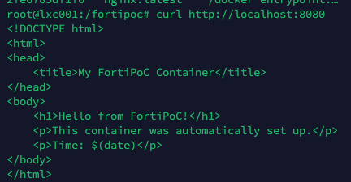
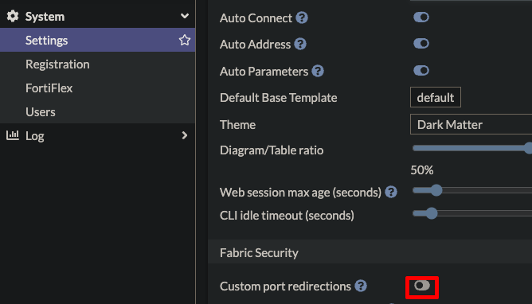
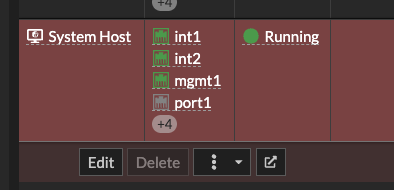
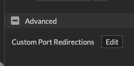
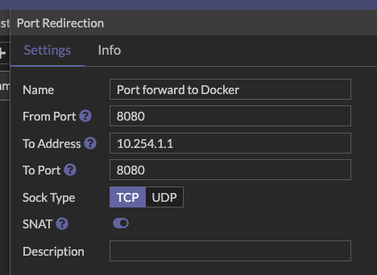

{}
Keep in mind that /fortipoc and postinst will be deprecated in future versions of Fabric Studio. It is recommended to transition to using /fabric for all custom scripts and data storage.
{}

This guide shows how to set up a "simple" auto-start system using Fabric's **/fabric/init** and **/fortipoc/postinst** to automatically install Docker and run a web server container.

**IMPORTANT**: Only **/fabric/** and **/fortipoc/** directories are backed up by Fabric Studio.

## Quick Overview

1. Fabric Studio calls **/fabric/init install** on first boot
2. Default **/fabric/init** (already built-in) calls **/fortipoc/postinst**
3. **/fortipoc/postinst** runs scripts in **/fortipoc/setup.d/** using **run-parts**
4. Result: Automatic Docker + nginx container setup

## Simple Setup Example

### Step 1: Create the FortiPoC post-install script

```bash
mkdir -p /fortipoc/{setup.d,logs}

tee /fortipoc/postinst > /dev/null << 'EOF'
#!/bin/bash
set -e

LOG_DIR="/fortipoc/logs"
MAIN_LOG="$LOG_DIR/postinst.log"
mkdir -p "$LOG_DIR"

log() {
    echo "$(date '+%Y-%m-%d %H:%M:%S') [FORTIPOC]: $*" | tee -a "$MAIN_LOG"
}

log "=== FortiPoC Post-Installation Started ==="

# Set environment variables for setup scripts
export FORTIPOC_SETUP_LOG_DIR="$LOG_DIR"

# Run all executable scripts in setup.d directory
if [[ -d "/fortipoc/setup.d" ]]; then
    log "Running setup scripts..."
    run-parts --verbose /fortipoc/setup.d 2>&1 | tee -a "$MAIN_LOG"
else
    log "No setup directory found"
fi

log "=== FortiPoC Post-Installation Complete ==="
EOF

chmod +x /fortipoc/postinst
```

### Step 2: Create setup scripts

**Install Docker:**

```bash
tee /fortipoc/setup.d/10-docker-install > /dev/null << 'EOF'
#!/bin/bash
set -e

log() {
    echo "$(date) [DOCKER]: $*"
}

# Check if Docker is already installed
if command -v docker &> /dev/null; then
    log "Docker already installed"
    exit 0
fi

log "Installing Docker..."

# Update packages
apt-get update -qq

# Install prerequisites
apt-get install -y -qq curl gnupg ca-certificates

# Add Docker repository
install -m 0755 -d /etc/apt/keyrings
curl -fsSL https://download.docker.com/linux/debian/gpg | gpg --dearmor -o /etc/apt/keyrings/docker.gpg
chmod a+r /etc/apt/keyrings/docker.gpg

echo "deb [arch=$(dpkg --print-architecture) signed-by=/etc/apt/keyrings/docker.gpg] https://download.docker.com/linux/debian $(. /etc/os-release && echo "$VERSION_CODENAME") stable" | tee /etc/apt/sources.list.d/docker.list > /dev/null

# Install Docker
apt-get update -qq
apt-get install -y -qq docker-ce docker-ce-cli containerd.io

# Start Docker
systemctl start docker
systemctl enable docker

log "Docker installed: $(docker --version)"
EOF

chmod +x /fortipoc/setup.d/10-docker-install
```

**Run nginx container:**

```bash
tee /fortipoc/setup.d/20-run-nginx > /dev/null << 'EOF'
#!/bin/bash
set -e

log() {
    echo "$(date) [NGINX]: $*"
}

# Wait for Docker to be ready
for i in {1..30}; do
    if docker info >/dev/null 2>&1; then
        break
    fi
    log "Waiting for Docker..."
    sleep 2
done

# Create web content directory (in backed up location)
mkdir -p /fortipoc/web-content

# Create a simple index page
cat > /fortipoc/web-content/index.html << 'HTML'
<!DOCTYPE html>
<html>
<head>
    <title>My FortiPoC Container</title>
</head>
<body>
    <h1>Hello from FortiPoC!</h1>
    <p>This container was automatically set up.</p>
    <p>Time: $(date)</p>
</body>
</html>
HTML

# Stop existing container if running
docker stop nginx-web 2>/dev/null || true
docker rm nginx-web 2>/dev/null || true

# Run nginx container
log "Starting nginx container..."
docker run -d \
    --name nginx-web \
    --restart unless-stopped \
    -p 8080:80 \
    -v /fortipoc/web-content:/usr/share/nginx/html:ro \
    nginx:latest

log "Nginx container started successfully"
log "Web server available at http://localhost:8080"
EOF

chmod +x /fortipoc/setup.d/20-run-nginx
```

### Step 3: Test the setup

```bash
# Test manually (simulates what Fabric Studio does)
/fabric/init install

# Check if it worked
docker ps
curl http://localhost
```



## Step 4. Add port forwarding in Fabric Studio

### Validate port forwarding is allowed

In your fabric studio settings, make sure Custom port redirects is allowed


Now if you want to see your web server from outside the LXC container, add a port forward in Fabric Studio. Make sure you know the IP address of the LXC host, in my case, 10.254.1.1

1. Edit the **System Host** Device
   
2. Under **Advanced** click **Custom Port Redirections**
   
3. Click **Create**
4. Fill out the relevant port details and click **OK**
   
5. Make sure you click Save on the System Host device
6. **Important**: Ensure you either sync the system host device, or install the system host again to apply the new port forward.

## How It Works

1. **Container starts** → Fabric Studio calls `/fabric/init install`
2. **Fabric init** → Calls `/fortipoc/postinst` (built-in behavior)
3. **FortiPoC postinst** → Uses `run-parts` to run scripts in `/fortipoc/setup.d/`
4. **Setup scripts run in order**:
   - `10-docker-install` → Installs Docker
   - `20-run-nginx` → Runs nginx container with content from `/fortipoc/web-content/`

## Save config and test persistence

1. Save your LXC container state in Fabric Studio by right clicking the device > **Config & License > Backup Config**
   
2. Choose a name and click **OK**
   
3. Open the event logs and confirm you see your files in the backup detail
   

### Test persistence

## Directory Structure

```
/fortipoc/
├── postinst                 # Main script (called by Fabric)
├── setup.d/                # Auto-executed scripts
│   ├── 10-docker-install   # Install Docker
│   └── 20-run-nginx       # Run nginx container
├── web-content/            # Web files (backed up!)
│   └── index.html
└── logs/                   # Log files
    └── postinst.log
```

## Key Points

- **Only `/fortipoc/` gets backed up** - store all important data there
- **Scripts run in alphabetical order** - use numbers (10, 20, 30)
- **Make scripts idempotent** - safe to run multiple times
- **Use `--restart unless-stopped`** - containers restart automatically
- **Mount volumes to `/fortipoc/`** - data persists through backups/restores

## Troubleshooting

```bash
# Check logs
tail -f /fortipoc/logs/postinst.log

# Test individual scripts
/fortipoc/setup.d/10-docker-install

# Check containers
docker ps -a

# Test manually
/fortipoc/postinst
```

This setup automatically installs Docker and runs an nginx web server every time your LXC container starts, with all data stored in the backed-up `/fortipoc/` directory.
