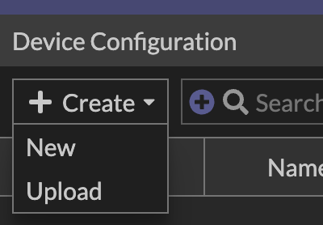
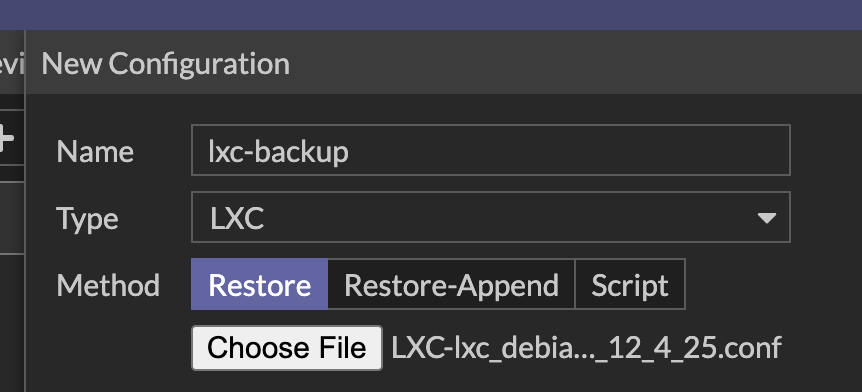

In this section, we’ll look at a pattern for running setup scripts automatically in an **LXC container** managed by Fabric Studio.

The goal:

- Keep all “your stuff” in `/fabric/`
- Let Fabric Studio drive _when_ things run (`install`, `restore`, `script`, `prepare`)
- Use `run-parts` and `/fabric/setup.d/` for small, ordered scripts
- Centralize logging so you can see exactly what happened

### Quick Setup (Option 1)

1. Download this lxc config.

{}

2. Create an LXC container in Fabric Studio
   

   

3. Open the device and select the Browse under Configuration
   
4. Click **Create > Upload** and select the downloaded config file. Make sure to select **Restore**
   
   
5. Install the Fabric
6. Access the container's shell and explore `/fabric/`
7. Check the logs in `/fabric/logs/setup.log`

### Deep Device on How It Works (Option 2)

We’ll use two main pieces:

- `/fabric/init` – the entrypoint Fabric Studio calls
- `/fabric/fabric.script` – your orchestration script, which in turn runs `/fabric/setup.d/*`

## Directory Layout

Example layout:

```bash
root@lxc002:/fabric# find .
.
./setup.d
./setup.d/10-environment-check
./setup.d/20-install-components
./setup.d/40-json-transform
./init
./logs
./logs/setup.log
./data
./data/config.json
./fabric.script
```

Meaning:

- `/fabric/init` – main control script called by Fabric Studio (`install`, `restore`, `prepare`, `script`)
- `/fabric/fabric.script` – your startup runner (invoked by `/fabric/init script`)
- `/fabric/setup.d/` – directory of small, ordered scripts run by `run-parts`
- `/fabric/logs/setup.log` – combined log for all setup scripts
- `/fabric/data/` – example data directory (e.g. `config.json`)

## How Fabric Studio Uses `/fabric/init`

Fabric Studio calls `/fabric/init` with different subcommands during backup/restore and on first boot.

Your `/fabric/init` looks like this (simplified for explanation):

```sh
#!/bin/sh
set -e

if [ -f /fabric.env ]; then
    . /fabric.env
fi

install() {
    # One-time first-boot install logic
    # ...
    restore
    script
}

script() {
    if [ ! -f /fabric.script ]; then
        return 0
    fi
    chmod +x /fabric.script
    /fabric.script
}

prepare() {
    # Called before backup, copy anything needed into /fabric
    true
}

restore() {
    # Called after /fabric has been restored
    cp /fabric/fabric.script /fabric.script
    true
}

COMMAND="$1"
shift

case ${COMMAND} in
    (install|script|prepare|restore)
        "${COMMAND}" "$@";;
    *)
        echo "ERROR: invalid command ${COMMAND}" >&2
        exit 254;;
esac
```

### Key Behaviors

- **`install`** (first boot)

  - Runs once on first boot.
  - In the default version, it ends by calling both `restore` and `script`:

    - `restore` copies `/fabric/fabric.script` → `/fabric.script`
    - `script` executes `/fabric.script` (your orchestration logic)

- **`restore`**

  - Called after Fabric Studio restores `/fabric/` from backup.
  - Your script can copy files from `/fabric` into the running system and restart services.
  - In this pattern, it also ensures `/fabric.script` is placed in `/`:

    ```sh
    cp /fabric/fabric.script /fabric.script
    ```

- **`script`**

  - Called explicitly when Fabric Studio uses the “Script method” (online/offline).
  - Also called from `install` after a fresh deployment.
  - Executes `/fabric.script` if it exists.

- **`prepare`**

  - Called **before backup**.
  - Use this to:

    - Stop services
    - Dump databases/configs into `/fabric`
    - Restart services so the VM remains functional

## The `fabric.script` Orchestrator

`/fabric/fabric.script` is where you define “what to do” when Fabric Studio triggers `script` (directly or via `install`).

Example:

```sh
#!/bin/sh
# /fabric/script
set -e

LOG_DIR="/fabric/logs"
LOG_FILE="$LOG_DIR/setup.log"

mkdir -p "$LOG_DIR"

log() {
    echo "$(date '+%Y-%m-%d %H:%M:%S') [FABRIC]: $*" >>"$LOG_FILE"
}

log "=== /fabric/script called by /fabric/init script() ==="

if [ ! -d /fabric/setup.d ]; then
    log "No /fabric/setup.d directory found. Nothing to do."
    exit 0
fi

export FABRIC_SETUP_LOG_DIR="$LOG_DIR"

if command -v systemd-run >/dev/null 2>&1; then
    log "Starting run-parts via systemd-run..."
    systemd-run --unit=fabric-setup \
        /bin/sh -c "run-parts --verbose /fabric/setup.d >>'$LOG_FILE' 2>&1"
    log "run-parts scheduled via systemd-run (unit: fabric-setup)."
else
    log "ERROR: systemd-run is not available"
fi

log "=== /fabric/script finished (control returned to /fabric/init) ==="
exit 0
```

### What This Does

1. Ensures `/fabric/logs` exists and logs everything to `/fabric/logs/setup.log`.
2. Verifies `/fabric/setup.d/` exists.
3. Sets `FABRIC_SETUP_LOG_DIR` so sub-scripts can also write logs if they want.
4. Uses `systemd-run` to start `run-parts` as a transient unit `fabric-setup`:

   - This means setup runs in the background under systemd.
   - All output of `run-parts` is appended to the same log.

If `systemd-run` is missing, it logs an error; you could adapt this to run `run-parts` directly in the foreground if needed.

## Using `/fabric/setup.d` with `run-parts`

`run-parts` executes all executable files in a directory, in lexical order. This gives you a simple “mini-pipeline”:

- `10-environment-check`
- `20-install-components`
- `40-json-transform`
- …

General rules:

- Scripts **must be executable**:

  ```bash
  chmod +x /fabric/setup.d/*
  ```

- Names should:

  - Start with a numeric prefix for ordering.
  - Avoid dots (`.`) if you want `run-parts` to pick them up on all distros.

- Each script should be self-contained and idempotent where possible.

### Example: `10-environment-check`

```sh
#!/bin/sh
set -e

LOG_DIR="${FABRIC_SETUP_LOG_DIR:-/fabric/logs}"
LOG_FILE="$LOG_DIR/setup.log"

echo "$(date '+%Y-%m-%d %H:%M:%S') [10-env] Checking environment..." >>"$LOG_FILE"

# Example check: ensure jq is installed
if ! command -v jq >/dev/null 2>&1; then
    echo "$(date '+%Y-%m-%d %H:%M:%S') [10-env] ERROR: jq is not installed" >>"$LOG_FILE"
    exit 1
fi
```

### Example: `40-json-transform` using `jq`

Assume you have `/fabric/data/config.json` that needs to be transformed on startup:

```sh
#!/bin/sh
set -e

LOG_DIR="${FABRIC_SETUP_LOG_DIR:-/fabric/logs}"
LOG_FILE="$LOG_DIR/setup.log"

echo "$(date '+%Y-%m-%d %H:%M:%S') [40-json] Transforming config.json..." >>"$LOG_FILE"

CONFIG_IN="/fabric/data/config.json"
CONFIG_OUT="/etc/myapp/config.json"

if [ ! -f "$CONFIG_IN" ]; then
    echo "$(date '+%Y-%m-%d %H:%M:%S') [40-json] No $CONFIG_IN found, skipping." >>"$LOG_FILE"
    exit 0
fi

mkdir -p "$(dirname "$CONFIG_OUT")"

jq '.settings |= . + { "enable_feature_x": true }' "$CONFIG_IN" >"$CONFIG_OUT.tmp"
mv "$CONFIG_OUT.tmp" "$CONFIG_OUT"

echo "$(date '+%Y-%m-%d %H:%M:%S') [40-json] Config written to $CONFIG_OUT" >>"$LOG_FILE"
```

This gives you a concrete, testable example of using `jq` inside this framework.

## Order of Operations (End-to-End)

Here’s how everything fits together across the main scenarios described in the documentation.

### 1. Initial Install (First Boot)

1. Fabric Studio:

   - Extracts configuration into `/fabric` (and `/fortipoc` if used).
   - Boots the VM.

2. Systemd:

   - At the end of the boot sequence, calls:

     ```sh
     /fabric/init install
     ```

3. `/fabric/init install`:

   - (Optional) runs any extra install logic, including legacy `/fortipoc/postinst` if present.
   - Calls:

     ```sh
     restore
     script
     ```

4. `/fabric/init restore`:

   - Copies `/fabric/fabric.script` → `/fabric.script`.
   - You can also copy any other config from `/fabric` into the running system.

5. `/fabric/init script`:

   - Makes `/fabric.script` executable.
   - Executes `/fabric.script`.

6. `/fabric/fabric.script`:

   - Logs its activity to `/fabric/logs/setup.log`.
   - Schedules `run-parts` on `/fabric/setup.d/` via `systemd-run`.

7. `run-parts`:

   - Runs each executable in `/fabric/setup.d/` in order.
   - All output goes into the same `setup.log`.

Result: on first boot, your environment is initialized **from `/fabric`**, and every step is logged.

### 2. Online Restore – “Restore method”

1. Fabric Studio copies the backup file to the VM and extracts it.
2. Fabric Studio calls:

   ```sh
   /fabric/init restore
   ```

3. `/fabric/init restore` copies `/fabric/fabric.script` → `/fabric.script` and can restore any other data.
4. You can then (manually or via Fabric Studio) call:

   ```sh
   /fabric/init script
   ```

5. That triggers the same flow as first boot: `fabric.script` → `run-parts` → `/fabric/setup.d/*`.

### 3. Online Restore – “Script method”

1. Fabric Studio copies the configuration file to the VM as:

   ```text
   /fabric.script
   ```

   (Instead of a tarball containing `/fabric`.)

2. Fabric Studio calls:

   ```sh
   /fabric/init script
   ```

3. `/fabric/init script` runs your `fabric.script` directly.

   - That script may:

     - Modify the system directly, **or**
     - Use `/fabric/setup.d/` if you’ve designed it that way.

In the pattern in this document, you typically rely on `/fabric` as a directory-based config store, but the Script method still works because `/fabric/init script` always runs `/fabric.script`.

### 4. Offline Restore

When the VM is powered off:

- Fabric Studio writes directly into the root filesystem and creates marker files (e.g. `/.ftnt/script_on_boot`, `/.ftnt/restore_on_boot`).
- On the next boot, system logic sees those markers and calls:

  - `/fabric/init restore` and/or
  - `/fabric/init script`

From your perspective, it eventually still flows through the same entrypoints: `restore` → `script` → `fabric.script` → `run-parts`.

## Observability and Troubleshooting

To see what’s happening:

- **Primary log:**

  ```bash
  less /fabric/logs/setup.log
  ```

- **Systemd unit for the setup run:**

  ```bash
  systemctl status fabric-setup
  journalctl -u fabric-setup
  ```

- **Manual test of the workflow (without Fabric Studio):**

  ```bash
  /fabric/init script
  ```

If something fails:

- Check that the scripts in `/fabric/setup.d/` are executable and have valid shebangs.
- Confirm `run-parts` exists and is in `$PATH`.
- If `systemd-run` is unavailable, adjust `fabric.script` to call `run-parts` directly:

  ```sh
  run-parts --verbose /fabric/setup.d >>"$LOG_FILE" 2>&1
  ```

## Summary

This pattern gives you:

- A clear entrypoint (`/fabric/init`) that aligns with Fabric Studio’s backup/restore lifecycle.
- A simple orchestration layer (`/fabric/fabric.script`) to:

  - Centralize logging
  - Delegate real work to small scripts

- A composable pipeline in `/fabric/setup.d/` managed by `run-parts`.

You get deterministic ordering, easy troubleshooting via logs, and a clean separation between Fabric Studio’s lifecycle hooks and your application-specific setup logic.
