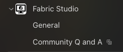

## Overview

Fabric Studio is an internal Fortinet tool designed to create simple or complex network topologies using different Fortinet products. It allows you to build, test, and demonstrate Fortinet solutions in a virtualized environment.

### Why Fabric Studio

The core engine has been designed with several key features:

- Incremental creation/destruction of devices while a fabric is running
- Direct connection between ports of VMs
- REST-like HTTP API and CLI commands with consistent behavior
- Modern user interface built with Neutrino

{}
Fabric Studio is the successor to FortiPOC, which is reaching End of Life (EOL).
{}

### Key Terminology

| Term                  | Description                                                                                                                                                                      |
|-----------------------|----------------------------------------------------------------------------------------------------------------------------------------------------------------------------------|
| **Fabric**            | A group of VMs interconnected by virtual networks (equivalent to a PoC in FortiPOC)                                                                                              |
| **Template**          | An exported fabric that can be stored in a repository or exchanged between users (similar to .fpoc files in FortiPOC)                                                            |
| **Firmware**          | Files containing the disks used to start a VM or LXC container (equivalent to images in FortiPOC)                                                                                |
| **Home Repository**   | A repository on your Fabric Studio where you can store firmwares and shared templates (similar to the local repository in FortiPOC)                                              |
| **System Repository** | A repository that manages local fabric templates used to create a fabric from scratch with minimal topology                                                                      |
| **VM**                | A LXC container or KVM virtual machine                                                                                                                                           |
| **Router**            | A simple router provided by Fabric Studio                                                                                                                                        |
| **Switch**            | A simple software switch provided by Fabric Studio (note: a network in FortiPOC was a combination of a switch and router)                                                        |
| **Host**              | Represents the Fabric Studio and its external ports to allow your fabric to access devices outside Fabric Studio and its internal ports that connect your fabric to the internet |

## Documentation

{}

## Getting Started

Fabric Studio allows you to:

1. Create new network topologies from scratch
2. Import existing FortiPOC environments
3. Use pre-built templates from the repository
4. Share your custom environments with others

{}
If you're migrating from FortiPOC, see the [Migration Guide](/03-migrate-fpoc) for step-by-step instructions.
{}

## Resources

### Documentation

Access the official documentation and resources on the internal Sharepoint site:

Fabric Studio Sharepoint

### Support

Report bugs or issues with Fabric Studio through the official bug tracker:

Report Bugs

### Community

Join the Microsoft Teams channel for updates and community support:

Join Teams Channel

{}
The Teams channel has multiple sections:

- **General channel**: Read-only update notifications
- **Community Q&A**: Where you can ask questions and get help with non-bug related issues
  {}

## FortiPOC to Fabric Studio Comparison

For users familiar with FortiPOC, here's a quick reference for Fabric Studio equivalents:

| FortiPOC Term    | Fabric Studio Term          |
|------------------|-----------------------------|
| PoC              | Fabric                      |
| .fpoc file       | Template                    |
| Image            | Firmware                    |
| Network          | Switch + Router combination |
| Local Repository | Home Repository             |