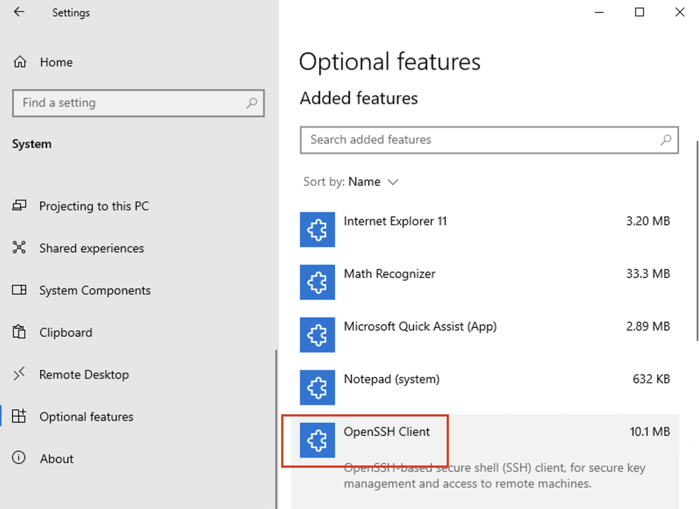
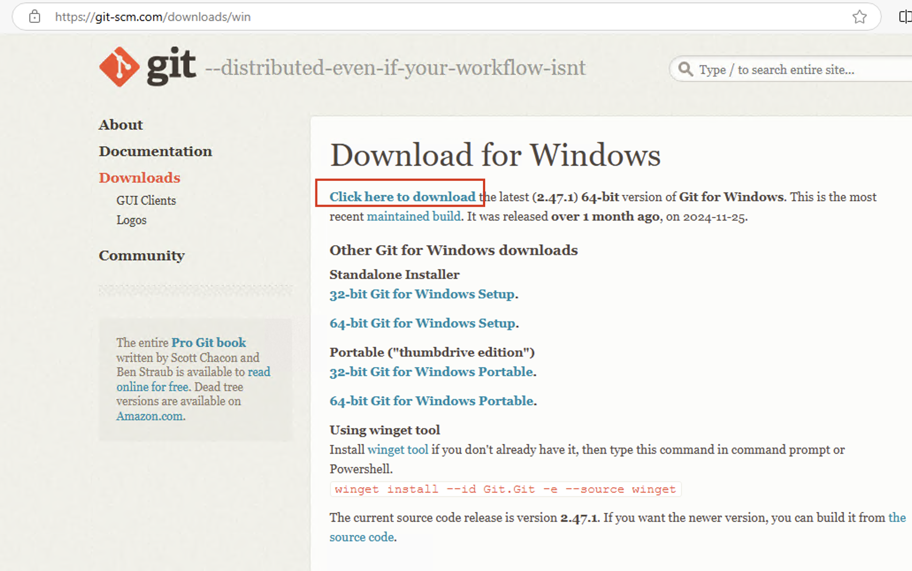
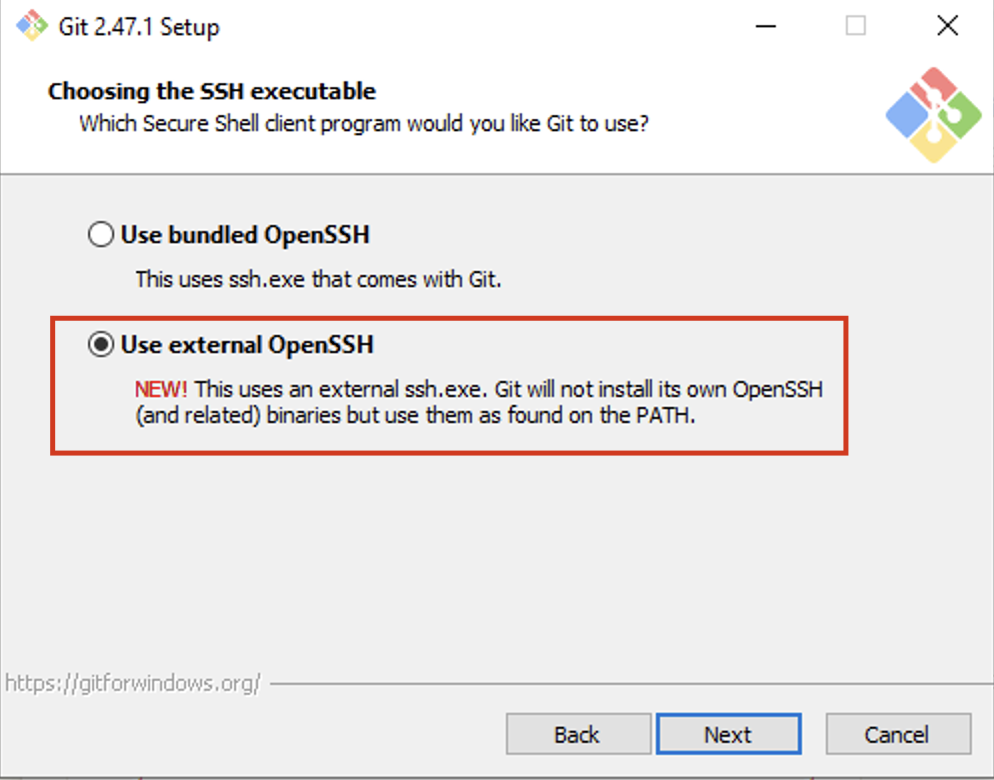

We focus on Windows 10 and 11 or newer. It needs a few extra steps to get Git and Hugo installed correctly.
We are going to use a lot of command line, so make sure you either use `Command Prompt`, or `Windows PowerShell`.

## ssh

Windows has its own build-in ssh client.
By default, the OpenSSH client and OpenSSH server are located in the directory: C:\Windows\System32\OpenSSH.
You can also check that it is present in Windows Settings > System > Optional features,
then search for "OpenSSH" in your added features.



## Generate SSH Key pair

If you have not done so, in command line, use command `ssh-keygen` to generate a pair of ssh keys.

When prompt for passphrase, you can just press Return to ignore it if you don't want input password everytime.

It will by default generate a pair of keys, one private, one public. And save both to your home folder,
in `.ssh` directory.

The default name of the private key is `id_ed25519`, and the default name of the public key is `id_ed25519.pub`.
It is also possible to generate RSA keys, and their name will be `id_rsa` and `id_rsa.pub`.

## App Installer and winget

Windows 10 and 11 has App Installer which provides a command called **winget**.
It is a command line based package manager. We can use it to install applications.
If `winget` is not recoganized as a command, you can install App Installer by following the
instructions on this web site:

[Installing the App Installer](https://learn.microsoft.com/en-us/windows/msix/app-installer/install-update-app-installer)

## Install Git

Go to [git download for Windows](https://git-scm.com/downloads/win) and download and run the Git for windows installer.


Follow all default option except when prompt for OpenSSH setup, choose **Use external OpenSSH**



Alternatively, you can use _winget_ to install Git from the command line:

```shell
winget install Git.Git
```

## Config Git user

Before you start using git, you will need to setup the default user for git (Use your name and fortinet email):

```shell
git config --global user.name 'Jingshao Chen'
git config --global user.email '<jingshao@fortinet.com>'
```

## Install Hugo

Use this command to install Hugo:

```shell
winget install hugo
```

Alternatively, download Hugo pre-build binary for Windows and copy it to your executable path.
You can copy it to `C:\Windows\System32`, or add the location of hugo.exe to the PATH environment variable.

## Common issues

1. When run `git clone`, it complains about authentication error because not public key is available.

   - This could because git is using its own ssh. Use this git configure command to let git use the system ssh:

     ```shell
     git config --global core.sshCommand C:/Windows/System32/OpenSSH/ssh.exe
     ```

1. When run `hugo server`, it complains about permission to open port 1313.

   - This probably is FortiClient is blocking hugo server from listening on any TCP port.
     You should see a notification pop up saying that. Open a ticket with mis to let them white list hugo on your computer.
