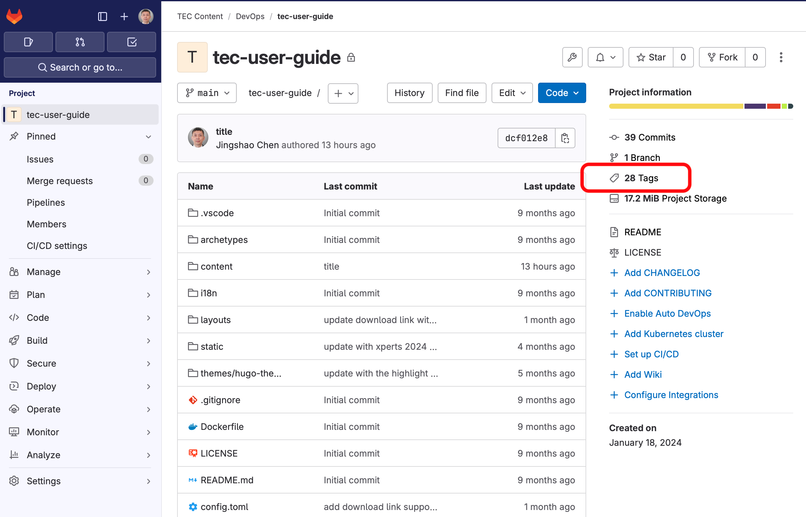
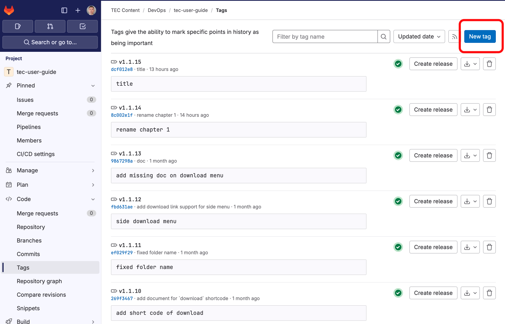
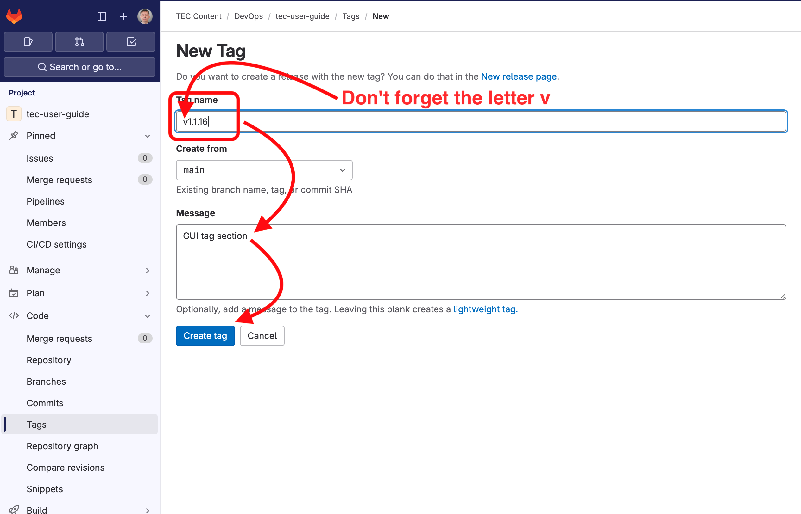

Once you are done, you can publish the project to the TEC website. GitLab CI/CD is already configured to automatically publish. All needed is to tag your document with a special formatted tag.

When you tag your document with something like **v1.2.3** and push to GitLab, the CI/CD will recognize the tag and automatically publish to the production server. If you are familiar with git, you will see the following steps just carry out exactly these two tasks.

## Publish to TEC

1. Pick a new tag for this publication. A tag is a version string that has to be in a specific format so the CI/CD system can recognize it. The tag has to be in a format starts with the letter `v`, and followed by a three part dot separated version numbers. It is like this:

   **v[MAJOR].[MINOR].[PATCH]**, where **MAJOR**, **MINOR** and **PATCH** are all numbers.

   For example,

   - These tags will trigger publishing: **v0.0.1**, **v0.0.2**, **v1.0.0**, and **v2.20.10**.
   - These will not: **1.0.0** (missing leading letter **v**), **v1.0** (missing patch level), **v1.0.0.0** (extra number), **v1.0.a** (a is not a number)

1. Let's say your release version tag is **v1.0.0**, now do the following commands, (in the folder of your project):

   ```shell
   git tag v1.0.0
   git push origin v1.0.0
   ```

   You can do this step in GitLab too.

1. That is it, the document should be automatically published at <https://tec.myfortinet.com/[PROJECT_PATH]/[PROJECT_NAME]/> in a matter of seconds.

1. The next time when you want to publish a new version, pick a larger version string, for example if you already have **v1.0.0**, then the next release can be **v1.0.1** if there are very small changes, or **v1.1.0** if there are minor changes, or **v2.0.0** if there are major changes.

{}
The url of the project will be the GitLab path + project name, without the `tec-content` part. For example, if the project is at `tec-content/competency/how-to-sase`, then the published URL will be `https://tec.myfortinet.com/competency/how-to-sase`.
{}

#### Create tag in GitLab

Instead of using git commands, you can create tags in GitLab.

1. On the project page, click the **tags** link
   

1. You can see all tags. Click the **New Tag** button
   

1. Add new tags
   

## Git Branch and Collaboration

If you are working on the project by yourself, it is OK to work on the **main** branch all the time. But if more people are working on
the same project at the same time, it is better to create your own
branch, then merge your changes into main. In the [Git](chapter-03-git) chapter, we will discuss the work flow.
