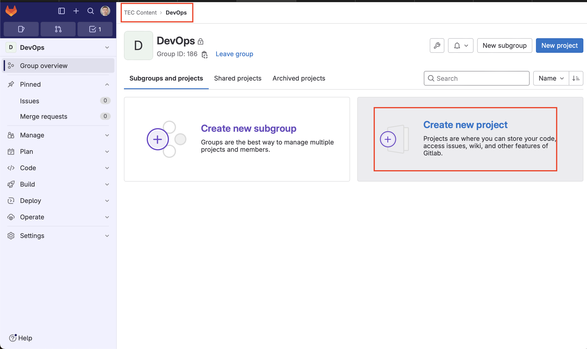
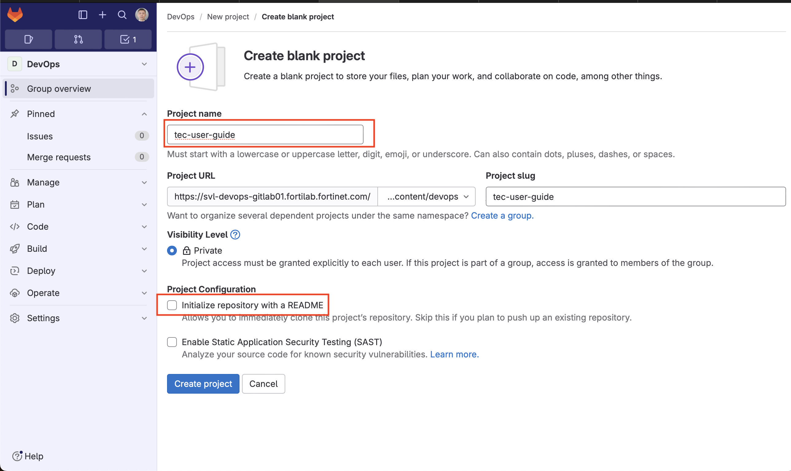
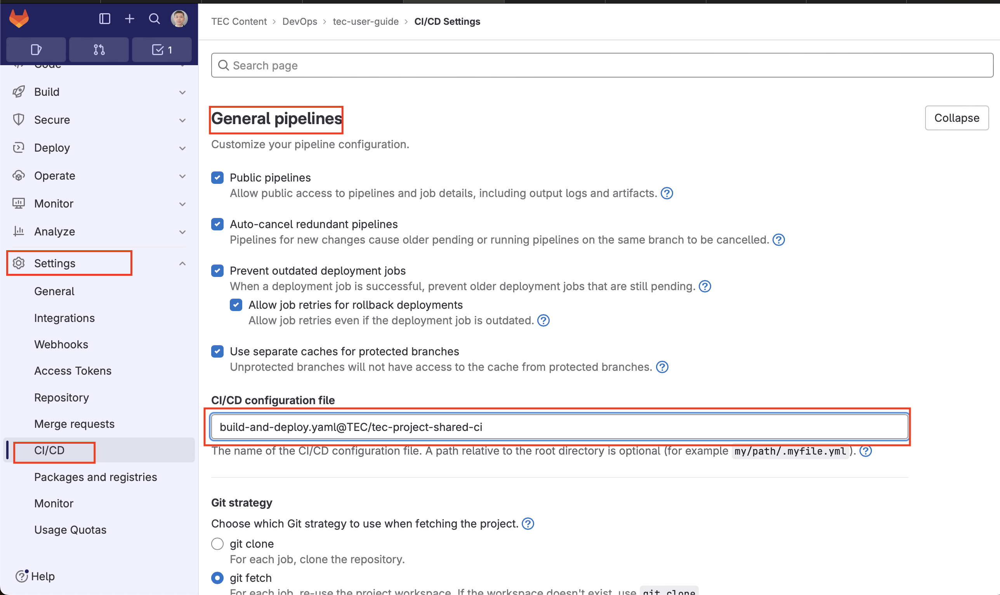
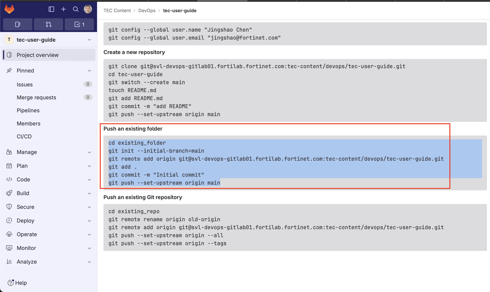

{}

# DEPRECATED

The steps listed here are for reference only. They are not working. Use
the [create-tec-project](https://svl-devops-gitlab01.fortilab.fortinet.com/tec/create-tec-project) command line tool instead.
{}

#### Step 1. Clone the `hugo-builder` Repository

```sh
git clone git@svl-devops-gitlab01.fortilab.fortinet.com:tec/hugo-builder.git
```

#### Step 2. Use `create_new_project.sh` to create a new project

```sh
cd hugo-builder
./create_new_project.sh [new project name]
```

The new project will be created in a folder with the same name as the project, in the same folder as the hugo-builder.
NOTE: you don't need to specify the sub-group name, just use the project's name.

NOTE: the name of the project is preferably in `lowercase-kebab-style`.

#### Step 3. Create a new project in GitLab

1. Find a sub group in `TEC CONTENT` group that fits the project. Create a new blank project.
   
1. Make sure to **un-check** the `Initialize repository with a REAME` option.
   
1. Set **Settings -> CI/CD -> General pipelines -> CI/CD configration file** to `build-and-deploy.yaml@TEC/tec-project-shared-ci`
   
1. Add authors as `Maintainer` to the new project
1. Add authors as `Developer` to `tec-project-shared-ci`

#### Step 4. Add the new folder to Gitlab

cd into the new project folder and do as **Push an existing folder** said to push it to gitlab



#### Step 5. Add new project to database

{}
Once the user add a version tag to the new project, it will be published automatically to the TEC web server.

This step just shows the new project on the home page of the tec website. Without this step, the project is still available at the tec, with `sub-group/project-name` as the url.

{}

As an admin, go to the [add project page](https://tec.myfortinet.com/project/add) to add the project to the TEC website homepage.
