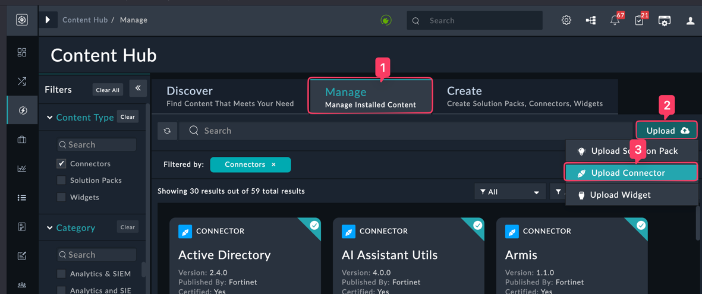
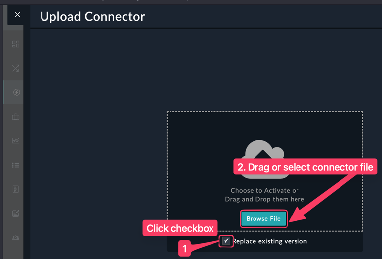
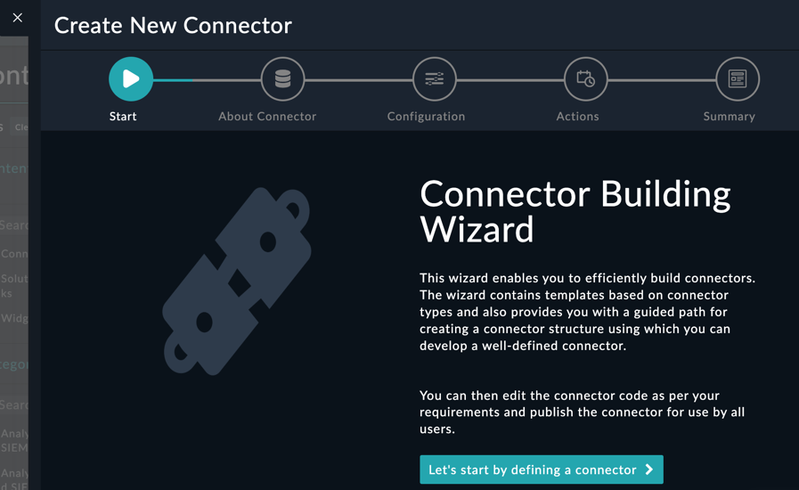
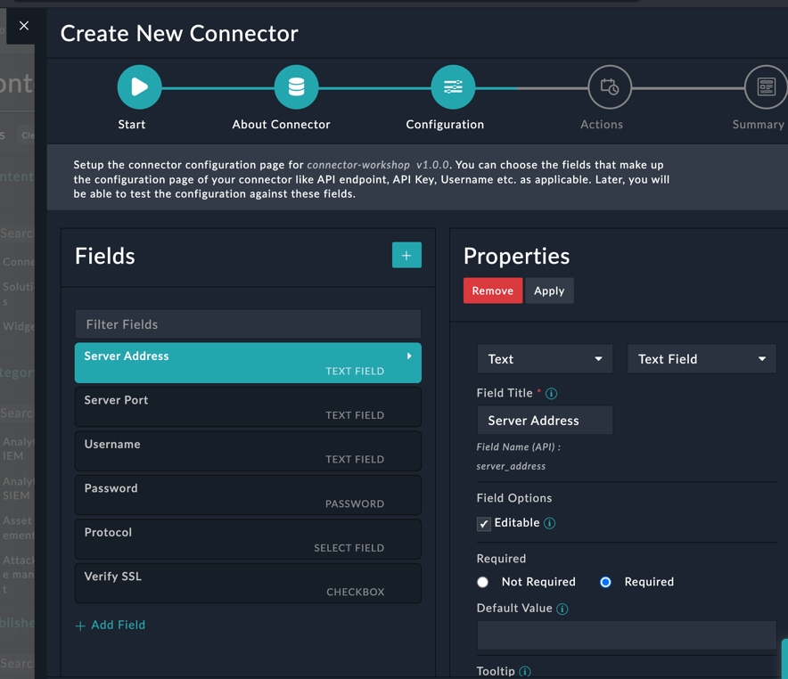
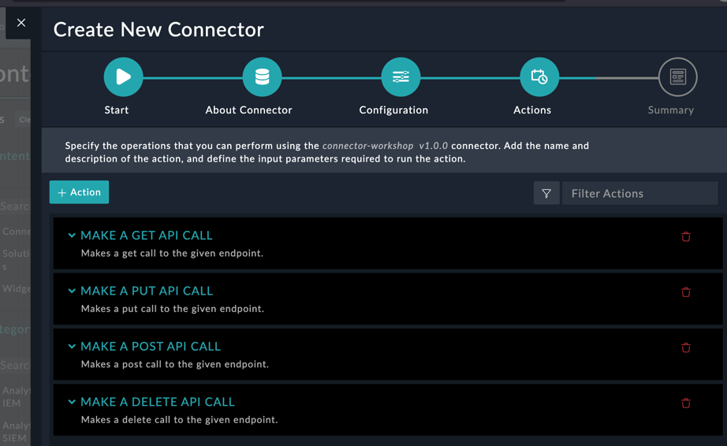

## Upload connector

## create connector

Fill in the details below. The template selection will give you pre-defined configuarion fields and operations. When done, click "Save and Continue"

Next we'll define the fields used to configure the connector.

Here we can define the connector actions that we want to be used by playbooks. Keep in mind when adding new actions, you'll still need to define the code used to execute them.

